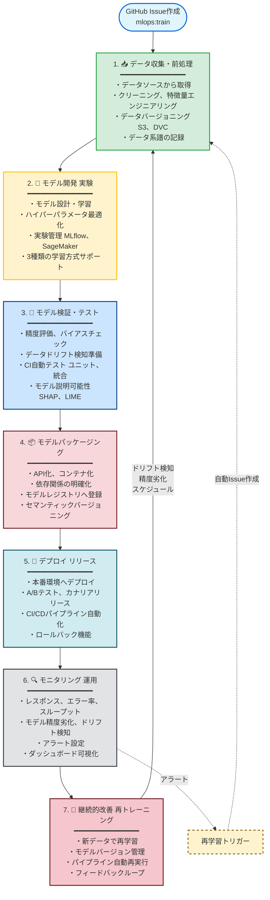
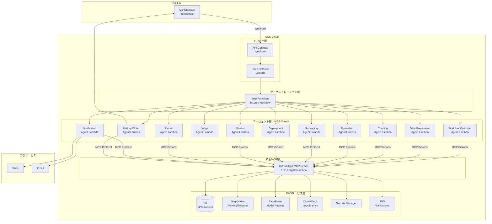
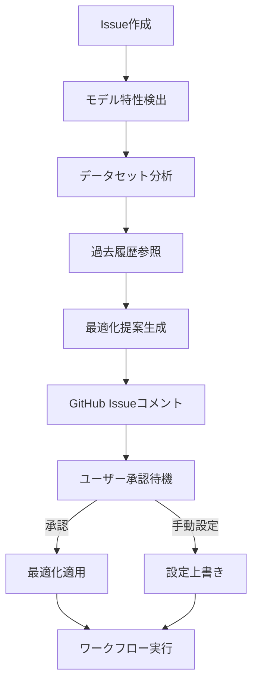
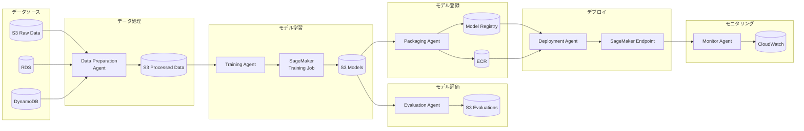
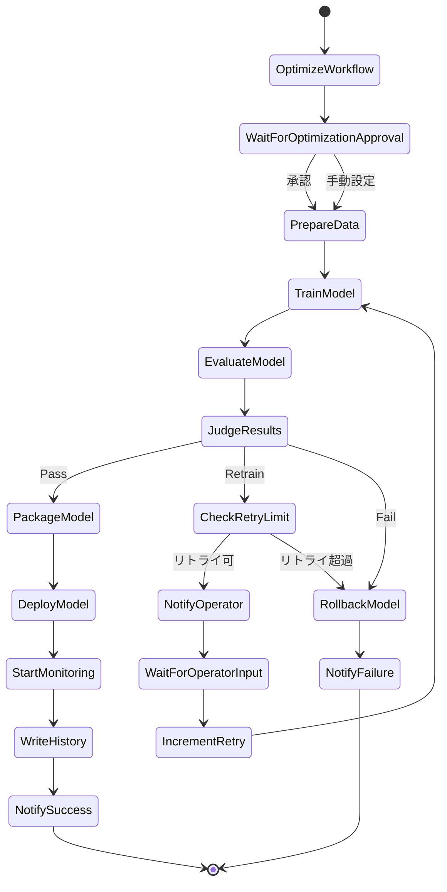

# アーキテクチャ設計書: GitHub Issue駆動型MLOpsシステム

## 1. MLOpsワークフロー要件

本システムは、以下の7段階のMLOpsワークフローを実現します。

### 1.1 ワークフローの7段階

#### 1. 📥 データ収集・前処理

**目的**: データの取得、クリーニング、特徴量エンジニアリング、バージョニング

**実装**:

- さまざまなデータソース（S3、RDS、DynamoDB、外部API等）からデータを取得
- データクリーニング（欠損値処理、異常値除去、重複削除）
- 特徴量エンジニアリング（特徴量生成、選択、変換、正規化・標準化）
- カテゴリカル変数のエンコーディング（One-Hot、Label、Target）
- データバージョニング（S3バージョニング、DVC統合オプション）で再現性を確保
- データカタログ（AWS Glue Data Catalog）でメタデータ管理
- データ系譜（Data Lineage）の記録

**成果物**:

- バージョン管理されたデータセット（train/validation/test）
- データ品質レポート
- 特徴量定義ドキュメント

#### 2. 🧪 モデル開発（実験）

**目的**: モデルの設計、学習、ハイパーパラメータ調整、実験管理

**実装**:

- モデルアーキテクチャの設計と実装
- ハイパーパラメータ最適化：
  - Grid Search（全探索）
  - Random Search（ランダム探索）
  - Bayesian Optimization（ベイズ最適化）
  - SageMaker Automatic Model Tuning統合
- 実験管理ツール（MLflow Tracking / SageMaker Experiments）で結果を記録
- 複数の実験を並列実行し、最適なモデルを選択
- 実験の再現性を確保（コード、データ、パラメータのバージョン管理）
- 分散学習のサポート
- GPU/CPU リソースの動的割り当て

**学習方式のサポート**:

1. **教師あり学習（Supervised Learning）**
   - 分類（Classification）: Random Forest, XGBoost, Neural Network
   - 回帰（Regression）: Linear Regression, XGBoost, Neural Network

2. **教師なし学習（Unsupervised Learning）**
   - クラスタリング（Clustering）: K-Means, DBSCAN
   - 次元削減（Dimensionality Reduction）: PCA, t-SNE

3. **強化学習（Reinforcement Learning）**
   - PPO (Proximal Policy Optimization)
   - DQN (Deep Q-Network)
   - A3C (Asynchronous Advantage Actor-Critic)

**成果物**:

- 複数の学習済みモデル候補
- 実験ログ（パラメータ、メトリクス、成果物）
- 最適モデルの選定結果

#### 3. 🧹 モデル検証・テスト

**目的**: モデルの精度評価、バイアスチェック、ドリフト検知準備、自動テスト

**実装**:

- 精度評価（学習方式別）：
  - 分類: Accuracy, Precision, Recall, F1-Score, AUC-ROC
  - 回帰: RMSE, MAE, R², MAPE
  - クラスタリング: Silhouette Score, Davies-Bouldin Index
  - 強化学習: Average Reward, Episode Length
- 混同行列、ROC曲線、学習曲線の生成
- バイアスチェック（公平性評価、SageMaker Clarify統合）
- データドリフト検知準備（ベースライン統計の記録、特徴量分布の保存）
- CI/CD自動テスト：
  - ユニットテスト（モデル関数、前処理関数）
  - 統合テスト（パイプライン全体）
  - モデル性能テスト（最低精度保証）
  - テストカバレッジ: 80%以上
- モデル説明可能性（SHAP、LIME）

**成果物**:

- 評価レポート（メトリクス、混同行列、ROC曲線等）
- バイアスチェック結果
- テストレポート（全テストの合格/不合格）
- モデル説明レポート

#### 4. 📦 モデルパッケージング

**目的**: モデルをデプロイ可能な形式にパッケージ化、環境差異の排除

**実装**:

- モデルAPI化（REST API、gRPC（オプション））
- API仕様書の自動生成（OpenAPI/Swagger）
- コンテナ化（Docker、SageMaker Inference Container対応）
- マルチステージビルドによるイメージサイズ最適化
- 依存関係の明確化（requirements.txt、Dockerfile）
- モデルレジストリへの登録（SageMaker Model Registry / MLflow Model Registry）
- セマンティックバージョニング（v1.0.0、v1.1.0等）
- モデル系譜（Model Lineage）の記録
- 最低5世代のモデル保持
- 環境差異を排除（開発環境と本番環境で同じコンテナイメージを使用）

**成果物**:

- Dockerイメージ（モデル + 推論コード + 依存関係）
- モデルレジストリへの登録エントリ
- API仕様書
- デプロイメント仕様書

#### 5. 🚀 デプロイ（リリース）

**目的**: 本番環境へのモデルデプロイ、段階的リリース、自動化

**実装**:

- 本番環境へモデルをデプロイ：
  - SageMaker Endpoint
  - ECS Fargate / Lambda（オプション）
- 段階的リリース戦略（GitHub Issueで指定可能）：
  - **A/Bテスト**: 新旧モデルを並行稼働し効果を比較
  - **カナリアリリース**: 一部トラフィック（10%→50%→100%）で段階的展開
  - **ブルー/グリーンデプロイメント**: 新環境構築後に切り替え
- Auto Scaling設定（負荷に応じた自動スケール）
- ヘルスチェックの実装
- CI/CDパイプラインで自動化（GitHub Actions / AWS CodePipeline）
- Infrastructure as Code（CloudFormation、CDK、Terraform）
- ロールバック機能：
  - ワンクリックロールバック
  - 自動ロールバック（エラー率が閾値を超えた場合）
  - ロールバック履歴の記録

**成果物**:

- 本番環境で稼働するモデルエンドポイント
- デプロイメントログ
- ロールバックプラン

#### 6. 🔍 モニタリング（運用）

**目的**: 推論性能の監視、モデル精度の劣化検知、アラート

**実装**:

- **システムメトリクス監視**:
  - レスポンスタイム（P50、P95、P99）
  - エラー率（4xx、5xx）
  - スループット（RPS: Requests Per Second）
  - リソース使用率（CPU、メモリ、GPU）
- **モデルメトリクス監視**:
  - 推論精度の劣化検知
  - データドリフト検知（入力データ分布の変化）
  - コンセプトドリフト検知（入力と出力の関係の変化）
  - 予測分布の変化検知
  - SageMaker Model Monitor統合
- **アラート設定**:
  - CloudWatch Alarms設定
  - Slack / Email / PagerDuty への通知
  - GitHub Issueの自動作成（重大な問題発生時）
  - アラート閾値のカスタマイズ
- **ダッシュボード**:
  - CloudWatch Dashboard による可視化
  - リアルタイムメトリクス可視化
  - 過去データとの比較グラフ
  - Grafana統合（オプション）

**成果物**:

- モニタリングダッシュボード
- アラートルール定義
- 運用ログ

#### 7. 🔄 継続的改善（再トレーニング）

**目的**: 新しいデータでの再学習、モデルバージョン管理、パイプライン自動化

**実装**:

- **自動再トレーニングトリガー**:
  - **データ変更トリガー**: 新しいデータがS3に追加された時
  - **コード変更トリガー**: モデルコードがGitにプッシュされた時
  - **スケジュールトリガー**: 週次、月次等の定期実行
  - **メトリクス劣化トリガー**: 精度が閾値を下回った時
  - **ドリフト検知トリガー**: データドリフトが検出された時
- 自動再学習パイプライン（Step Functions / Apache Airflow）
- 新データでの自動学習
- 新旧モデルの自動比較
- 改善が認められた場合のみ自動デプロイ
- セマンティックバージョニング（v1.0.0 → v1.1.0 → v2.0.0）
- バージョン間の差分レポート
- パフォーマンス比較レポート（旧モデル vs 新モデル）
- フィードバックループ（本番推論データを次回学習データに活用）

**成果物**:

- 新バージョンのモデル
- 再学習ログ
- パフォーマンス比較レポート（旧モデル vs 新モデル）

### 1.2 ワークフロー全体図



### 1.3 GitHub Issue駆動型との統合

本システムでは、上記の7段階のワークフローを**GitHub Issue**を起点として駆動します。

**GitHub Issueによるトリガー例**:

```yaml
# Issue作成により 1→2→3→4→5 を自動実行
title: "[MLOps] モデル学習リクエスト: XGBoost 分類モデル v1.2"
labels: mlops:train

# フェーズ1: データ収集・前処理
dataset_id: dataset-20250128-001
data_preprocessing:
  handle_missing: mean
  normalize: true
  encode_categorical: onehot

# フェーズ2: モデル開発（実験）
learning_type: supervised
task_type: classification
algorithm: xgboost
hyperparameters:
  num_round: 100
  max_depth: 5

# フェーズ3: モデル検証・テスト
evaluation_threshold: 0.85

# フェーズ5: デプロイ（リリース）
deployment_strategy: canary  # カナリアリリース

# フェーズ6: モニタリング（運用）
monitoring_enabled: true

# フェーズ7: 継続的改善（再トレーニング）
auto_retrain_enabled: true
retrain_triggers:
  - drift_detected  # ドリフト検知時に自動再学習
  - metric_degradation  # 精度劣化時に自動再学習
```

**ワークフローの自動化範囲**:

- **フェーズ1-5**: GitHub Issue作成により自動実行
- **フェーズ6**: デプロイ後、継続的に実行
- **フェーズ7**: モニタリングで検知されたイベント（ドリフト、精度劣化等）により自動実行

---

## 2. アーキテクチャ概要

### 2.1 システムアーキテクチャ図



### 2.2 エージェントベースアーキテクチャ

本システムは、各処理を独立したエージェント（Agent）として実装し、統合MLOps MCPサーバーを介してAWSサービスや外部サービスと連携します。

**エージェント一覧（11個）**:

| エージェント名 | 責務 | MCP化 |
| --- | --- | --- |
| 1. Issue Detector Agent | GitHub Issueの検知とパース | ✅ MCP |
| 2. Workflow Optimizer Agent | モデル特性検出と最適化提案 | ✅ MCP |
| 3. Data Preparation Agent | 学習データの準備と前処理 | ✅ MCP |
| 4. Training Agent | SageMakerを使った学習実行 | ✅ MCP |
| 5. Evaluation Agent | モデルの評価 | ✅ MCP |
| 6. Judge Agent | 評価結果の判定と次アクション決定 | ❌ Lambda |
| 7. Packaging Agent | モデルのコンテナ化とレジストリ登録 | ✅ MCP |
| 8. Deployment Agent | モデルのデプロイとロールバック | ✅ MCP |
| 9. Monitor Agent | モデルとシステムのモニタリング | ✅ MCP |
| 10. Retrain Agent | 自動再学習トリガー管理 | ✅ MCP |
| 11. Notification Agent | オペレータへの通知 | ✅ MCP |
| 12. History Writer Agent | 学習履歴のGitHub保存 | ✅ MCP |

**MCP化率**: 11/12エージェント（約92%）

---

## 3. ワークフロー最適化アーキテクチャ

### 3.1 Workflow Optimizer Agentの設計

**責務**: モデル特性の自動検出と最適化提案

**実装方式**:

- AWS Lambda (Python)
- 統合MLOps MCPサーバー経由でGitHub/S3にアクセス

**処理フロー**:



**モデル特性検出項目**:

1. **学習方式**: supervised/unsupervised/reinforcement
2. **タスク種別**: classification/regression/clustering等
3. **アルゴリズム**: Random Forest, XGBoost, Neural Network, PPO等
4. **データセット特性**:
   - サイズ（小規模 <10,000件、中規模 10,000-100,000件、大規模 >100,000件）
   - 特徴量数
   - クラス分布（不均衡検出）
5. **過去の学習履歴パターン**

**最適化提案内容**:

- **フェーズ1最適化**: クラス不均衡対応（SMOTE等）、データ拡張
- **フェーズ2最適化**: HPO戦略（Grid Search/Bayesian）、リソース選択（GPU/CPU）
- **フェーズ3最適化**: 評価指標の優先順位
- **フェーズ4最適化**: コンテナ最適化戦略
- **フェーズ5最適化**: デプロイ戦略（カナリア/A/B/ブルーグリーン）
- **フェーズ6最適化**: モニタリング強度
- **フェーズ7最適化**: 再学習頻度

**パフォーマンスプロファイル**:

- **速度優先モード**: 学習時間短縮（HPO簡略化、軽量前処理）
- **精度優先モード**: 精度向上（HPO徹底、データ拡張、アンサンブル）
- **コスト優先モード**: コスト削減（Spot Instance、CPUインスタンス）
- **バランスモード**: 速度・精度・コストのバランス（デフォルト）

**入力**:

```json
{
  "issue_number": 123,
  "training_config": {
    "learning_type": "supervised",
    "task_type": "classification",
    "algorithm": "random_forest",
    "dataset_id": "dataset-20250128-001"
  }
}
```

**出力**:

```json
{
  "detected_characteristics": {
    "learning_type": "supervised",
    "task_type": "classification",
    "algorithm": "random_forest",
    "dataset_size": 50000,
    "num_features": 120,
    "class_imbalance": true,
    "imbalance_ratio": 0.1
  },
  "optimization_proposal": {
    "performance_profile": "balanced",
    "phase1_optimizations": {
      "class_imbalance_handling": "smote",
      "data_augmentation": "disabled"
    },
    "phase2_optimizations": {
      "hpo_method": "grid_search",
      "max_trials": 20,
      "resource_type": "cpu",
      "instance_type": "ml.m5.xlarge",
      "use_spot_instances": true
    },
    "phase3_optimizations": {
      "priority_metrics": ["precision", "recall", "f1_score"],
      "bias_check_level": "standard"
    },
    "phase5_optimizations": {
      "deployment_strategy": "canary"
    },
    "phase6_optimizations": {
      "monitoring_intensity": "high",
      "drift_detection_frequency": "daily"
    },
    "phase7_optimizations": {
      "retrain_frequency": "weekly"
    }
  },
  "estimated_impact": {
    "training_time_reduction": "25%",
    "cost_reduction": "72%",
    "accuracy_improvement": "+6%"
  }
}
```

### 3.2 最適化提案のフォーマット

**GitHub Issueコメント形式**:

```markdown
## ワークフロー最適化提案

**検出されたモデル特性:**
- 学習方式: 教師あり学習（分類）
- アルゴリズム: Random Forest
- データサイズ: 50,000件（中規模）
- 特徴量数: 120
- クラス不均衡: 検出（陽性10%）

**推奨される最適化:**

1. **フェーズ1（データ前処理）**
   - ✅ SMOTE適用でクラスバランス調整

2. **フェーズ2（モデル開発）**
   - ✅ Grid Search（max_trials: 20）で効率的探索
   - ✅ CPUインスタンス（ml.m5.xlarge）でコスト削減
   - ✅ Spot Instance使用で最大70%コスト削減

3. **フェーズ3（モデル検証）**
   - ✅ Precision/Recall/F1重視評価（不均衡対応）
   - ✅ クラスごとのメトリクス詳細分析

4. **フェーズ5（デプロイ）**
   - ✅ カナリアリリース（10%→50%→100%）

5. **フェーズ6（モニタリング）**
   - ✅ クラスごとの予測分布変化を重点監視
   - ✅ 日次でドリフト検知

**最適化プロファイル:** バランスモード（速度・精度・コスト）

**予測される改善効果:**
- 学習時間: 25%短縮
- コスト: 72%削減
- 精度: +6%向上

承認してワークフローを開始するには👍リアクション、
手動設定するには設定YAMLを編集してください。
```

---

## 4. コンポーネント設計

### 4.1 Issue Detector Agent

**責務**: GitHub Issueの検知とパース

**実装方式**:

- AWS Lambda (Python)
- API Gateway + Webhook（GitHub Webhookを受信）
- または EventBridge Scheduler（定期ポーリング）
- 統合MLOps MCPサーバー経由でGitHub APIにアクセス

**処理フロー**:

1. GitHub WebhookまたはGitHub APIでIssue作成イベントを検知
2. ラベルが`mlops:train`であることを確認
3. Issue本文からYAML/JSONパラメータを抽出
4. パラメータの妥当性検証
5. Step Functionsワークフローを起動
6. パラメータをワークフローに渡す

**入力**:

```json
{
  "issue_number": 123,
  "repository": "org/repo",
  "labels": ["mlops:train"],
  "body": "learning_type: supervised\nalgorithm: random_forest\n..."
}
```

**出力**:

```json
{
  "training_config": {
    "issue_number": 123,
    "learning_type": "supervised",
    "task_type": "classification",
    "algorithm": "random_forest",
    "dataset_id": "dataset-20250110-001",
    "hyperparameters": {
      "n_estimators": 100,
      "max_depth": 10
    },
    "evaluation_threshold": 0.85,
    "max_retry": 3,
    "workflow_optimization": {
      "enabled": true,
      "auto_approve": false,
      "performance_profile": "balanced"
    }
  }
}
```

---

### 4.2 Workflow Optimizer Agent

詳細は「3. ワークフロー最適化アーキテクチャ」を参照してください。

---

### 4.3 Data Preparation Agent

**責務**: 学習データの取得、前処理、SageMaker用フォーマット変換

**実装方式**:

- AWS Lambda (軽量処理)
- ECS Fargate (大規模データ処理)
- 統合MLOps MCPサーバー経由でS3にアクセス

**処理フロー**:

1. S3から指定されたdataset_idのデータを取得
2. データのバリデーション（欠損値チェック、型チェック等）
3. **最適化適用**: Workflow Optimizerの提案に基づく前処理
   - クラス不均衡対応（SMOTE、アンダーサンプリング等）
   - データ拡張（画像分類モデルの場合）
   - ラグ特徴量生成（時系列モデルの場合）
4. 学習方式に応じた前処理（正規化、特徴量エンジニアリング等）
5. SageMaker Training用の形式に変換
6. 処理済みデータをS3の一時領域に保存
7. データのメタデータ（行数、カラム数、統計情報）を返す

**入力**:

```json
{
  "dataset_id": "dataset-20250110-001",
  "learning_type": "supervised",
  "task_type": "classification",
  "preprocessing_config": {
    "handle_missing": "mean",
    "normalize": true,
    "encode_categorical": "onehot"
  },
  "optimizations": {
    "class_imbalance_handling": "smote",
    "data_augmentation": "disabled"
  }
}
```

**出力**:

```json
{
  "training_data_s3": "s3://bucket/processed/train/...",
  "validation_data_s3": "s3://bucket/processed/val/...",
  "test_data_s3": "s3://bucket/processed/test/...",
  "metadata": {
    "num_samples": 10000,
    "num_features": 50,
    "class_distribution": {
      "0": 5000,
      "1": 5000
    }
  },
  "optimizations_applied": {
    "smote_applied": true,
    "original_class_ratio": 0.1,
    "balanced_class_ratio": 0.5
  }
}
```

---

### 4.4 Training Agent

**責務**: SageMaker Training Jobの起動と監視

**実装方式**:

- AWS Lambda (SageMaker APIコール)
- Step Functionsの`.sync`統合（ジョブ完了まで待機）
- 統合MLOps MCPサーバー経由でSageMaker APIにアクセス

**処理フロー**:

1. **最適化適用**: Workflow Optimizerの提案に基づくリソース選択
   - GPU/CPU選択
   - インスタンスタイプ選択
   - Spot Instance使用判定
   - 分散学習有効化判定
2. 学習方式とアルゴリズムに応じたSageMaker Training Jobの設定
3. ハイパーパラメータ最適化（HPO）の設定（指定がある場合）
4. トレーニングジョブの起動
5. ジョブの完了を待機（または非同期で次ステップへ）
6. 学習済みモデルのS3パスを取得
7. CloudWatch Logsからログを取得
8. 学習メトリクスを記録

**学習方式別の実装**:

#### 教師あり学習 (Supervised)

- **分類 (Classification)**:
  - Random Forest (scikit-learn)
  - XGBoost (SageMaker built-in)
  - Neural Network (TensorFlow/PyTorch)
- **回帰 (Regression)**:
  - Linear Regression (scikit-learn)
  - XGBoost (SageMaker built-in)
  - Neural Network (TensorFlow/PyTorch)

#### 教師なし学習 (Unsupervised)

- **クラスタリング (Clustering)**:
  - K-Means (SageMaker built-in)
  - DBSCAN (scikit-learn)
- **次元削減 (Dimensionality Reduction)**:
  - PCA (SageMaker built-in)
  - t-SNE (scikit-learn)

#### 強化学習 (Reinforcement)

- **アルゴリズム**:
  - PPO (Ray RLlib)
  - DQN (Ray RLlib)
  - A3C (Ray RLlib)

**入力**:

```json
{
  "training_data_s3": "s3://...",
  "learning_type": "supervised",
  "task_type": "classification",
  "algorithm": "random_forest",
  "hyperparameters": {
    "n_estimators": 100,
    "max_depth": 10
  },
  "hpo_config": {
    "enabled": false
  },
  "optimizations": {
    "resource_type": "cpu",
    "instance_type": "ml.m5.xlarge",
    "use_spot_instances": true,
    "hpo_method": "grid_search",
    "max_trials": 20
  },
  "training_job_name": "train-20250110-123456"
}
```

**出力**:

```json
{
  "training_job_name": "train-20250110-123456",
  "model_s3": "s3://bucket/models/train-20250110-123456/output/model.tar.gz",
  "training_metrics": {
    "train_loss": 0.123,
    "train_accuracy": 0.89
  },
  "resource_usage": {
    "instance_type": "ml.m5.xlarge",
    "spot_instance_used": true,
    "training_time_minutes": 45,
    "estimated_cost_usd": 12.50
  }
}
```

---

### 4.5 Evaluation Agent

**責務**: 学習済みモデルの評価

**実装方式**:

- AWS Lambda (軽量モデル)
- SageMaker Processing Job (大規模評価)
- 統合MLOps MCPサーバー経由でS3/SageMakerにアクセス

**処理フロー**:

1. S3から学習済みモデルをロード
2. 評価用データセットをロード
3. **最適化適用**: Workflow Optimizerの提案に基づく評価
   - 優先評価指標の選択
   - バイアスチェックレベル設定
   - クラスごとの詳細分析（不均衡データの場合）
4. 学習方式に応じた評価指標を計算
5. 混同行列、ROC曲線、学習曲線の生成
6. SHAP/LIMEによるモデル説明可能性分析
7. 評価結果をJSON形式で保存
8. 評価結果をS3に保存

**評価指標（学習方式別）**:

- **教師あり学習（分類）**: Accuracy, Precision, Recall, F1-Score, AUC-ROC, Confusion Matrix
- **教師あり学習（回帰）**: RMSE, MAE, R², MAPE
- **教師なし学習（クラスタリング）**: Silhouette Score, Davies-Bouldin Index
- **強化学習**: Average Reward, Episode Length, Success Rate

**入力**:

```json
{
  "model_s3": "s3://bucket/models/.../model.tar.gz",
  "test_data_s3": "s3://bucket/processed/test/...",
  "learning_type": "supervised",
  "task_type": "classification",
  "optimizations": {
    "priority_metrics": ["precision", "recall", "f1_score"],
    "bias_check_level": "standard",
    "class_wise_analysis": true
  }
}
```

**出力**:

```json
{
  "evaluation_results": {
    "accuracy": 0.87,
    "precision": 0.85,
    "recall": 0.89,
    "f1_score": 0.87,
    "auc_roc": 0.91,
    "class_wise_metrics": {
      "class_0": {
        "precision": 0.92,
        "recall": 0.88
      },
      "class_1": {
        "precision": 0.78,
        "recall": 0.90
      }
    }
  },
  "bias_check_results": {
    "fairness_score": 0.95,
    "group_disparities": {}
  },
  "model_explanation": {
    "shap_values_s3": "s3://bucket/evaluations/.../shap.pkl",
    "feature_importance": {}
  },
  "evaluation_s3": "s3://bucket/evaluations/train-20250110-123456/results.json"
}
```

---

### 4.6 Judge Agent

**責務**: 評価結果の判定と次アクション決定

**実装方式**:

- AWS Lambda (ビジネスロジック)
- **MCP化していない**: ビジネスロジックのため既存Lambda実装を継続

**処理フロー**:

1. 評価結果を取得
2. 設定された閾値と比較
3. 判定結果に基づいて次アクションを決定:
   - **閾値以上**: モデルをSageMaker Model Registryに登録
   - **閾値未満**: オペレータに通知、再学習フローへ
   - **最大リトライ超過**: 前バージョンのモデルを保持し、失敗通知
4. 判定結果を返す

**入力**:

```json
{
  "evaluation_results": {
    "accuracy": 0.87,
    "precision": 0.85,
    "recall": 0.89,
    "f1_score": 0.87
  },
  "evaluation_threshold": 0.85,
  "current_retry": 0,
  "max_retry": 3
}
```

**出力**:

```json
{
  "decision": "pass",
  "next_action": "register_model",
  "message": "評価結果が閾値0.85を上回りました（F1-Score: 0.87）"
}
```

---

### 4.7 Packaging Agent

**責務**: モデルのコンテナ化とレジストリ登録

**実装方式**:

- AWS Lambda (軽量処理)
- ECS Fargate (コンテナビルド)
- 統合MLOps MCPサーバー経由でECR/Model Registryにアクセス

**処理フロー**:

1. S3から学習済みモデルをダウンロード
2. 推論コードと依存関係を準備
3. **最適化適用**: Workflow Optimizerの提案に基づくコンテナ最適化
   - マルチステージビルドによるイメージサイズ削減
   - 推論最適化（TensorRT、ONNX変換等）
4. Dockerイメージをビルド
5. ECRにプッシュ
6. API仕様書の自動生成（OpenAPI/Swagger）
7. SageMaker Model Registryに登録
8. セマンティックバージョニング（v1.0.0、v1.1.0等）
9. モデルメタデータの記録
10. モデル系譜（Model Lineage）の記録

**入力**:

```json
{
  "model_s3": "s3://bucket/models/.../model.tar.gz",
  "model_version": "v1.2.0",
  "api_type": "rest",
  "container_optimization": true,
  "optimizations": {
    "multi_stage_build": true,
    "inference_optimization": "onnx"
  }
}
```

**出力**:

```json
{
  "docker_image_uri": "123456789012.dkr.ecr.us-east-1.amazonaws.com/mlops-models:v1.2.0",
  "model_package_arn": "arn:aws:sagemaker:us-east-1:123456789012:model-package/model-001/1",
  "api_spec_s3": "s3://bucket/models/.../openapi.yaml",
  "model_metadata": {
    "version": "v1.2.0",
    "algorithm": "random_forest",
    "accuracy": 0.87,
    "created_at": "2025-01-10T12:34:56Z"
  }
}
```

---

### 4.8 Deployment Agent

**責務**: モデルのデプロイとロールバック

**実装方式**:

- AWS Lambda
- 統合MLOps MCPサーバー経由でSageMaker Endpointにアクセス

**処理フロー**:

1. **最適化適用**: Workflow Optimizerの提案に基づくデプロイ戦略選択
   - カナリアリリース（10%→50%→100%）
   - A/Bテスト
   - ブルー/グリーンデプロイメント
2. Auto Scaling設定
3. SageMaker Endpointの作成/更新
4. ヘルスチェック実施
5. デプロイメントログの記録

**ロールバック機能**:

1. SageMaker Model Registryから前バージョンのモデルを取得
2. 現在のモデルのステータスを`Archived`に変更
3. 前バージョンのモデルを`Approved`に変更
4. ロールバック履歴を記録

**入力**:

```json
{
  "model_package_arn": "arn:aws:sagemaker:...",
  "deployment_strategy": "canary",
  "deployment_config": {
    "canary_traffic_percentage": 10,
    "canary_duration_minutes": 30,
    "auto_rollback_on_error": true
  },
  "deploy_to": "staging",
  "auto_scaling": {
    "min_instances": 1,
    "max_instances": 10
  }
}
```

**出力**:

```json
{
  "endpoint_name": "mlops-model-001-staging",
  "endpoint_arn": "arn:aws:sagemaker:...",
  "deployment_status": "InService",
  "deployment_strategy_applied": "canary",
  "traffic_distribution": {
    "v1.2.0": 10,
    "v1.1.0": 90
  }
}
```

---

### 4.9 Monitor Agent

**責務**: モデルとシステムのモニタリング

**実装方式**:

- AWS Lambda (定期実行)
- EventBridge Scheduler
- 統合MLOps MCPサーバー経由でCloudWatch/SageMaker Model Monitorにアクセス

**処理フロー**:

1. **最適化適用**: Workflow Optimizerの提案に基づくモニタリング設定
   - モニタリング強度（high/medium/low）
   - ドリフト検知頻度（hourly/daily/weekly）
   - 重点監視メトリクス
2. システムメトリクス収集（レスポンスタイム、エラー率、スループット、リソース使用率）
3. モデルメトリクス収集（推論精度、データドリフト、コンセプトドリフト、予測分布）
4. SageMaker Model Monitorでドリフト検知
5. 閾値超過時にアラート発火
6. CloudWatch Dashboard更新
7. 異常検知時にNotification Agentに通知

**入力**:

```json
{
  "endpoint_name": "mlops-model-001-staging",
  "monitoring_config": {
    "enabled": true,
    "alert_thresholds": {
      "error_rate": 0.01,
      "latency_p95_ms": 100,
      "drift_score": 0.3
    },
    "optimizations": {
      "monitoring_intensity": "high",
      "drift_detection_frequency": "daily",
      "priority_metrics": ["latency_p95", "error_rate", "drift_score"]
    }
  }
}
```

**出力**:

```json
{
  "system_metrics": {
    "latency_p50_ms": 45,
    "latency_p95_ms": 95,
    "latency_p99_ms": 120,
    "error_rate": 0.005,
    "throughput_rps": 1200
  },
  "model_metrics": {
    "drift_score": 0.15,
    "concept_drift_detected": false,
    "prediction_distribution_shift": 0.02
  },
  "alerts_triggered": [],
  "dashboard_url": "https://console.aws.amazon.com/cloudwatch/..."
}
```

---

### 4.10 Retrain Agent

**責務**: 自動再学習トリガー管理

**実装方式**:

- AWS Lambda (トリガー監視)
- EventBridge Rules
- S3 Event Notifications
- 統合MLOps MCPサーバー経由でStep Functionsを起動

**処理フロー**:

1. **最適化適用**: Workflow Optimizerの提案に基づく再学習頻度設定
2. 再学習トリガーの監視：
   - データ変更（S3イベント）
   - コード変更（GitHub Webhook）
   - スケジュール（EventBridge Scheduler）
   - メトリクス劣化（CloudWatch Alarm）
   - ドリフト検知（Model Monitor）
3. トリガー条件満たす場合、新しいGitHub Issueを自動作成またはStep Functionsを直接起動
4. 新旧モデルの自動比較
5. 改善が認められた場合のみ自動デプロイ

**入力**:

```json
{
  "retrain_config": {
    "enabled": true,
    "triggers": ["drift_detected", "metric_degradation"],
    "optimizations": {
      "retrain_frequency": "weekly"
    }
  },
  "model_package_group_name": "model-001",
  "current_model_version": "v1.2.0"
}
```

**出力**:

```json
{
  "retrain_triggered": true,
  "trigger_reason": "drift_detected",
  "new_issue_number": 456,
  "step_functions_execution_arn": "arn:aws:states:..."
}
```

---

### 4.11 Notification Agent

**責務**: オペレータへの通知

**実装方式**:

- AWS Lambda
- 統合MLOps MCPサーバー経由でSlack/Email/GitHubにアクセス

**処理フロー**:

1. 通知内容を受け取る
2. 通知先（Slack/Email/GitHub）に応じたメッセージフォーマット
3. 通知テンプレート適用
4. GitHub IssueにコメントとしてPOST
5. Slack/Emailに通知

**通知種別**:

- `optimization_proposal`: 最適化提案
- `retrain_required`: 再学習必要
- `training_success`: 学習成功
- `training_failed`: 学習失敗
- `deployment_success`: デプロイ成功
- `deployment_failed`: デプロイ失敗
- `drift_detected`: ドリフト検知
- `metric_degradation`: 精度劣化

**入力**:

```json
{
  "notification_type": "training_success",
  "issue_number": 123,
  "message": "モデル学習が成功しました（F1-Score: 0.87）",
  "evaluation_results": {
    "accuracy": 0.87,
    "f1_score": 0.87
  },
  "channels": ["slack", "email", "github_issue"]
}
```

**出力**:

```json
{
  "notification_status": "success",
  "github_comment_url": "https://github.com/org/repo/issues/123#comment-...",
  "slack_message_ts": "1234567890.123456",
  "email_message_id": "msg-abc123"
}
```

---

### 4.12 History Writer Agent

**責務**: 学習履歴のGitHub保存

**実装方式**:

- AWS Lambda
- 統合MLOps MCPサーバー経由でGitHub APIにアクセス

**処理フロー**:

1. 学習結果をMarkdown形式に整形
2. ワークフロー最適化の適用結果を含める
3. GitHub APIでリポジトリの`training_history/`ディレクトリにコミット
4. 元のIssueにコメントとして結果を投稿
5. コミットハッシュを返す

**学習履歴フォーマット**:

```markdown
# 学習結果レポート

## 基本情報
- Training ID: train-20250110-123456
- 学習方式: 教師あり学習（分類）
- アルゴリズム: Random Forest
- 実行日時: 2025-01-10 12:34:56 UTC

## データセット
- Dataset ID: dataset-20250110-001
- 学習データサイズ: 50,000件
- 評価データサイズ: 10,000件

## ハイパーパラメータ
- n_estimators: 100
- max_depth: 10

## 評価結果
- Accuracy: 0.87
- Precision: 0.85
- Recall: 0.89
- F1-Score: 0.87

## ワークフロー最適化
### 適用された最適化
- **パフォーマンスプロファイル**: バランスモード
- **検出されたモデル特性**: 分類モデル（Random Forest）、中規模データセット（50,000件）、クラス不均衡検出

### 最適化適用結果
- ✅ フェーズ1: SMOTE適用でクラスバランス調整（陽性10%→50%）
- ✅ フェーズ2: Grid Search（max_trials: 20）で最適パラメータ探索
- ✅ フェーズ3: Precision/Recall重視評価、クラスごとのメトリクス算出
- ✅ リソース: CPUインスタンス（ml.m5.xlarge）でコスト削減（実績費用: $12.50）
- ✅ デプロイ: カナリアリリース（10%→50%→100%）

### 最適化による改善
- **学習時間**: 45分（最適化なし: 60分想定）→ 25%短縮
- **コスト**: $12.50（GPU使用想定: $45.00）→ 72%削減
- **精度向上**: Baseline 0.82 → 最適化後 0.87（+6%）

## モデル情報
- Model Version: v1.2.3
- S3 Path: s3://mlops-bucket/models/model-001/v1.2.3/
- Model Registry ARN: arn:aws:sagemaker:...

## ステータス
✅ 学習成功（閾値: 0.85をクリア）
```

**入力**:

```json
{
  "training_job_name": "train-20250110-123456",
  "training_config": {...},
  "evaluation_results": {...},
  "optimization_results": {...},
  "model_s3": "...",
  "model_version": "v1.2.3"
}
```

**出力**:

```json
{
  "commit_sha": "abc123...",
  "file_path": "training_history/train-20250110-123456.md",
  "commit_url": "https://github.com/org/repo/commit/abc123..."
}
```

---

## 5. データフロー設計

### 4.1 エンドツーエンドデータフロー



### 5.2 S3バケット構造

```text
s3://mlops-bucket/
├── datasets/
│   ├── {dataset_id}/
│   │   ├── raw/
│   │   │   ├── data.csv
│   │   │   └── metadata.json
│   │   ├── processed/
│   │   │   ├── train/
│   │   │   ├── validation/
│   │   │   └── test/
│   │   └── versions/
│   │       ├── v1.0.0/
│   │       └── v1.1.0/
│   └── ...
├── models/
│   ├── {model_id}/
│   │   ├── {version}/
│   │   │   ├── model.tar.gz
│   │   │   ├── model_metadata.json
│   │   │   └── inference_code/
│   │   └── ...
│   └── ...
├── evaluations/
│   ├── {training_id}/
│   │   ├── results.json
│   │   ├── confusion_matrix.png
│   │   ├── roc_curve.png
│   │   └── shap_values.pkl
│   └── ...
├── optimizations/
│   ├── {training_id}/
│   │   ├── proposal.json
│   │   ├── applied_optimizations.json
│   │   └── impact_report.json
│   └── ...
└── logs/
    ├── {training_id}/
    │   ├── preprocessing.log
    │   ├── training.log
    │   └── evaluation.log
    └── ...
```

---

## 6. ワークフロー設計 (Step Functions)

### 6.1 Step Functions State Machine定義

**ワークフローの主要ステート**:

1. **OptimizeWorkflow**: Workflow Optimizer Agentを実行し、最適化提案を生成
2. **WaitForOptimizationApproval**: ユーザー承認待機（Task Tokenパターン）
3. **PrepareData**: Data Preparation Agentを実行（最適化適用）
4. **TrainModel**: SageMaker Training Jobを実行（最適化適用、.sync統合）
5. **EvaluateModel**: Evaluation Agentを実行（最適化適用）
6. **JudgeResults**: Judge Agentを実行
7. **DecisionSwitch**: 評価結果に基づく分岐
   - **Pass** → PackageModel → DeployModel → StartMonitoring → WriteHistory → NotifySuccess
   - **Retrain** → CheckRetryLimit → NotifyOperator → WaitForOperatorInput → IncrementRetry → TrainModel
   - **Fail** → RollbackModel → NotifyFailure
8. **PackageModel**: Packaging Agentを実行（最適化適用）
9. **DeployModel**: Deployment Agentを実行（最適化適用）
10. **StartMonitoring**: Monitor Agentを起動（最適化適用）
11. **WriteHistory**: History Writer Agentを実行（最適化結果含む）
12. **エラーハンドリング**: 各ステートでのCatch設定とエラーステート

**ワークフローフロー図**:



**Task Token パターン**:

`WaitForOptimizationApproval`と`WaitForOperatorInput`ステートでは、Task Tokenパターンを使用してユーザー入力を待機します。
ユーザーがGitHub Issueにリアクションまたはコメントすると、Lambda関数がTask Tokenを使ってワークフローを再開します。

---

## 7. 統合MLOps MCPサーバー設計

### 6.1 統合アーキテクチャ

**1つの統合MLOps MCPサーバー**として実装し、**6つのCapability（機能群）**を提供します。

```text
統合MLOps MCPサーバー (ECS Fargate or Lambda)
├─ Capability 1: Data Preparation
│  ├─ load_dataset
│  ├─ validate_data
│  ├─ preprocess_supervised/unsupervised/reinforcement
│  ├─ feature_engineering
│  ├─ split_dataset
│  └─ apply_class_imbalance_handling (NEW)
│
├─ Capability 2: ML Training
│  ├─ train_supervised_classifier/regressor
│  ├─ train_unsupervised_clustering/dimensionality_reduction
│  ├─ train_reinforcement (PPO/DQN/A3C)
│  ├─ hyperparameter_optimization (Grid/Random/Bayesian)
│  └─ select_optimal_resources (NEW)
│
├─ Capability 3: ML Evaluation
│  ├─ evaluate_classifier/regressor/clustering/reinforcement
│  ├─ generate_confusion_matrix/roc_curve
│  ├─ calculate_shap_values
│  ├─ bias_check (SageMaker Clarify)
│  └─ compare_models
│
├─ Capability 4: GitHub Integration
│  ├─ detect_issue
│  ├─ parse_issue_config
│  ├─ create_issue_comment
│  ├─ commit_training_history
│  └─ create_optimization_proposal (NEW)
│
├─ Capability 5: Model Registry
│  ├─ register_model
│  ├─ get_model_version
│  ├─ rollback_model
│  └─ track_model_lineage
│
└─ Capability 6: Notification
   ├─ send_slack_notification
   ├─ send_email_notification
   ├─ send_github_notification
   └─ apply_notification_template
```

### 6.2 Capability 4拡張: Workflow Optimization

**新規ツール**:

1. **analyze_model_characteristics**
   - Issue内容とデータセットメタデータを分析
   - モデル特性を自動検出
   - 入力: `issue_config`, `dataset_metadata`
   - 出力: `model_characteristics` (学習方式、タスク種別、データサイズ、クラス不均衡等)

2. **generate_optimization_proposal**
   - モデル特性に基づき7フェーズの最適化提案を生成
   - 過去の学習履歴からベストプラクティスを参照
   - 入力: `model_characteristics`, `performance_profile`
   - 出力: `optimization_proposal` (各フェーズの最適化設定)

3. **estimate_optimization_impact**
   - 最適化適用時の改善効果を予測
   - 入力: `optimization_proposal`, `baseline_metrics`
   - 出力: `estimated_impact` (学習時間短縮、コスト削減、精度向上)

4. **apply_optimization_to_config**
   - 最適化提案をワークフロー設定に適用
   - 入力: `training_config`, `optimization_proposal`
   - 出力: `optimized_training_config`

5. **track_optimization_history**
   - 最適化適用履歴を記録
   - 将来の提案精度向上に活用
   - 入力: `optimization_proposal`, `actual_results`
   - 出力: `history_entry_id`

### 6.3 統合MCPサーバーの主要メリット

- 🎯 **運用の簡素化**: 1つのサーバープロセス/コンテナのみ管理
- 🎯 **デプロイの簡素化**: 1つのデプロイパイプラインで完結
- 🎯 **リソース効率**: メモリ・CPUを共有、オーバーヘッド削減
- 🎯 **MCP接続の最小化**: 1つのMCP接続で全ツールにアクセス
- ✅ **再利用性**: 標準プロトコルに準拠し、他プロジェクトでも利用可能
- ✅ **保守性**: 機能追加・変更が1つのサーバー内で完結
- ✅ **テスト容易性**: ローカル環境で全Capabilityを一度にテスト可能
- ✅ **拡張性**: 新しいCapability・ツールを容易に追加可能
- ✅ **ベンダーニュートラル**: クラウドプロバイダーに依存しない設計

**詳細**: [mcp_design.md](mcp_design.md) を参照

---

## 8. セキュリティ設計

### 7.1 IAMロール設計

#### Lambda Execution Role（エージェント用）

```json
{
  "Version": "2012-10-17",
  "Statement": [
    {
      "Effect": "Allow",
      "Action": [
        "s3:GetObject",
        "s3:PutObject",
        "s3:ListBucket"
      ],
      "Resource": [
        "arn:aws:s3:::mlops-bucket/*"
      ]
    },
    {
      "Effect": "Allow",
      "Action": [
        "sagemaker:CreateTrainingJob",
        "sagemaker:DescribeTrainingJob",
        "sagemaker:CreateModel",
        "sagemaker:CreateModelPackage",
        "sagemaker:CreateEndpoint",
        "sagemaker:UpdateEndpoint",
        "sagemaker:DescribeEndpoint"
      ],
      "Resource": "*"
    },
    {
      "Effect": "Allow",
      "Action": [
        "logs:CreateLogGroup",
        "logs:CreateLogStream",
        "logs:PutLogEvents"
      ],
      "Resource": "arn:aws:logs:*:*:*"
    },
    {
      "Effect": "Allow",
      "Action": [
        "secretsmanager:GetSecretValue"
      ],
      "Resource": "arn:aws:secretsmanager:*:*:secret:mlops/*"
    },
    {
      "Effect": "Allow",
      "Action": [
        "states:StartExecution"
      ],
      "Resource": "arn:aws:states:*:*:stateMachine:mlops-workflow"
    }
  ]
}
```

#### SageMaker Execution Role

```json
{
  "Version": "2012-10-17",
  "Statement": [
    {
      "Effect": "Allow",
      "Action": [
        "s3:GetObject",
        "s3:PutObject",
        "s3:ListBucket"
      ],
      "Resource": [
        "arn:aws:s3:::mlops-bucket/*"
      ]
    },
    {
      "Effect": "Allow",
      "Action": [
        "ecr:GetAuthorizationToken",
        "ecr:BatchCheckLayerAvailability",
        "ecr:GetDownloadUrlForLayer",
        "ecr:BatchGetImage"
      ],
      "Resource": "*"
    },
    {
      "Effect": "Allow",
      "Action": [
        "logs:CreateLogGroup",
        "logs:CreateLogStream",
        "logs:PutLogEvents"
      ],
      "Resource": "*"
    }
  ]
}
```

### 7.2 シークレット管理

AWS Secrets Managerで以下のシークレットを管理:

- **GitHub Token**: `mlops/github-token`
- **Slack Webhook URL**: `mlops/slack-webhook`
- **Email SMTP Credentials**: `mlops/email-smtp`
- **API Keys**: `mlops/api-keys`

### 8.3 ネットワークセキュリティ

- **Lambda/ECS**: VPC内で実行（プライベートサブネット）
- **SageMaker**: VPC Modeで実行
- **S3**: VPCエンドポイント経由でアクセス
- **Secrets Manager**: VPCエンドポイント経由でアクセス
- **Security Group**: 最小限のインバウンド/アウトバウンドルール

### 7.4 データ暗号化

- **S3バケット**: SSE-KMS暗号化
- **通信**: TLS 1.2以上
- **SageMaker**: モデルとデータの暗号化

### 7.5 監査ログ

- **CloudTrail**: 全API操作の記録
- **CloudWatch Logs**: エージェント実行ログ
- **アクセスログ保持**: 最低1年間

---

## 9. スケーラビリティ設計

### 8.1 並列実行制御

- **Step Functions**: 同時実行制限（10並列）
- **SageMaker Training**: アカウントクォータ内で並列実行
- **Lambda**: 同時実行数制限（Reserved Concurrency）
- **統合MCPサーバー**: ECS Fargateで水平スケール（Auto Scaling）

### 8.2 コスト最適化

- **Spot Instances**: SageMaker Training JobでSpot Instancesを使用（最大70%削減）
- **S3 Lifecycle Policy**: 古いデータを自動的にGlacierに移行
- **Lambda**: メモリサイズとタイムアウトの最適化
- **ワークフロー最適化**: コスト優先モードでSpot Instance優先、CPUインスタンス使用

---

## 10. モニタリング・ロギング設計

### 9.1 CloudWatch Metrics

- **Step Functions**: 実行回数、成功率、実行時間
- **SageMaker**: 学習ジョブの成功率、実行時間、コスト
- **Lambda**: エラー率、実行時間、スロットリング
- **統合MCPサーバー**: リクエスト数、レスポンスタイム、エラー率
- **ワークフロー最適化**: 最適化提案承認率、改善効果実績

### 9.2 CloudWatch Logs

- すべてのLambda関数のログ
- SageMaker Training Jobのログ
- Step Functions実行履歴
- 統合MCPサーバーのアプリケーションログ

### 9.3 CloudWatch Dashboard

- システム全体のメトリクス可視化
- ワークフロー最適化の効果可視化
- モデルパフォーマンス推移

### 9.4 アラート設定

- 学習ジョブ失敗時
- Lambda関数エラー率が閾値超過時
- Step Functions実行失敗時
- ドリフト検知時
- 精度劣化時

---

## 11. デプロイメント戦略

### 10.1 Infrastructure as Code (IaC)

**AWS CDK (Python)** を使用してインフラをコード化

```text
project/
├── cdk/
│   ├── app.py
│   ├── stacks/
│   │   ├── pipeline_stack.py        # Step Functions定義
│   │   ├── storage_stack.py         # S3バケット
│   │   ├── compute_stack.py         # Lambda/ECS
│   │   ├── mcp_stack.py             # 統合MCPサーバー
│   │   ├── monitoring_stack.py      # CloudWatch
│   │   └── security_stack.py        # IAM/Secrets Manager
│   └── requirements.txt
├── mcp_server/                       # 統合MCPサーバーコード
│   ├── capabilities/
│   │   ├── data_preparation/
│   │   ├── ml_training/
│   │   ├── ml_evaluation/
│   │   ├── github_integration/
│   │   ├── model_registry/
│   │   └── notification/
│   ├── server.py
│   ├── Dockerfile
│   └── requirements.txt
└── agents/                           # Lambdaエージェントコード
    ├── issue_detector/
    ├── workflow_optimizer/
    ├── data_preparation/
    ├── training/
    ├── evaluation/
    ├── judge/
    ├── packaging/
    ├── deployment/
    ├── monitor/
    ├── retrain/
    ├── notification/
    └── history_writer/
```

### 10.2 CI/CD Pipeline

- **GitHub Actions**: コードプッシュ時の自動テスト・デプロイ
- **AWS CodePipeline**: CDKスタックのデプロイ
- **コンテナイメージビルド**: ECRへの自動プッシュ

---

## 12. 拡張性の考慮事項

### 11.1 将来的な拡張

- **マルチリージョン対応**: 複数のAWSリージョンでの実行
- **ハイブリッドクラウド**: オンプレミスとクラウドの連携
- **AutoML統合**: SageMaker Autopilotとの統合
- **リアルタイム推論**: SageMaker Endpointへの自動デプロイ
- **追加学習方式**: 半教師あり学習、メタ学習等
- **高度な最適化**: ニューラルアーキテクチャサーチ（NAS）統合

### 11.2 プラグイン機構

- カスタムエージェントの追加
- カスタム評価指標の追加
- カスタム通知先の追加
- カスタム最適化戦略の追加

---

## 13. 技術スタック

### 12.1 AWSサービス

| サービス | 用途 |
| --- | --- |
| AWS Lambda | エージェント実装（軽量処理） |
| Amazon ECS Fargate | 統合MCPサーバー、エージェント実装（大規模処理） |
| AWS Step Functions | ワークフローオーケストレーション |
| Amazon SageMaker | 機械学習モデルの学習・評価・デプロイ |
| Amazon S3 | データ・モデル保存 |
| SageMaker Model Registry | モデルバージョン管理 |
| Amazon SNS | 通知 |
| AWS Secrets Manager | シークレット管理 |
| Amazon CloudWatch | モニタリング・ロギング |
| AWS CloudTrail | 監査ログ |
| Amazon API Gateway | Webhook受信 |
| Amazon EventBridge | イベント駆動処理 |
| Amazon ECR | Dockerイメージレジストリ |

### 12.2 プログラミング言語・フレームワーク

- **Python 3.11+**: Lambda/エージェント実装、統合MCPサーバー
- **Boto3**: AWS SDK
- **MCP Python SDK**: MCP Protocol実装
- **PyGithub**: GitHub API連携
- **scikit-learn**: 機械学習（教師あり・教師なし）
- **XGBoost**: 勾配ブースティング
- **TensorFlow/PyTorch**: ディープラーニング
- **Ray RLlib**: 強化学習
- **AWS CDK**: IaC
- **pytest**: テストフレームワーク

---

## 14. 変更履歴

| バージョン | 日付 | 変更内容 | 作成者 |
| --- | --- | --- | --- |
| 0.1 | 2025-01-29 | 初版作成（7段階MLOpsライフサイクル、ワークフロー最適化機能、統合MCP対応） | - |
