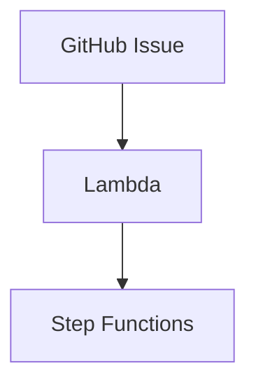

# Mermaidダイアグラム

このディレクトリには、MLOpsシステムのアーキテクチャを表すMermaid形式のダイアグラムが格納されています。

## ダイアグラム一覧

### 1. システムアーキテクチャ図

**ファイル**: [system_architecture.mmd](system_architecture.mmd)

システム全体のコンポーネント構成を示す図です。以下の要素を含みます：

- GitHub Repository（Issue、Documents、Training History）
- GitHub Integration Service（Lambda、Secrets Manager）
- AWS Step Functions（Orchestrator）
- Agent Layer（各エージェント）
- Storage Layer（S3、Model Registry）
- Monitoring & Logging
- Notification Service

### 2. データフロー図

**ファイル**: [data_flow.mmd](data_flow.mmd)

GitHub Issueの作成から学習完了までのエンドツーエンドのデータフローを示すフローチャートです。以下のフローを含みます：

- 正常フロー（Issue → データ準備 → 学習 → 評価 → 判定 → モデル登録 → 履歴保存）
- 再学習フロー（評価結果が閾値未満の場合）
- エラーフロー（学習失敗時のロールバック）

### 3. Step Functionsワークフロー図

**ファイル**: [step_functions_workflow.mmd](step_functions_workflow.mmd)

AWS Step Functionsのステートマシン定義を視覚化した状態遷移図です。以下の状態を含みます：

- PrepareData（データ準備）
- TrainModel（学習）
- EvaluateModel（評価）
- JudgeResults（判定）
- DecisionSwitch（分岐）
- RegisterModel / RollbackModel / NotifyOperator
- エラーハンドリング状態

### 4. エージェントアーキテクチャ図

**ファイル**: [agent_architecture.mmd](agent_architecture.mmd)

エージェントベースアーキテクチャの詳細を示す図です。以下のレイヤーを含みます：

- Trigger Layer（GitHub Issue）
- Detection Layer（Issue Detector Agent）
- Orchestration Layer（Step Functions）
- Agent Layer（8つのエージェント）
- Storage Layer（S3、Model Registry、Secrets Manager）
- Monitoring Layer（CloudWatch）

### 5. S3バケット構造図

**ファイル**: [s3_bucket_structure.mmd](s3_bucket_structure.mmd)

S3バケット内のディレクトリ構造を示すツリー図です。以下の構造を含みます：

- datasets/（学習データ）
  - raw/（生データ）
  - processed/（前処理済みデータ）
- models/（学習済みモデル）
  - バージョン別ディレクトリ（v1.0.0、v1.1.0、v1.2.0）
- evaluations/（評価結果）
- logs/（ログ）

### 6. 学習方式図

**ファイル**: [learning_types.mmd](learning_types.mmd)

3種類の学習方式（教師あり、教師なし、強化学習）とサポートするアルゴリズムを示すフローチャートです。以下を含みます：

- 教師あり学習
  - 分類（Random Forest、XGBoost、Neural Network）
  - 回帰（Linear Regression、XGBoost、Neural Network）
- 教師なし学習
  - クラスタリング（K-Means、DBSCAN、Autoencoder）
  - 次元削減（PCA、t-SNE）
- 強化学習（PPO、DQN、A3C）

### 7. ディレクトリ構造図

**ファイル**: [directory_structure.mmd](directory_structure.mmd)

プロジェクト全体のディレクトリ構造を視覚化した図です。以下の要素を含みます：

- 📄 ドキュメント（README.md、要件仕様書、アーキテクチャ設計書、テスト設計書）
- ⚙️ 設定ファイル（requirements.txt、.gitignore）
- 📊 Mermaidダイアグラム（7つのダイアグラムファイル）
- 🤖 エージェント実装（8つのエージェントと共通モジュール）
- ☁️ Infrastructure as Code（CDKスタック）
- 🧪 テストコード（単体、統合、システムテスト）
- 📝 環境設定（dev、test、prod）
- 📖 追加ドキュメント
- 📜 学習履歴（自動生成）
- ⚡ CI/CD（GitHub Actions）

## Mermaidダイアグラムの表示方法

### GitHub上での表示

GitHubはMermaid記法をネイティブサポートしています。各`.mmd`ファイルをクリックすると、自動的にレンダリングされた図が表示されます。

### ローカルでの表示

#### 方法1: VSCode拡張機能

1. VSCodeで「Markdown Preview Mermaid Support」拡張機能をインストール
2. `.mmd`ファイルを開く
3. プレビューを表示（`Ctrl+Shift+V` または `Cmd+Shift+V`）

#### 方法2: Mermaid Live Editor

1. [Mermaid Live Editor](https://mermaid.live/)にアクセス
2. `.mmd`ファイルの内容をコピー&ペースト
3. リアルタイムでレンダリングされた図を確認

#### 方法3: Mermaid CLI

```bash
# インストール
npm install -g @mermaid-js/mermaid-cli

# PNG画像として出力
mmdc -i system_architecture.mmd -o system_architecture.png

# SVG画像として出力
mmdc -i system_architecture.mmd -o system_architecture.svg
```

### Markdownファイルへの埋め込み

Markdownファイルで以下のように記述すると、Mermaid図を埋め込めます：

```markdown

```

または、Mermaidコードブロックとして直接埋め込むこともできます：

````markdown

````

## ダイアグラムの編集

1. `.mmd`ファイルをテキストエディタで開く
2. Mermaid記法で編集
3. [Mermaid Live Editor](https://mermaid.live/)で確認しながら編集すると便利

### Mermaid記法リファレンス

- [公式ドキュメント](https://mermaid.js.org/)
- [フローチャート](https://mermaid.js.org/syntax/flowchart.html)
- [状態遷移図](https://mermaid.js.org/syntax/stateDiagram.html)
- [シーケンス図](https://mermaid.js.org/syntax/sequenceDiagram.html)

## ライセンス

MIT License
