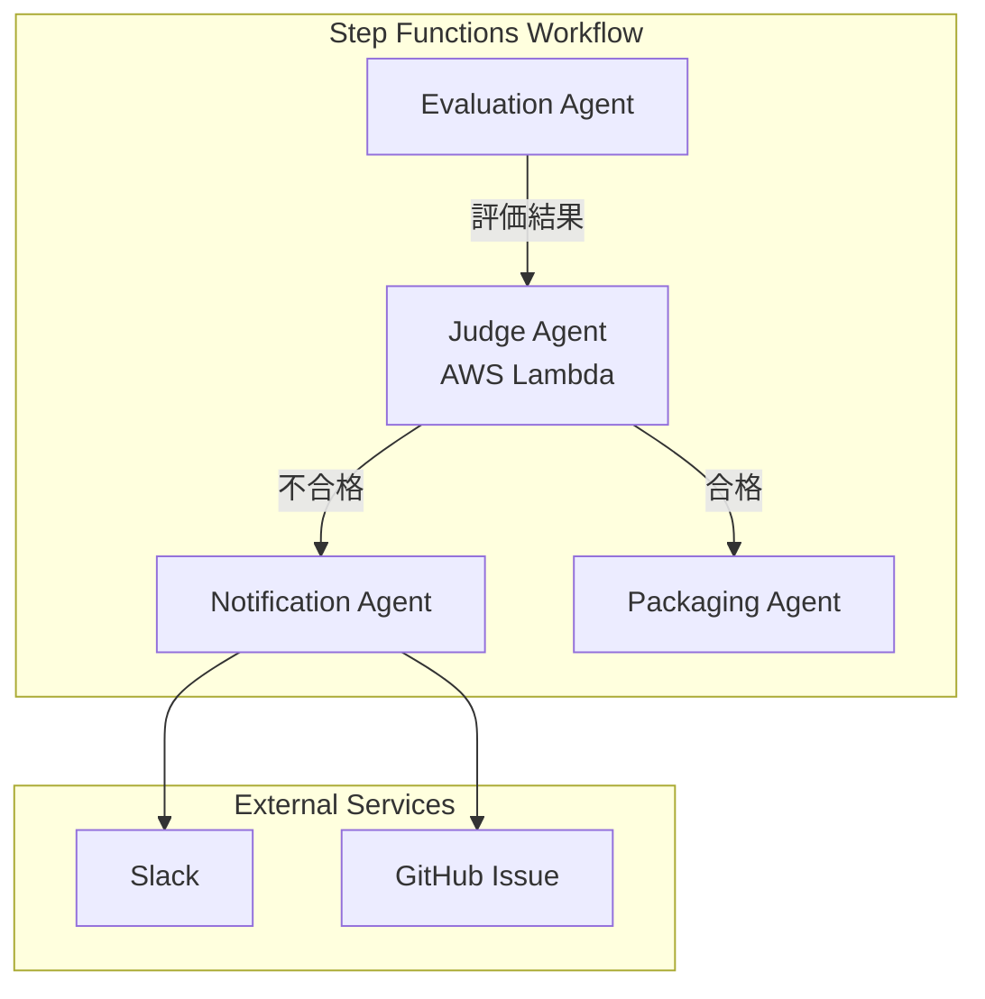
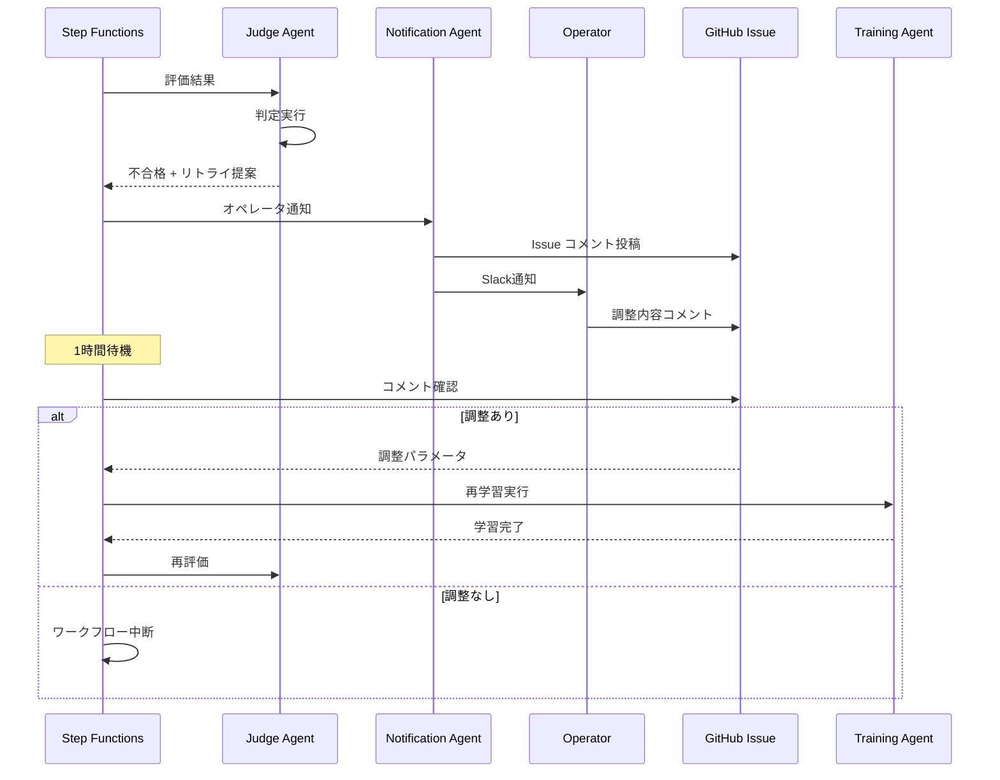

# エージェント設計書: 非MCP化エージェントの詳細設計

**注**: 本ドキュメントで使用される技術用語・略語の定義は[用語集](../others/glossary.md)を参照してください。

---

## 1. 概要

### 1.1 目的

本ドキュメントでは、MLOpsシステムにおいて**MCP化されていないエージェント**の詳細設計を定義します。システム全体で11個のエージェントが存在し、そのうち10個はMCP統合サーバー経由で実装されていますが、**Judge Agent**のみがAWS Lambda単体で実装されます。

### 1.2 対象エージェント

| エージェント名 | MCP化 | 実装方法 | 理由 |
| -------------- | ----- | -------- | ---- |
| Judge Agent    | ❌    | AWS Lambda | 軽量なビジネスロジック判定のため、MCPサーバー経由は不要 |

### 1.3 Judge Agentの役割

Judge Agentは、MLOpsパイプラインにおいて**評価結果の判定と次アクションの決定**を担当します。具体的には以下の責務を持ちます：

- **評価結果の判定**: Evaluation Agentの出力（精度、損失等）を閾値と比較
- **合格/不合格の決定**: モデルが本番デプロイに適しているか判定
- **次アクションの決定**:
  - 合格 → Packaging & Deployment フェーズへ進む
  - 不合格 → オペレータに通知 & 再学習を提案
- **対話型調整の制御**: 再学習が必要な場合、オペレータへのフィードバック要求

---

## 2. Judge Agent 詳細設計

### 2.1 アーキテクチャ



### 2.2 入力データ

Judge Agentは、Step Functionsから以下のデータを受け取ります：

**入力スキーマ (JSON)**:

```json
{
  "training_id": "train-20250101-001",
  "model_type": "supervised_learning",
  "task_type": "classification",
  "evaluation_results": {
    "accuracy": 0.92,
    "precision": 0.90,
    "recall": 0.94,
    "f1_score": 0.92,
    "auc_roc": 0.95,
    "confusion_matrix_s3_uri": "s3://mlops-bucket/evaluations/train-001/confusion_matrix.png"
  },
  "acceptance_criteria": {
    "min_accuracy": 0.85,
    "min_precision": 0.80,
    "min_recall": 0.80,
    "min_f1_score": 0.80,
    "min_auc_roc": 0.85
  },
  "retry_count": 0,
  "max_retries": 3,
  "github_issue_url": "https://github.com/user/repo/issues/42",
  "notification_channels": ["slack", "github"]
}
```

### 2.3 判定ロジック

#### 2.3.1 合格判定アルゴリズム

```python
def is_model_acceptable(evaluation_results: dict, acceptance_criteria: dict) -> bool:
    """
    モデルが本番デプロイに適しているか判定

    Args:
        evaluation_results: 評価結果
        acceptance_criteria: 受入基準

    Returns:
        True: 合格（デプロイ可能）
        False: 不合格（再学習必要）
    """
    criteria_checks = []

    # タスクタイプに応じた判定
    if task_type == "classification":
        criteria_checks = [
            evaluation_results.get("accuracy", 0) >= acceptance_criteria.get("min_accuracy", 0.85),
            evaluation_results.get("precision", 0) >= acceptance_criteria.get("min_precision", 0.80),
            evaluation_results.get("recall", 0) >= acceptance_criteria.get("min_recall", 0.80),
            evaluation_results.get("f1_score", 0) >= acceptance_criteria.get("min_f1_score", 0.80),
        ]

        # AUC-ROCがある場合は追加
        if "auc_roc" in evaluation_results:
            criteria_checks.append(
                evaluation_results["auc_roc"] >= acceptance_criteria.get("min_auc_roc", 0.85)
            )

    elif task_type == "regression":
        criteria_checks = [
            evaluation_results.get("rmse", float('inf')) <= acceptance_criteria.get("max_rmse", 10.0),
            evaluation_results.get("mae", float('inf')) <= acceptance_criteria.get("max_mae", 5.0),
            evaluation_results.get("r2_score", 0) >= acceptance_criteria.get("min_r2_score", 0.80),
        ]

    elif task_type == "clustering":
        criteria_checks = [
            evaluation_results.get("silhouette_score", 0) >= acceptance_criteria.get("min_silhouette_score", 0.50),
        ]

    elif task_type == "reinforcement_learning":
        criteria_checks = [
            evaluation_results.get("avg_reward", 0) >= acceptance_criteria.get("min_avg_reward", 100),
            evaluation_results.get("success_rate", 0) >= acceptance_criteria.get("min_success_rate", 0.70),
        ]

    # すべての基準を満たす場合のみ合格
    return all(criteria_checks)
```

#### 2.3.2 次アクション決定ロジック

```python
def determine_next_action(
    is_acceptable: bool,
    retry_count: int,
    max_retries: int
) -> dict:
    """
    次のアクションを決定

    Returns:
        {
            "action": "deploy" | "retry" | "abort",
            "reason": str,
            "notify_operator": bool
        }
    """
    if is_acceptable:
        return {
            "action": "deploy",
            "reason": "Model meets all acceptance criteria",
            "notify_operator": False
        }

    if retry_count < max_retries:
        return {
            "action": "retry",
            "reason": f"Model does not meet criteria. Retry {retry_count + 1}/{max_retries}",
            "notify_operator": True
        }

    return {
        "action": "abort",
        "reason": f"Model failed after {max_retries} retries. Manual intervention required.",
        "notify_operator": True
    }
```

### 2.4 出力データ

**出力スキーマ (JSON)**:

```json
{
  "training_id": "train-20250101-001",
  "judgment": {
    "is_acceptable": true,
    "passed_criteria": [
      "accuracy >= 0.85 (actual: 0.92)",
      "precision >= 0.80 (actual: 0.90)",
      "recall >= 0.80 (actual: 0.94)",
      "f1_score >= 0.80 (actual: 0.92)",
      "auc_roc >= 0.85 (actual: 0.95)"
    ],
    "failed_criteria": []
  },
  "next_action": {
    "action": "deploy",
    "reason": "Model meets all acceptance criteria",
    "notify_operator": false
  },
  "retry_count": 0,
  "timestamp": "2025-01-01T12:34:56Z"
}
```

**不合格時の出力例**:

```json
{
  "training_id": "train-20250101-002",
  "judgment": {
    "is_acceptable": false,
    "passed_criteria": [
      "precision >= 0.80 (actual: 0.82)",
      "recall >= 0.80 (actual: 0.88)"
    ],
    "failed_criteria": [
      "accuracy >= 0.85 (actual: 0.78)",
      "f1_score >= 0.80 (actual: 0.75)",
      "auc_roc >= 0.85 (actual: 0.80)"
    ]
  },
  "next_action": {
    "action": "retry",
    "reason": "Model does not meet criteria. Retry 1/3",
    "notify_operator": true
  },
  "retry_count": 1,
  "timestamp": "2025-01-01T13:00:00Z",
  "operator_notification": {
    "message": "モデルが受入基準を満たしませんでした。以下の改善を検討してください:\n\n**失敗した基準:**\n- accuracy: 0.78 (目標: 0.85)\n- f1_score: 0.75 (目標: 0.80)\n- auc_roc: 0.80 (目標: 0.85)\n\n**推奨アクション:**\n1. ハイパーパラメータの調整（学習率、正則化パラメータ等）\n2. データ拡張の追加\n3. クラス不均衡対策の強化\n\nGitHub Issueにコメントして調整内容を指示してください。",
    "channels": ["slack", "github"]
  }
}
```

### 2.5 Lambda関数実装

#### 2.5.1 Python実装例

**ファイルパス**: `agents/judge_agent/lambda_function.py`

```python
import json
import logging
import os
import re
from typing import Dict, Any, List
from datetime import datetime

logger = logging.getLogger()
logger.setLevel(logging.INFO)


class JudgeAgent:
    """
    評価結果の判定と次アクションの決定を行うエージェント
    """

    def __init__(self):
        self.logger = logger
        # デフォルト閾値の読み込み（環境変数または設定ファイルから）
        self.default_thresholds = self._load_default_thresholds()

    def _load_default_thresholds(self) -> Dict[str, Dict[str, float]]:
        """
        デフォルト閾値を環境変数またはS3設定ファイルから読み込み

        環境変数が設定されていない場合はハードコーディング値を使用
        """
        # 環境変数からの読み込み（JSON形式）
        thresholds_json = os.getenv("DEFAULT_THRESHOLDS")

        if thresholds_json:
            try:
                return json.loads(thresholds_json)
            except json.JSONDecodeError:
                self.logger.warning("Failed to parse DEFAULT_THRESHOLDS from env, using hardcoded defaults")

        # フォールバック: ハードコーディング値
        return {
            "classification": {
                "min_accuracy": 0.85,
                "min_precision": 0.80,
                "min_recall": 0.80,
                "min_f1_score": 0.80,
                "min_auc_roc": 0.85
            },
            "regression": {
                "max_rmse": 10.0,
                "max_mae": 5.0,
                "min_r2_score": 0.80
            },
            "clustering": {
                "min_silhouette_score": 0.50
            },
            "reinforcement_learning": {
                "min_avg_reward": 100,
                "min_success_rate": 0.70
            }
        }

    def _validate_github_url(self, url: str) -> bool:
        """
        GitHub IssueのURL検証（URLインジェクション対策）

        Args:
            url: 検証するURL

        Returns:
            True: 有効なGitHub Issue URL
            False: 無効なURL
        """
        if not url:
            return True  # URLが空の場合は検証スキップ

        pattern = r'^https://github\.com/[\w-]+/[\w-]+/issues/\d+$'
        return re.match(pattern, url) is not None

    def judge_model(self, event: Dict[str, Any]) -> Dict[str, Any]:
        """
        モデル評価結果を判定し、次アクションを決定

        Args:
            event: Step Functionsからの入力データ

        Returns:
            判定結果と次アクション
        """
        training_id = event["training_id"]
        model_type = event["model_type"]
        task_type = event["task_type"]
        evaluation_results = event["evaluation_results"]
        acceptance_criteria = event["acceptance_criteria"]
        retry_count = event.get("retry_count", 0)
        max_retries = event.get("max_retries", 3)

        # GitHub Issue URL検証（セキュリティ対策）
        github_issue_url = event.get("github_issue_url", "")
        if github_issue_url and not self._validate_github_url(github_issue_url):
            raise ValueError(f"Invalid GitHub Issue URL: {github_issue_url}")

        self.logger.info(f"Judging model: {training_id}, task_type: {task_type}")

        # 判定実行
        is_acceptable, passed_criteria, failed_criteria = self._evaluate_criteria(
            task_type, evaluation_results, acceptance_criteria
        )

        # 次アクション決定
        next_action = self._determine_next_action(
            is_acceptable, retry_count, max_retries
        )

        # 結果構築
        result = {
            "training_id": training_id,
            "judgment": {
                "is_acceptable": is_acceptable,
                "passed_criteria": passed_criteria,
                "failed_criteria": failed_criteria
            },
            "next_action": next_action,
            "retry_count": retry_count if not is_acceptable else 0,
            "timestamp": datetime.utcnow().isoformat() + "Z"
        }

        # オペレータ通知が必要な場合
        if next_action["notify_operator"]:
            result["operator_notification"] = self._create_notification_message(
                training_id, failed_criteria, retry_count, max_retries, event
            )

        self.logger.info(f"Judgment result: {json.dumps(result, indent=2)}")
        return result

    def _evaluate_criteria(
        self,
        task_type: str,
        evaluation_results: Dict[str, float],
        acceptance_criteria: Dict[str, float]
    ) -> tuple[bool, List[str], List[str]]:
        """
        受入基準の評価

        Returns:
            (is_acceptable, passed_criteria, failed_criteria)
        """
        passed = []
        failed = []

        # デフォルト閾値を取得（環境変数または設定ファイルから）
        default_thresholds = self.default_thresholds.get(task_type, {})

        if task_type == "classification":
            criteria_map = {
                "accuracy": ("min_accuracy", default_thresholds.get("min_accuracy", 0.85), ">="),
                "precision": ("min_precision", default_thresholds.get("min_precision", 0.80), ">="),
                "recall": ("min_recall", default_thresholds.get("min_recall", 0.80), ">="),
                "f1_score": ("min_f1_score", default_thresholds.get("min_f1_score", 0.80), ">="),
                "auc_roc": ("min_auc_roc", default_thresholds.get("min_auc_roc", 0.85), ">=")
            }
        elif task_type == "regression":
            criteria_map = {
                "rmse": ("max_rmse", default_thresholds.get("max_rmse", 10.0), "<="),
                "mae": ("max_mae", default_thresholds.get("max_mae", 5.0), "<="),
                "r2_score": ("min_r2_score", default_thresholds.get("min_r2_score", 0.80), ">=")
            }
        elif task_type == "clustering":
            criteria_map = {
                "silhouette_score": ("min_silhouette_score", default_thresholds.get("min_silhouette_score", 0.50), ">=")
            }
        elif task_type == "reinforcement_learning":
            criteria_map = {
                "avg_reward": ("min_avg_reward", default_thresholds.get("min_avg_reward", 100), ">="),
                "success_rate": ("min_success_rate", default_thresholds.get("min_success_rate", 0.70), ">=")
            }
        else:
            raise ValueError(f"Unknown task_type: {task_type}")

        for metric_name, (criteria_key, default_threshold, operator) in criteria_map.items():
            if metric_name not in evaluation_results:
                continue

            actual_value = evaluation_results[metric_name]
            threshold = acceptance_criteria.get(criteria_key, default_threshold)

            if operator == ">=":
                is_passed = actual_value >= threshold
            else:  # "<="
                is_passed = actual_value <= threshold

            criterion_text = f"{metric_name} {operator} {threshold} (actual: {actual_value:.4f})"

            if is_passed:
                passed.append(criterion_text)
            else:
                failed.append(criterion_text)

        is_acceptable = len(failed) == 0
        return is_acceptable, passed, failed

    def _determine_next_action(
        self,
        is_acceptable: bool,
        retry_count: int,
        max_retries: int
    ) -> Dict[str, Any]:
        """
        次アクションの決定
        """
        if is_acceptable:
            return {
                "action": "deploy",
                "reason": "Model meets all acceptance criteria",
                "notify_operator": False
            }

        if retry_count < max_retries:
            return {
                "action": "retry",
                "reason": f"Model does not meet criteria. Retry {retry_count + 1}/{max_retries}",
                "notify_operator": True
            }

        return {
            "action": "abort",
            "reason": f"Model failed after {max_retries} retries. Manual intervention required.",
            "notify_operator": True
        }

    def _create_notification_message(
        self,
        training_id: str,
        failed_criteria: List[str],
        retry_count: int,
        max_retries: int,
        event: Dict[str, Any]
    ) -> Dict[str, Any]:
        """
        オペレータ向け通知メッセージの生成
        """
        message_lines = [
            f"🚨 **モデル評価結果: 不合格**",
            f"",
            f"**Training ID**: `{training_id}`",
            f"**リトライ回数**: {retry_count + 1}/{max_retries}",
            f"",
            f"**失敗した基準**:"
        ]

        for criterion in failed_criteria:
            message_lines.append(f"- {criterion}")

        message_lines.extend([
            f"",
            f"**推奨アクション**:",
            f"1. ハイパーパラメータの調整（学習率、正則化パラメータ等）",
            f"2. データ拡張の追加",
            f"3. クラス不均衡対策の強化（SMOTE、クラスウェイト調整等）",
            f"4. 特徴量エンジニアリングの見直し",
            f"",
            f"GitHub Issueにコメントして調整内容を指示してください:",
            f"{event.get('github_issue_url', 'N/A')}"
        ])

        return {
            "message": "\n".join(message_lines),
            "channels": event.get("notification_channels", ["slack", "github"])
        }


def lambda_handler(event, context):
    """
    Lambda関数のエントリーポイント
    """
    try:
        judge_agent = JudgeAgent()
        result = judge_agent.judge_model(event)

        return {
            "statusCode": 200,
            "body": result
        }

    except Exception as e:
        logger.error(f"Error in Judge Agent: {str(e)}", exc_info=True)
        return {
            "statusCode": 500,
            "body": {
                "error": str(e),
                "training_id": event.get("training_id", "unknown")
            }
        }
```

#### 2.5.2 ユニットテスト

**ファイルパス**: `agents/judge_agent/test_judge_agent.py`

```python
import pytest
from lambda_function import JudgeAgent


class TestJudgeAgent:
    """
    Judge Agentのユニットテスト
    """

    @pytest.fixture
    def judge_agent(self):
        return JudgeAgent()

    def test_judge_acceptable_classification(self, judge_agent):
        """
        分類タスクで合格判定のテスト
        """
        event = {
            "training_id": "train-001",
            "model_type": "supervised_learning",
            "task_type": "classification",
            "evaluation_results": {
                "accuracy": 0.92,
                "precision": 0.90,
                "recall": 0.94,
                "f1_score": 0.92,
                "auc_roc": 0.95
            },
            "acceptance_criteria": {
                "min_accuracy": 0.85,
                "min_precision": 0.80,
                "min_recall": 0.80,
                "min_f1_score": 0.80,
                "min_auc_roc": 0.85
            },
            "retry_count": 0,
            "max_retries": 3
        }

        result = judge_agent.judge_model(event)

        assert result["judgment"]["is_acceptable"] is True
        assert result["next_action"]["action"] == "deploy"
        assert result["next_action"]["notify_operator"] is False
        assert len(result["judgment"]["failed_criteria"]) == 0

    def test_judge_unacceptable_classification(self, judge_agent):
        """
        分類タスクで不合格判定のテスト
        """
        event = {
            "training_id": "train-002",
            "model_type": "supervised_learning",
            "task_type": "classification",
            "evaluation_results": {
                "accuracy": 0.78,
                "precision": 0.82,
                "recall": 0.88,
                "f1_score": 0.75,
                "auc_roc": 0.80
            },
            "acceptance_criteria": {
                "min_accuracy": 0.85,
                "min_precision": 0.80,
                "min_recall": 0.80,
                "min_f1_score": 0.80,
                "min_auc_roc": 0.85
            },
            "retry_count": 0,
            "max_retries": 3
        }

        result = judge_agent.judge_model(event)

        assert result["judgment"]["is_acceptable"] is False
        assert result["next_action"]["action"] == "retry"
        assert result["next_action"]["notify_operator"] is True
        assert len(result["judgment"]["failed_criteria"]) == 3  # accuracy, f1_score, auc_roc

    def test_judge_max_retries_exceeded(self, judge_agent):
        """
        最大リトライ回数超過時のテスト
        """
        event = {
            "training_id": "train-003",
            "model_type": "supervised_learning",
            "task_type": "classification",
            "evaluation_results": {
                "accuracy": 0.75,
                "precision": 0.70,
                "recall": 0.80,
                "f1_score": 0.70
            },
            "acceptance_criteria": {
                "min_accuracy": 0.85,
                "min_precision": 0.80,
                "min_recall": 0.80,
                "min_f1_score": 0.80
            },
            "retry_count": 3,
            "max_retries": 3
        }

        result = judge_agent.judge_model(event)

        assert result["judgment"]["is_acceptable"] is False
        assert result["next_action"]["action"] == "abort"
        assert result["next_action"]["notify_operator"] is True

    def test_judge_regression_task(self, judge_agent):
        """
        回帰タスクの判定テスト
        """
        event = {
            "training_id": "train-004",
            "model_type": "supervised_learning",
            "task_type": "regression",
            "evaluation_results": {
                "rmse": 8.5,
                "mae": 4.2,
                "r2_score": 0.88
            },
            "acceptance_criteria": {
                "max_rmse": 10.0,
                "max_mae": 5.0,
                "min_r2_score": 0.80
            },
            "retry_count": 0,
            "max_retries": 3
        }

        result = judge_agent.judge_model(event)

        assert result["judgment"]["is_acceptable"] is True
        assert result["next_action"]["action"] == "deploy"

    def test_judge_clustering_task(self, judge_agent):
        """
        クラスタリングタスクの判定テスト
        """
        event = {
            "training_id": "train-005",
            "model_type": "unsupervised_learning",
            "task_type": "clustering",
            "evaluation_results": {
                "silhouette_score": 0.65
            },
            "acceptance_criteria": {
                "min_silhouette_score": 0.50
            },
            "retry_count": 0,
            "max_retries": 3
        }

        result = judge_agent.judge_model(event)

        assert result["judgment"]["is_acceptable"] is True
        assert result["next_action"]["action"] == "deploy"
        assert len(result["judgment"]["passed_criteria"]) == 1

    def test_judge_reinforcement_learning_task(self, judge_agent):
        """
        強化学習タスクの判定テスト
        """
        event = {
            "training_id": "train-006",
            "model_type": "reinforcement_learning",
            "task_type": "reinforcement_learning",
            "evaluation_results": {
                "avg_reward": 150.5,
                "success_rate": 0.85
            },
            "acceptance_criteria": {
                "min_avg_reward": 100,
                "min_success_rate": 0.70
            },
            "retry_count": 0,
            "max_retries": 3
        }

        result = judge_agent.judge_model(event)

        assert result["judgment"]["is_acceptable"] is True
        assert result["next_action"]["action"] == "deploy"
        assert len(result["judgment"]["passed_criteria"]) == 2

    def test_judge_partial_metrics(self, judge_agent):
        """
        一部の指標のみ存在する場合のテスト（auc_rocなし）
        """
        event = {
            "training_id": "train-007",
            "model_type": "supervised_learning",
            "task_type": "classification",
            "evaluation_results": {
                "accuracy": 0.90,
                "precision": 0.88,
                "recall": 0.92,
                "f1_score": 0.90
                # auc_roc is missing
            },
            "acceptance_criteria": {
                "min_accuracy": 0.85,
                "min_precision": 0.80,
                "min_recall": 0.80,
                "min_f1_score": 0.80,
                "min_auc_roc": 0.85
            },
            "retry_count": 0,
            "max_retries": 3
        }

        result = judge_agent.judge_model(event)

        # auc_rocがなくても他の指標が合格なら全体として合格
        assert result["judgment"]["is_acceptable"] is True
        assert result["next_action"]["action"] == "deploy"
        assert len(result["judgment"]["passed_criteria"]) == 4

    def test_notification_message_format(self, judge_agent):
        """
        通知メッセージフォーマットのテスト
        """
        event = {
            "training_id": "train-008",
            "model_type": "supervised_learning",
            "task_type": "classification",
            "evaluation_results": {
                "accuracy": 0.78,
                "precision": 0.82,
                "recall": 0.88,
                "f1_score": 0.75,
                "auc_roc": 0.80
            },
            "acceptance_criteria": {
                "min_accuracy": 0.85,
                "min_precision": 0.80,
                "min_recall": 0.80,
                "min_f1_score": 0.80,
                "min_auc_roc": 0.85
            },
            "retry_count": 0,
            "max_retries": 3,
            "github_issue_url": "https://github.com/user/repo/issues/42",
            "notification_channels": ["slack", "github"]
        }

        result = judge_agent.judge_model(event)

        # 通知メッセージの存在確認
        assert "operator_notification" in result
        notification = result["operator_notification"]

        # メッセージフォーマット検証
        assert "message" in notification
        assert "channels" in notification
        assert "モデル評価結果: 不合格" in notification["message"]
        assert "train-008" in notification["message"]
        assert "accuracy" in notification["message"]
        assert "https://github.com/user/repo/issues/42" in notification["message"]
        assert notification["channels"] == ["slack", "github"]

    def test_github_url_validation_valid(self, judge_agent):
        """
        有効なGitHub Issue URLの検証テスト
        """
        assert judge_agent._validate_github_url("https://github.com/user/repo/issues/123") is True
        assert judge_agent._validate_github_url("https://github.com/my-org/my-repo/issues/1") is True
        assert judge_agent._validate_github_url("") is True  # 空URLは許可

    def test_github_url_validation_invalid(self, judge_agent):
        """
        無効なGitHub Issue URLの検証テスト
        """
        # 無効なURL形式
        assert judge_agent._validate_github_url("http://github.com/user/repo/issues/123") is False  # http
        assert judge_agent._validate_github_url("https://github.com/user/repo/pull/123") is False  # pull request
        assert judge_agent._validate_github_url("https://github.com/user/repo") is False  # issueなし
        assert judge_agent._validate_github_url("https://evil.com/github.com/user/repo/issues/123") is False  # 悪意あるURL
        assert judge_agent._validate_github_url("javascript:alert(1)") is False  # XSS攻撃

    def test_judge_with_invalid_github_url(self, judge_agent):
        """
        無効なGitHub Issue URLでエラーが発生することのテスト
        """
        event = {
            "training_id": "train-009",
            "model_type": "supervised_learning",
            "task_type": "classification",
            "evaluation_results": {
                "accuracy": 0.78
            },
            "acceptance_criteria": {
                "min_accuracy": 0.85
            },
            "retry_count": 0,
            "max_retries": 3,
            "github_issue_url": "https://evil.com/malicious"  # 無効なURL
        }

        with pytest.raises(ValueError) as exc_info:
            judge_agent.judge_model(event)

        assert "Invalid GitHub Issue URL" in str(exc_info.value)
```

### 2.6 Step Functions統合

Judge AgentはStep Functionsのワークフロー内で以下のように使用されます：

**Step Functions定義 (ASL - Amazon States Language)**:

```json
{
  "Comment": "MLOps Pipeline - Evaluation & Judgment Phase",
  "StartAt": "EvaluateModel",
  "States": {
    "EvaluateModel": {
      "Type": "Task",
      "Resource": "arn:aws:lambda:us-east-1:123456789012:function:EvaluationAgent",
      "ResultPath": "$.evaluation_results",
      "Next": "JudgeModel"
    },
    "JudgeModel": {
      "Type": "Task",
      "Resource": "arn:aws:lambda:us-east-1:123456789012:function:JudgeAgent",
      "ResultPath": "$.judgment",
      "Next": "DecideNextAction"
    },
    "DecideNextAction": {
      "Type": "Choice",
      "Choices": [
        {
          "Variable": "$.judgment.next_action.action",
          "StringEquals": "deploy",
          "Next": "PackageModel"
        },
        {
          "Variable": "$.judgment.next_action.action",
          "StringEquals": "retry",
          "Next": "NotifyOperator"
        },
        {
          "Variable": "$.judgment.next_action.action",
          "StringEquals": "abort",
          "Next": "AbortWorkflow"
        }
      ],
      "Default": "AbortWorkflow"
    },
    "PackageModel": {
      "Type": "Task",
      "Resource": "arn:aws:lambda:us-east-1:123456789012:function:PackagingAgent",
      "End": true
    },
    "NotifyOperator": {
      "Type": "Task",
      "Resource": "arn:aws:lambda:us-east-1:123456789012:function:NotificationAgent",
      "Next": "WaitForOperatorAdjustment"
    },
    "WaitForOperatorAdjustment": {
      "Type": "Wait",
      "Seconds": 3600,
      "Next": "CheckAdjustmentProvided"
    },
    "CheckAdjustmentProvided": {
      "Type": "Task",
      "Resource": "arn:aws:lambda:us-east-1:123456789012:function:CheckGitHubIssueComment",
      "Next": "HasAdjustment"
    },
    "HasAdjustment": {
      "Type": "Choice",
      "Choices": [
        {
          "Variable": "$.has_adjustment",
          "BooleanEquals": true,
          "Next": "RetrainWithAdjustment"
        }
      ],
      "Default": "AbortWorkflow"
    },
    "RetrainWithAdjustment": {
      "Type": "Task",
      "Resource": "arn:aws:lambda:us-east-1:123456789012:function:TrainingAgent",
      "Next": "EvaluateModel"
    },
    "AbortWorkflow": {
      "Type": "Fail",
      "Error": "ModelRejected",
      "Cause": "Model failed acceptance criteria after maximum retries"
    }
  }
}
```

### 2.7 IAMロール設計

**Judge Agent用IAMロール**:

```json
{
  "Version": "2012-10-17",
  "Statement": [
    {
      "Effect": "Allow",
      "Action": [
        "logs:CreateLogGroup",
        "logs:CreateLogStream",
        "logs:PutLogEvents"
      ],
      "Resource": "arn:aws:logs:*:*:*"
    },
    {
      "Effect": "Allow",
      "Action": [
        "s3:GetObject"
      ],
      "Resource": "arn:aws:s3:::mlops-bucket/evaluations/*"
    },
    {
      "Effect": "Allow",
      "Action": [
        "cloudwatch:PutMetricData"
      ],
      "Resource": "*",
      "Condition": {
        "StringEquals": {
          "cloudwatch:namespace": "MLOps/JudgeAgent"
        }
      }
    }
  ]
}
```

### 2.8 監視とアラート

**CloudWatch Metrics**:

- `JudgmentCount`: 判定実行回数
- `AcceptanceRate`: 合格率（過去24時間）
- `RetryRate`: リトライ率
- `AbortRate`: 中断率

**CloudWatch Alarms**:

- `LowAcceptanceRate`: 合格率が50%未満の場合にアラート
- `HighRetryRate`: リトライ率が70%超の場合にアラート（モデル品質問題の可能性）

---

## 3. 対話型調整フロー

### 3.1 対話型調整の概要

Judge Agentが不合格と判定した場合、オペレータとの対話的な調整プロセスが開始されます。



### 3.2 GitHub Issue コメント例

**Judge Agentからの通知**:

```markdown
## 🚨 モデル評価結果: 不合格

**Training ID**: `train-20250101-002`
**リトライ回数**: 1/3

### 失敗した基準
- accuracy >= 0.85 (actual: 0.7800)
- f1_score >= 0.80 (actual: 0.7500)
- auc_roc >= 0.85 (actual: 0.8000)

### 推奨アクション
1. ハイパーパラメータの調整（学習率、正則化パラメータ等）
2. データ拡張の追加
3. クラス不均衡対策の強化（SMOTE、クラスウェイト調整等）
4. 特徴量エンジニアリングの見直し

### 調整方法
以下の形式でコメントしてください：

\`\`\`yaml
adjust:
  hyperparameters:
    learning_rate: 0.001
    batch_size: 64
    epochs: 150
  preprocessing:
    class_imbalance_method: smote
    smote_ratio: 0.8
\`\`\`
```

**オペレータからの調整コメント例**:

```yaml
adjust:
  hyperparameters:
    learning_rate: 0.001
    batch_size: 64
    epochs: 150
    weight_decay: 0.0001
  preprocessing:
    class_imbalance_method: smote
    smote_ratio: 0.8
  data_augmentation:
    enabled: true
    mixup_alpha: 0.2
```

---

## 4. デプロイメント

### 4.1 CDKによるデプロイ定義

**ファイルパス**: `cdk/stacks/judge_agent_stack.py`

```python
from aws_cdk import (
    Stack,
    aws_lambda as lambda_,
    aws_iam as iam,
    aws_logs as logs,
    Duration
)
from constructs import Construct


class JudgeAgentStack(Stack):
    """
    Judge Agent用のCDKスタック
    """

    def __init__(self, scope: Construct, construct_id: str, **kwargs):
        super().__init__(scope, construct_id, **kwargs)

        # IAMロール
        judge_agent_role = iam.Role(
            self, "JudgeAgentRole",
            assumed_by=iam.ServicePrincipal("lambda.amazonaws.com"),
            managed_policies=[
                iam.ManagedPolicy.from_aws_managed_policy_name(
                    "service-role/AWSLambdaBasicExecutionRole"
                )
            ]
        )

        # S3読み取り権限
        judge_agent_role.add_to_policy(
            iam.PolicyStatement(
                actions=["s3:GetObject"],
                resources=["arn:aws:s3:::mlops-bucket/evaluations/*"]
            )
        )

        # CloudWatch Metrics書き込み権限
        judge_agent_role.add_to_policy(
            iam.PolicyStatement(
                actions=["cloudwatch:PutMetricData"],
                resources=["*"],
                conditions={
                    "StringEquals": {
                        "cloudwatch:namespace": "MLOps/JudgeAgent"
                    }
                }
            )
        )

        # Lambda関数
        self.judge_agent_function = lambda_.Function(
            self, "JudgeAgentFunction",
            runtime=lambda_.Runtime.PYTHON_3_11,
            handler="lambda_function.lambda_handler",
            code=lambda_.Code.from_asset("../agents/judge_agent"),
            role=judge_agent_role,
            timeout=Duration.seconds(60),
            memory_size=256,
            environment={
                "LOG_LEVEL": "INFO"
            },
            log_retention=logs.RetentionDays.ONE_MONTH
        )
```

### 4.2 デプロイコマンド

```bash
cd cdk
cdk deploy JudgeAgentStack
```

---

## 5. テスト戦略

### 5.1 ユニットテスト

- **対象**: 判定ロジック、次アクション決定ロジック
- **ツール**: pytest
- **カバレッジ目標**: 90%以上

### 5.2 統合テスト

- **対象**: Step Functions連携、Notification Agent連携
- **ツール**: moto（AWSサービスモック）、pytest

### 5.3 E2Eテスト

- **対象**: GitHub Issue → Judge Agent → 再学習の一連のフロー
- **環境**: テスト環境（dev環境）

---

## 6. 運用考慮事項

### 6.1 エラーハンドリング

- Lambda関数内で例外発生時はStep Functionsにエラーを返却
- Step FunctionsのRetry/Catchメカニズムで自動リトライ

### 6.2 ログ管理

- すべての判定結果をCloudWatch Logsに記録
- 構造化ログ（JSON形式）で検索容易性を確保

### 6.3 メトリクス監視

- 合格率、リトライ率、中断率をCloudWatch Metricsで追跡
- 異常値検知時はSNS経由でアラート通知

---

## 7. 将来の拡張

### 7.1 機械学習ベースの判定

現在はルールベースの判定ですが、将来的には以下を検討：

- **異常検知モデル**: 過去の合格/不合格パターンから学習
- **自動調整提案**: 失敗したメトリクスから最適なハイパーパラメータを推薦

### 7.2 A/Bテスト統合

- 複数モデルの並行デプロイと性能比較
- トラフィック分割による段階的評価

---

## 8. まとめ

Judge Agentは、以下の理由でMCP化せずAWS Lambda単体で実装します：

1. **軽量なビジネスロジック**: 複雑なデータ処理やML計算は不要
2. **低レイテンシ要求**: Step Functionsとの密結合で高速応答が必要
3. **AWS特化の機能**: Step Functionsとの統合がメイン用途

このアプローチにより、システム全体のシンプルさと保守性を維持しつつ、効率的な判定プロセスを実現します。
