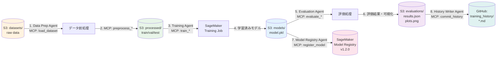
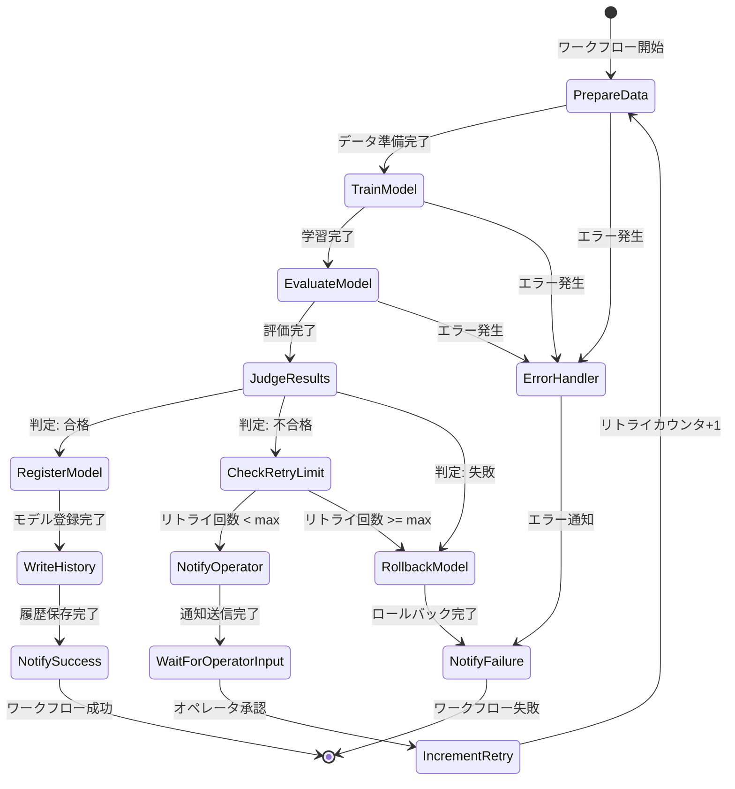

# 実装ガイド: 統合MLOps MCPシステム

**バージョン**: 1.0
**作成日**: 2025-12-30
**対象**: 開発者向け実装・運用ガイド

---

## 目次

1. [実装設計](#1-実装設計)
2. [MLOpsワークフロー](#2-mlopsワークフロー)
3. [統合MCPサーバー開発ガイド](#3-統合mcpサーバー開発ガイド)
4. [デプロイメント](#4-デプロイメント)
5. [運用ガイド](#5-運用ガイド)

---

## 1. 実装設計

### 1.1 概要

本セクションは、統合MLOps MCPサーバーの詳細な実装設計を定義します。[mcp_design.md](mcp_design.md)および[../specifications/system_specification.md](../specifications/system_specification.md)で定義されたアーキテクチャを実装レベルに落とし込みます。

### 1.2 実装範囲

**Phase 1（Week 1-6）**: コアMLOps Capability実装

- 統合サーバーの基盤構築
- Capability 1: Data Preparation
- Capability 2: ML Training
- Capability 3: ML Evaluation

**Phase 2（Week 7-12）**: 統合Capability実装

- Capability 4: GitHub Integration
- Capability 5: Model Registry
- Capability 6: Notification

**Phase 3（Week 13-14）**: E2Eテスト・最適化

### 1.3 技術スタック

| カテゴリ               | 技術            | バージョン |
| ---------------------- | --------------- | ---------- |
| **言語**               | Python          | 3.11+      |
| **MCPフレームワーク**  | mcp             | 1.0.0+     |
| **AWS SDK**            | boto3           | 1.34.0+    |
| **機械学習**           | scikit-learn    | 1.4.0+     |
|                        | xgboost         | 2.0.0+     |
|                        | tensorflow      | 2.15.0+    |
|                        | pytorch         | 2.1.0+     |
| **強化学習**           | ray[rllib]      | 2.9.0+     |
| **GitHub API**         | PyGithub        | 2.1.1+     |
| **通知**               | slack-sdk       | 3.26.0+    |
| **テスト**             | pytest          | 8.0.0+     |
|                        | pytest-asyncio  | 0.23.0+    |
|                        | pytest-cov      | 4.1.0+     |
| **リンター**           | ruff            | 0.1.0+     |
|                        | mypy            | 1.8.0+     |
| **コンテナ**           | Docker          | 24.0+      |

### 1.4 ディレクトリ構造詳細

```text
mcp_server/
├── __init__.py                         # パッケージ初期化
├── __main__.py                         # エントリーポイント
├── server.py                           # メインサーバー実装
├── config.py                           # 設定管理
├── router.py                           # ツールルーティング
│
├── capabilities/                       # 11個のCapability実装
│   ├── __init__.py
│   ├── base.py                        # 基底Capabilityクラス
│   │
│   ├── data_preparation/              # Capability 1
│   │   ├── __init__.py
│   │   ├── capability.py              # DataPreparationCapability
│   │   ├── schemas.py                 # Pydanticスキーマ定義
│   │   └── tools/
│   │       ├── __init__.py
│   │       ├── load_dataset.py
│   │       ├── validate_data.py
│   │       ├── preprocess_supervised.py
│   │       ├── preprocess_unsupervised.py
│   │       ├── preprocess_reinforcement.py
│   │       ├── feature_engineering.py
│   │       ├── split_dataset.py
│   │       └── save_processed_data.py
│   │
│   ├── ml_training/                   # Capability 2
│   │   ├── __init__.py
│   │   ├── capability.py              # MLTrainingCapability
│   │   ├── schemas.py
│   │   └── tools/
│   │       ├── __init__.py
│   │       ├── supervised/
│   │       │   ├── __init__.py
│   │       │   ├── random_forest.py
│   │       │   ├── xgboost.py
│   │       │   └── neural_network.py
│   │       ├── unsupervised/
│   │       │   ├── __init__.py
│   │       │   ├── kmeans.py
│   │       │   ├── dbscan.py
│   │       │   ├── pca.py
│   │       │   └── tsne.py
│   │       ├── reinforcement/
│   │       │   ├── __init__.py
│   │       │   ├── ppo.py
│   │       │   ├── dqn.py
│   │       │   └── a3c.py
│   │       ├── get_training_metrics.py
│   │       └── save_model.py
│   │
│   ├── ml_evaluation/                 # Capability 3
│   │   ├── __init__.py
│   │   ├── capability.py              # MLEvaluationCapability
│   │   ├── schemas.py
│   │   └── tools/
│   │       ├── __init__.py
│   │       ├── load_model.py
│   │       ├── evaluate_classifier.py
│   │       ├── evaluate_regressor.py
│   │       ├── evaluate_clustering.py
│   │       ├── evaluate_reinforcement.py
│   │       ├── compare_models.py
│   │       ├── generate_report.py
│   │       └── visualization.py
│   │
│   ├── github_integration/            # Capability 4
│   │   ├── __init__.py
│   │   ├── capability.py              # GitHubIntegrationCapability
│   │   ├── schemas.py
│   │   └── tools/
│   │       ├── __init__.py
│   │       ├── issue_management.py
│   │       ├── label_management.py
│   │       ├── repository_operations.py
│   │       ├── webhook_handler.py
│   │       └── parser.py
│   │
│   ├── model_registry/                # Capability 5
│   │   ├── __init__.py
│   │   ├── capability.py              # ModelRegistryCapability
│   │   ├── schemas.py
│   │   └── tools/
│   │       ├── __init__.py
│   │       ├── model_registration.py
│   │       ├── version_management.py
│   │       ├── status_management.py
│   │       ├── rollback.py
│   │       └── search.py
│   │
│   └── notification/                  # Capability 6
│       ├── __init__.py
│       ├── capability.py              # NotificationCapability
│       ├── schemas.py
│       └── tools/
│           ├── __init__.py
│           ├── slack_notifier.py
│           ├── email_notifier.py
│           ├── teams_notifier.py
│           ├── discord_notifier.py
│           └── template_manager.py
│
├── common/                            # 共通ユーティリティ
│   ├── __init__.py
│   ├── s3_utils.py                   # S3操作ヘルパー
│   ├── secrets.py                    # Secrets Manager統合
│   ├── logger.py                     # 構造化ロギング
│   ├── exceptions.py                 # カスタム例外
│   └── metrics.py                    # CloudWatch Metrics統合
│
├── Dockerfile                        # ECS Fargate用
├── Dockerfile.lambda                 # Lambda用（オプション）
├── requirements.txt                  # 依存関係
├── requirements-dev.txt              # 開発用依存関係
└── pyproject.toml                    # プロジェクト設定（ruff, mypy等）
```

### 1.5 コアコンポーネント実装

#### メインサーバー（server.py）

```python
"""統合MLOps MCPサーバーのメイン実装"""
import asyncio
from typing import Any

from mcp.server import Server
from mcp.types import Tool, TextContent, ImageContent, EmbeddedResource

from .config import Config
from .router import ToolRouter
from .capabilities import (
    DataPreparationCapability,
    MLTrainingCapability,
    MLEvaluationCapability,
    GitHubIntegrationCapability,
    ModelRegistryCapability,
    NotificationCapability,
)
from .common.logger import get_logger
from .common.exceptions import MCPServerError

logger = get_logger(__name__)


class UnifiedMLOpsMCPServer:
    """統合MLOps MCPサーバー"""

    def __init__(self, config: Config):
        self.config = config
        self.server = Server("unified-mlops-mcp-server")

        # Capabilityの初期化
        self.capabilities = {
            "data_preparation": DataPreparationCapability(config),
            "ml_training": MLTrainingCapability(config),
            "ml_evaluation": MLEvaluationCapability(config),
            "github_integration": GitHubIntegrationCapability(config),
            "model_registry": ModelRegistryCapability(config),
            "notification": NotificationCapability(config),
        }

        # ツールルーター初期化
        self.router = ToolRouter(self.capabilities)

        # MCPハンドラー登録
        self._register_handlers()

        logger.info("Unified MLOps MCP Server initialized")

    def _register_handlers(self):
        """MCPハンドラーを登録"""

        @self.server.list_tools()
        async def list_tools() -> list[Tool]:
            """全Capabilityのツール一覧を返す"""
            tools = []
            for capability in self.capabilities.values():
                tools.extend(capability.list_tools())
            logger.info(f"Listed {len(tools)} tools")
            return tools

        @self.server.call_tool()
        async def call_tool(name: str, arguments: dict[str, Any]) -> list[TextContent | ImageContent | EmbeddedResource]:
            """ツールを実行（適切なCapabilityにルーティング）"""
            try:
                logger.info(f"Tool call: {name}", extra={
                    "tool_name": name,
                    "arguments": self._mask_secrets(arguments),
                })

                # ツールルーターで適切なCapabilityに振り分け
                result = await self.router.route_tool_call(name, arguments)

                logger.info(f"Tool call succeeded: {name}", extra={
                    "tool_name": name,
                    "status": "success",
                })

                return result

            except Exception as e:
                logger.error(f"Tool call failed: {name}", extra={
                    "tool_name": name,
                    "error": str(e),
                    "status": "error",
                }, exc_info=True)
                raise MCPServerError(f"Tool execution failed: {str(e)}") from e

    def _mask_secrets(self, arguments: dict[str, Any]) -> dict[str, Any]:
        """機密情報をマスク"""
        masked = arguments.copy()
        secret_keys = {"token", "password", "api_key", "webhook_url"}

        for key in masked:
            if any(secret in key.lower() for secret in secret_keys):
                masked[key] = "***masked***"

        return masked

    async def run(self):
        """サーバーを起動"""
        from mcp.server.stdio import stdio_server

        logger.info("Starting Unified MLOps MCP Server")
        async with stdio_server() as (read_stream, write_stream):
            await self.server.run(
                read_stream,
                write_stream,
                self.server.create_initialization_options()
            )
```

#### ツールルーター（router.py）

```python
"""ツールルーティング機構"""
from typing import Any

from mcp.types import TextContent, ImageContent, EmbeddedResource

from .common.logger import get_logger
from .common.exceptions import ToolNotFoundError

logger = get_logger(__name__)


class ToolRouter:
    """ツールを適切なCapabilityにルーティング"""

    def __init__(self, capabilities: dict):
        self.capabilities = capabilities
        self._tool_mapping = self._build_tool_mapping()

    def _build_tool_mapping(self) -> dict[str, str]:
        """ツール名 → Capability名のマッピングを構築"""
        mapping = {}

        for capability_name, capability in self.capabilities.items():
            for tool in capability.list_tools():
                if tool.name in mapping:
                    raise ValueError(
                        f"Tool name collision: {tool.name} is defined in multiple capabilities"
                    )
                mapping[tool.name] = capability_name

        logger.info(f"Built tool mapping: {len(mapping)} tools")
        return mapping

    async def route_tool_call(
        self,
        tool_name: str,
        arguments: dict[str, Any]
    ) -> list[TextContent | ImageContent | EmbeddedResource]:
        """ツール呼び出しを適切なCapabilityにルーティング"""

        # ツール名からCapabilityを特定
        capability_name = self._tool_mapping.get(tool_name)

        if not capability_name:
            raise ToolNotFoundError(f"Tool not found: {tool_name}")

        # Capabilityを取得
        capability = self.capabilities[capability_name]

        # ツールを実行
        logger.debug(f"Routing {tool_name} to {capability_name}")
        return await capability.execute_tool(tool_name, arguments)
```

#### 設定管理（config.py）

```python
"""設定管理"""
import os
from dataclasses import dataclass
from typing import Optional


@dataclass
class Config:
    """統合MCPサーバーの設定"""

    # AWS設定
    aws_region: str
    s3_bucket: str

    # Secrets Manager プレフィックス
    secrets_prefix: str = "mlops/"

    # ログレベル
    log_level: str = "INFO"

    # CloudWatch Logs設定
    cloudwatch_log_group: Optional[str] = None
    cloudwatch_log_stream: Optional[str] = None

    # SageMaker設定
    sagemaker_role_arn: Optional[str] = None

    @classmethod
    def from_env(cls) -> "Config":
        """環境変数から設定を読み込む"""
        return cls(
            aws_region=os.environ.get("AWS_REGION", "us-east-1"),
            s3_bucket=os.environ["MLOPS_S3_BUCKET"],
            secrets_prefix=os.environ.get("MLOPS_SECRETS_PREFIX", "mlops/"),
            log_level=os.environ.get("LOG_LEVEL", "INFO"),
            cloudwatch_log_group=os.environ.get("CLOUDWATCH_LOG_GROUP"),
            cloudwatch_log_stream=os.environ.get("CLOUDWATCH_LOG_STREAM"),
            sagemaker_role_arn=os.environ.get("SAGEMAKER_ROLE_ARN"),
        )
```

#### 基底Capabilityクラス（capabilities/base.py）

```python
"""基底Capabilityクラス"""
from abc import ABC, abstractmethod
from typing import Any

from mcp.types import Tool, TextContent, ImageContent, EmbeddedResource

from ..config import Config
from ..common.logger import get_logger

logger = get_logger(__name__)


class BaseCapability(ABC):
    """すべてのCapabilityの基底クラス"""

    def __init__(self, config: Config):
        self.config = config
        self.logger = get_logger(self.__class__.__name__)

    @abstractmethod
    def list_tools(self) -> list[Tool]:
        """このCapabilityが提供するツール一覧を返す"""
        pass

    @abstractmethod
    async def execute_tool(
        self,
        tool_name: str,
        arguments: dict[str, Any]
    ) -> list[TextContent | ImageContent | EmbeddedResource]:
        """ツールを実行"""
        pass
```

### 1.6 共通ユーティリティ実装

#### S3操作（common/s3_utils.py）

```python
"""S3操作ユーティリティ"""
import io
import pandas as pd
import boto3
from botocore.exceptions import ClientError

from .logger import get_logger

logger = get_logger(__name__)


class S3Utils:
    """S3操作ヘルパー"""

    def __init__(self, config):
        self.config = config
        self.s3_client = boto3.client('s3', region_name=config.aws_region)

    async def read_dataframe(self, s3_uri: str) -> pd.DataFrame:
        """S3からDataFrameを読み込む"""
        bucket, key = self._parse_s3_uri(s3_uri)

        try:
            obj = self.s3_client.get_object(Bucket=bucket, Key=key)

            if key.endswith('.csv'):
                df = pd.read_csv(io.BytesIO(obj['Body'].read()))
            elif key.endswith('.parquet'):
                df = pd.read_parquet(io.BytesIO(obj['Body'].read()))
            else:
                raise ValueError(f"Unsupported file format: {key}")

            logger.info(f"Loaded dataframe from {s3_uri}: {df.shape}")
            return df

        except ClientError as e:
            logger.error(f"Failed to read from S3: {s3_uri}", exc_info=True)
            raise

    async def write_dataframe(self, df: pd.DataFrame, s3_uri: str):
        """DataFrameをS3に書き込む"""
        bucket, key = self._parse_s3_uri(s3_uri)

        try:
            buffer = io.BytesIO()

            if key.endswith('.csv'):
                df.to_csv(buffer, index=False)
            elif key.endswith('.parquet'):
                df.to_parquet(buffer, index=False)
            else:
                raise ValueError(f"Unsupported file format: {key}")

            buffer.seek(0)
            self.s3_client.put_object(
                Bucket=bucket,
                Key=key,
                Body=buffer.getvalue(),
                ServerSideEncryption='aws:kms'  # KMS暗号化
            )

            logger.info(f"Wrote dataframe to {s3_uri}: {df.shape}")

        except ClientError as e:
            logger.error(f"Failed to write to S3: {s3_uri}", exc_info=True)
            raise

    def _parse_s3_uri(self, s3_uri: str) -> tuple[str, str]:
        """S3 URIをbucketとkeyにパース"""
        if not s3_uri.startswith('s3://'):
            raise ValueError(f"Invalid S3 URI: {s3_uri}")

        parts = s3_uri[5:].split('/', 1)
        bucket = parts[0]
        key = parts[1] if len(parts) > 1 else ''

        return bucket, key
```

#### カスタム例外（common/exceptions.py）

```python
"""カスタム例外定義"""


class MCPServerError(Exception):
    """MCPサーバーの基底例外"""
    pass


class ToolNotFoundError(MCPServerError):
    """ツールが見つからない"""
    pass


class ToolExecutionError(MCPServerError):
    """ツール実行エラー"""
    pass


class S3Error(MCPServerError):
    """S3操作エラー"""
    pass


class SecretsManagerError(MCPServerError):
    """Secrets Manager操作エラー"""
    pass


class ValidationError(MCPServerError):
    """入力検証エラー"""
    pass
```

---

## 2. MLOpsワークフロー

### 2.1 ワークフロー概要

本システムは、GitHub Issueをトリガーとして、機械学習モデルの学習・評価・デプロイを自動化するMLOpsパイプラインです。統合MLOps MCPサーバーを活用し、エージェントベースで処理を実行します。

### 2.2 エンドツーエンドワークフロー図

```mermaid
graph TB
    Start([オペレータ]) -->|1. GitHub Issueを作成<br/>ラベル: mlops:train| Issue[GitHub Issue]

    Issue -->|2. Webhook| Detector[Issue Detector Agent]
    Detector -->|3. Issue解析<br/>パラメータ抽出| Parse{Issue本文<br/>パース}

    Parse -->|4. 有効なパラメータ| SF[Step Functions<br/>ワークフロー起動]
    Parse -->|無効| NotifyError[エラー通知]

    SF -->|5. データ準備| PrepAgent[Data Preparation Agent]
    PrepAgent -->|MCP呼び出し| MCP1[統合MCP Server<br/>Capability:<br/>Data Preparation]
    MCP1 -->|6. S3から<br/>データロード| S3_1[(S3: datasets/)]
    MCP1 -->|7. 前処理実行<br/>正規化・エンコーディング| Prep[前処理]
    Prep -->|8. 処理済みデータ保存| S3_2[(S3: processed/)]

    S3_2 -->|9. 学習開始| TrainAgent[Training Agent]
    TrainAgent -->|MCP呼び出し| MCP2[統合MCP Server<br/>Capability:<br/>ML Training]
    MCP2 -->|10. SageMaker<br/>Training Job起動| SageMaker[Amazon SageMaker<br/>Training Job]
    SageMaker -->|11. 学習完了<br/>モデル保存| S3_3[(S3: models/)]

    S3_3 -->|12. 評価開始| EvalAgent[Evaluation Agent]
    EvalAgent -->|MCP呼び出し| MCP3[統合MCP Server<br/>Capability:<br/>ML Evaluation]
    MCP3 -->|13. モデル評価<br/>メトリクス計算| Eval[評価処理]
    Eval -->|14. 評価結果保存| S3_4[(S3: evaluations/)]

    S3_4 -->|15. 判定| JudgeAgent[Judge Agent]
    JudgeAgent -->|16. 閾値比較| Decision{評価結果<br/>≥ 閾値?}

    Decision -->|Yes: 合格| RegistryAgent[Model Registry操作]
    RegistryAgent -->|MCP呼び出し| MCP5[統合MCP Server<br/>Capability:<br/>Model Registry]
    MCP5 -->|17. モデル登録| Registry[(SageMaker<br/>Model Registry)]

    Decision -->|No: 不合格| RetryCheck{再学習<br/>回数<br/>< max_retry?}
    RetryCheck -->|Yes| NotifyRetry[Notification Agent]
    NotifyRetry -->|MCP呼び出し| MCP6[統合MCP Server<br/>Capability:<br/>Notification]
    MCP6 -->|19. 再学習通知| Slack1[Slack/Email]
    Slack1 -->|20. オペレータ承認待ち| WaitApproval[承認待機]
    WaitApproval -->|21. 承認| PrepAgent

    RetryCheck -->|No: 超過| RollbackAgent[Rollback Agent]
    RollbackAgent -->|MCP呼び出し| MCP5_2[統合MCP Server<br/>Capability:<br/>Model Registry]
    MCP5_2 -->|22. 前バージョンに<br/>ロールバック| Registry

    Registry -->|23. 履歴保存| HistoryAgent[History Writer Agent]
    HistoryAgent -->|MCP呼び出し| MCP4[統合MCP Server<br/>Capability:<br/>GitHub Integration]
    MCP4 -->|24. 学習結果を<br/>Markdown作成| History[training_history/<br/>train-20251227-001.md]
    MCP4 -->|25. GitHubに<br/>コミット| GitHub[(GitHub Repository)]

    style MCP1 fill:#e1f5fe
    style MCP2 fill:#e1f5fe
    style MCP3 fill:#e1f5fe
    style MCP4 fill:#e1f5fe
    style MCP5 fill:#e1f5fe
    style MCP6 fill:#e1f5fe
    style Decision fill:#fff9c4
    style RetryCheck fill:#fff9c4
```



### 2.3 データフロー

#### S3バケット間のデータ移動



### 2.4 Step Functions ステートマシン

#### メインワークフロー（状態遷移図）



#### 各ステートの詳細

| ステート名                | タイプ       | 実行内容                               | タイムアウト | リトライ |
| ------------------------- | ------------ | -------------------------------------- | ------------ | -------- |
| **PrepareData**           | Task         | Data Preparation Agent実行             | 15分         | 3回      |
| **TrainModel**            | Task         | Training Agent実行（.sync統合）        | 60分         | 1回      |
| **EvaluateModel**         | Task         | Evaluation Agent実行                   | 15分         | 3回      |
| **JudgeResults**          | Task         | Judge Agent実行                        | 5分          | なし     |
| **CheckRetryLimit**       | Choice       | リトライ回数判定                       | -            | -        |
| **NotifyOperator**        | Task         | Notification Agent実行                 | 5分          | 3回      |
| **WaitForOperatorInput**  | Task (Token) | オペレータ承認待機                     | 24時間       | なし     |
| **IncrementRetry**        | Pass         | リトライカウンタ+1                     | -            | -        |
| **RegisterModel**         | Task         | Model Registry操作Agent実行            | 10分         | 3回      |
| **WriteHistory**          | Task         | History Writer Agent実行               | 5分          | 3回      |
| **NotifySuccess**         | Task         | Notification Agent実行                 | 5分          | 3回      |
| **RollbackModel**         | Task         | Rollback Agent実行                     | 10分         | 3回      |
| **NotifyFailure**         | Task         | Notification Agent実行                 | 5分          | 3回      |
| **ErrorHandler**          | Catch        | エラーハンドリング                     | -            | -        |

---

## 3. 統合MCPサーバー開発ガイド

### 3.1 統合MLOps MCP Server 概要

統合MLOps MCP Serverは、MLOpsパイプラインの全専門機能を**1つのMCPサーバー**として提供します。

MCPサーバーは、データ前処理・モデル学習・モデル評価などの機械学習専門機能を標準化されたプロトコルで提供します。

### 3.2 提供Capability（6個の機能群）

#### 1. Data Preparation

**責務**: データ前処理・特徴量エンジニアリング

**提供ツール**:

- `load_dataset` - S3からデータセットを読み込む
- `validate_data` - データのバリデーション
- `preprocess_supervised` - 教師あり学習用の前処理
- `preprocess_unsupervised` - 教師なし学習用の前処理
- `preprocess_reinforcement` - 強化学習用の前処理
- `split_dataset` - データセットの分割
- `feature_engineering` - 特徴量エンジニアリング
- `save_processed_data` - 処理済みデータをS3に保存

#### 2. ML Training

**責務**: 機械学習モデルの学習

**提供ツール**:

**教師あり学習**:

- `train_supervised_classifier` - 分類モデルの学習（Random Forest, XGBoost, Neural Network）
- `train_supervised_regressor` - 回帰モデルの学習（Linear Regression, XGBoost Regressor, Neural Network Regressor）

**教師なし学習**:

- `train_unsupervised_clustering` - クラスタリング（K-Means, DBSCAN, Autoencoder）
- `train_unsupervised_dimension_reduction` - 次元削減（PCA, t-SNE）

**強化学習**:

- `train_reinforcement` - 強化学習モデルの学習（PPO, DQN, A3C）

**共通**:

- `get_training_metrics` - 学習中のメトリクスを取得
- `save_model` - 学習済みモデルをS3に保存

#### 3. ML Evaluation

**責務**: モデルの評価・可視化

**提供ツール**:

- `load_model` - S3からモデルをロード
- `evaluate_classifier` - 分類モデルの評価
- `evaluate_regressor` - 回帰モデルの評価
- `evaluate_clustering` - クラスタリングモデルの評価
- `evaluate_reinforcement` - 強化学習モデルの評価
- `compare_models` - 複数モデルの比較
- `generate_evaluation_report` - 評価レポートの生成
- `save_evaluation_results` - 評価結果をS3に保存

#### 4. GitHub Integration

**責務**: GitHub連携機能の統合

**提供ツール**:

- Issue管理、ラベル管理、リポジトリ操作、Webhook処理

#### 5. Model Registry

**責務**: モデルバージョン管理・レジストリ操作

**提供ツール**:

- モデル登録、バージョン管理、ステータス管理、ロールバック、モデル検索

#### 6. Notification

**責務**: 通知チャネルの統合管理

**提供ツール**:

- GitHub通知、Slack通知、Email通知、Teams通知、Discord通知、通知テンプレート

### 3.3 ローカル開発

#### 前提条件

- Python 3.11以上
- MCP SDK (`pip install mcp`)

#### 統合MCPサーバーの起動

```bash
cd mcp_server && python -m mcp_server
```

または

```bash
python -m mcp_server
```

#### 統合MCPサーバーのテスト

```bash
# サーバー・ルーティングのテスト
pytest tests/mcp_server/test_server.py

# 各Capabilityのテスト
pytest tests/mcp_server/test_data_preparation.py
pytest tests/mcp_server/test_ml_training.py
pytest tests/mcp_server/test_ml_evaluation.py
pytest tests/mcp_server/test_github_integration.py
pytest tests/mcp_server/test_model_registry.py
pytest tests/mcp_server/test_notification.py

# 統合テスト
pytest tests/integration/test_agent_mcp_integration.py
```

### 3.4 MCPクライアント実装例

```python
# Lambda Agent側（MCP Client）
from mcp import ClientSession, StdioServerParameters
from mcp.client.stdio import stdio_client

async def call_mcp_tool():
    # 統合MCPサーバーを起動
    server_params = StdioServerParameters(
        command="python",
        args=["-m", "mcp_server"],  # 統合サーバー
        env={"AWS_REGION": "us-east-1"}
    )

    async with stdio_client(server_params) as (read, write):
        async with ClientSession(read, write) as session:
            await session.initialize()

            # Data Preparationツールを呼び出し
            result = await session.call_tool(
                "preprocess_supervised",
                arguments={
                    "dataset_s3_uri": "s3://mlops-bucket/datasets/train.csv",
                    "target_column": "label",
                    "task_type": "classification"
                }
            )

            # ML Trainingツールを呼び出し（同じセッションで）
            result2 = await session.call_tool(
                "train_supervised_classifier",
                arguments={
                    "algorithm": "random_forest",
                    "train_data_s3_uri": "s3://mlops-bucket/processed/train.csv",
                    "training_job_name": "rf-training-001"
                }
            )

            return result, result2
```

---

## 4. デプロイメント

### 4.1 ECS Fargate デプロイ（推奨）

統合MCPサーバーを1つのECS Fargateタスクとしてデプロイ

**推奨構成**:

- CPU: 2 vCPU
- Memory: 8GB
- Auto Scaling: 最小1タスク、最大5タスク

```bash
# Dockerイメージのビルド
cd mcp_server
docker build -t mlops-unified-mcp-server .

# ECRへのプッシュ
aws ecr get-login-password --region us-east-1 | docker login --username AWS --password-stdin <account-id>.dkr.ecr.us-east-1.amazonaws.com
docker tag mlops-unified-mcp-server:latest <account-id>.dkr.ecr.us-east-1.amazonaws.com/mlops-unified-mcp-server:latest
docker push <account-id>.dkr.ecr.us-east-1.amazonaws.com/mlops-unified-mcp-server:latest

# ECS Serviceのデプロイ（CDK経由）
cd cdk
cdk deploy UnifiedMCPServerStack
```

### 4.2 Lambda デプロイ（軽量処理・開発環境向け）

統合MCPサーバーを1つのLambda関数としてデプロイ

**推奨構成**:

- Memory: 4096MB - 10240MB
- Timeout: 15分
- Ephemeral storage: 10GB

```bash
# Lambda関数のパッケージング
cd mcp_server
zip -r function.zip .

# Lambdaへのデプロイ（CDK経由）
cd cdk
cdk deploy UnifiedMCPServerStack --context deployment-type=lambda
```

### 4.3 Dockerfile

```dockerfile
FROM python:3.11-slim

# 作業ディレクトリ
WORKDIR /app

# システム依存関係
RUN apt-get update && apt-get install -y \
    gcc \
    g++ \
    && rm -rf /var/lib/apt/lists/*

# Python依存関係
COPY requirements.txt .
RUN pip install --no-cache-dir -r requirements.txt

# アプリケーションコード
COPY mcp_server/ ./mcp_server/

# ヘルスチェック
HEALTHCHECK --interval=30s --timeout=3s --start-period=5s --retries=3 \
    CMD python -c "import sys; sys.exit(0)"

# エントリーポイント
ENTRYPOINT ["python", "-m", "mcp_server"]
```

### 4.4 requirements.txt

```txt
# MCPフレームワーク
mcp==1.0.0

# AWS SDK
boto3==1.34.0
botocore==1.34.0

# 機械学習
scikit-learn==1.4.0
xgboost==2.0.0
tensorflow==2.15.0
torch==2.1.0

# 強化学習
ray[rllib]==2.9.0

# データ処理
pandas==2.2.0
numpy==1.26.0
pyarrow==15.0.0

# GitHub API
PyGithub==2.1.1

# 通知
slack-sdk==3.26.0

# ユーティリティ
pydantic==2.5.0
python-dotenv==1.0.0
```

### 4.5 環境変数

```bash
# AWS設定
AWS_REGION=us-east-1
MLOPS_S3_BUCKET=mlops-data-bucket

# Secrets Manager
MLOPS_SECRETS_PREFIX=mlops/

# ログ設定
LOG_LEVEL=INFO
CLOUDWATCH_LOG_GROUP=/aws/mcp/unified-mlops-server
CLOUDWATCH_LOG_STREAM=production

# SageMaker
SAGEMAKER_ROLE_ARN=arn:aws:iam::123456789012:role/SageMakerExecutionRole
```

---

## 5. 運用ガイド

### 5.1 トラブルシューティング

#### サーバーが起動しない

```bash
# 依存関係の確認
pip install -r requirements.txt

# Python versionの確認
python --version  # 3.11以上が必要
```

#### ツールが見つからない

```bash
# サーバーのツール一覧を確認
python -m mcp_server --list-tools
```

#### メモリ不足エラー

ECS FargateまたはLambdaのメモリ設定を増やしてください:

- ECS: 8GB → 16GB
- Lambda: 4096MB → 10240MB

### 5.2 モニタリング

#### CloudWatch Logs ロググループ構成

```text
/aws/lambda/issue-detector-agent
/aws/lambda/data-preparation-agent
/aws/lambda/training-agent
/aws/lambda/evaluation-agent
/aws/lambda/judge-agent
/aws/lambda/notification-agent
/aws/lambda/rollback-agent
/aws/lambda/history-writer-agent
/aws/ecs/unified-mcp-server
/aws/sagemaker/TrainingJobs
/aws/states/mlops-workflow
```

#### 統合ログフォーマット（JSON）

```json
{
  "timestamp": "2025-12-27T10:30:00.123Z",
  "level": "INFO",
  "service": "training-agent",
  "execution_id": "exec-abc123",
  "issue_number": 123,
  "training_job_name": "train-20251227-001",
  "message": "Training job started successfully",
  "duration_ms": 1234,
  "status": "success"
}
```

### 5.3 統合アプローチのメリット

| 項目                 | 統合MCPサーバー（1個）           | 独立MCPサーバー（11個）              |
| -------------------- | -------------------------------- | ------------------------------------ |
| **運用の簡素さ**     | ✅ 1プロセスのみ                 | ❌ 11プロセス管理                    |
| **デプロイの簡素さ** | ✅ 1デプロイのみ                 | ❌ 11デプロイ管理                    |
| **リソース効率**     | ✅ 共有により効率的              | ❌ 各サーバーでオーバーヘッド        |
| **MCP接続数**        | ✅ 1接続のみ                     | ❌ 11接続必要                        |
| **Agent実装**        | ✅ 1つのクライアントで全機能     | ❌ 11個のクライアント必要            |
| **インフラコスト**   | ✅ 低い（リソース共有）          | ❌ 高い（11倍のオーバーヘッド）      |

---

## 6. 参考資料

- [システム仕様書](../specifications/system_specification.md)
- [MCP設計書](mcp_design.md)
- [REVIEW.md](REVIEW.md) - 設計レビューと意思決定記録
- [Model Context Protocol 仕様](https://spec.modelcontextprotocol.io/)

---

## 7. 変更履歴

| バージョン | 日付       | 変更内容                                                               | 作成者 |
| ---------- | ---------- | ---------------------------------------------------------------------- | ------ |
| 1.0        | 2025-12-30 | 実装設計、ワークフロー、MCP開発ガイドを統合し実装ガイドとして発行     | -      |
