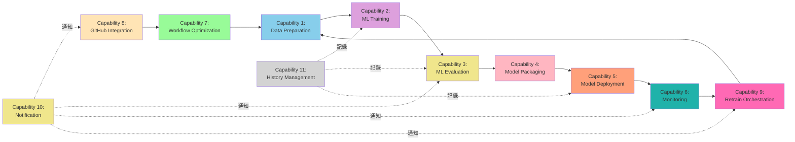
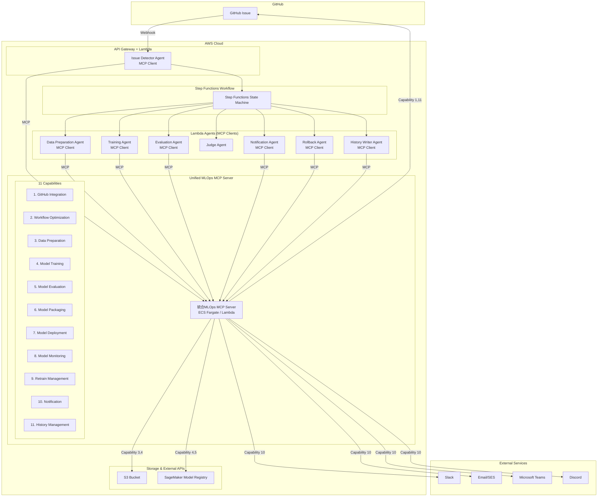
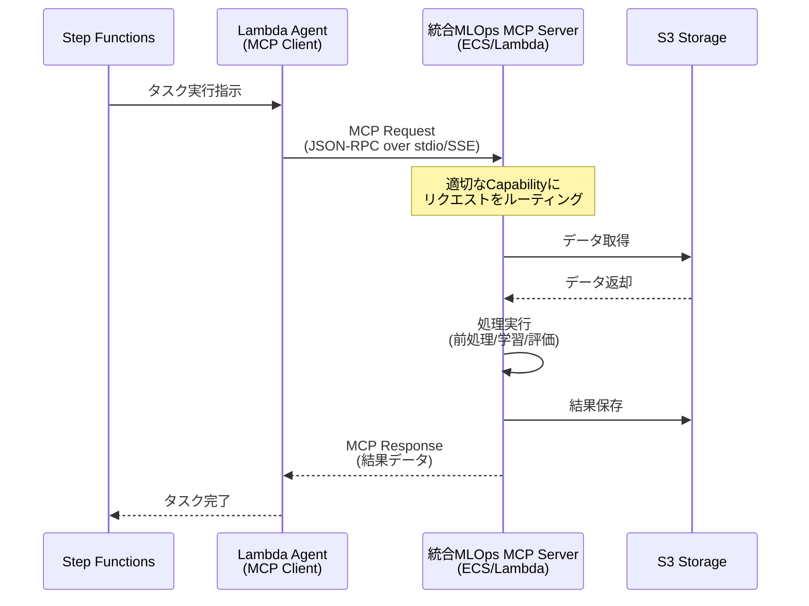
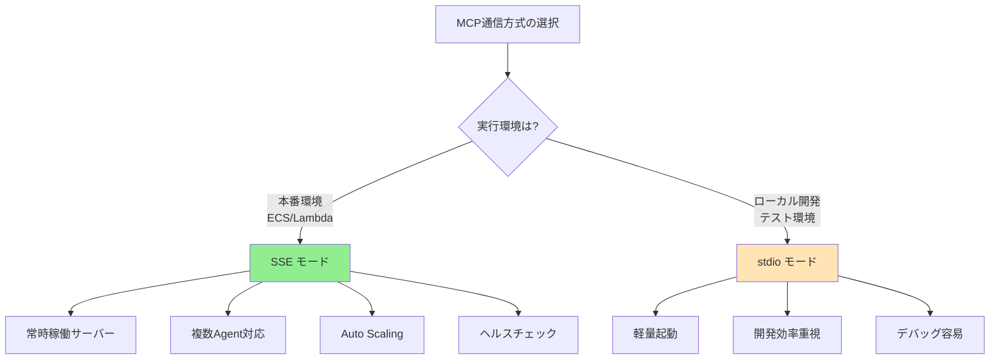
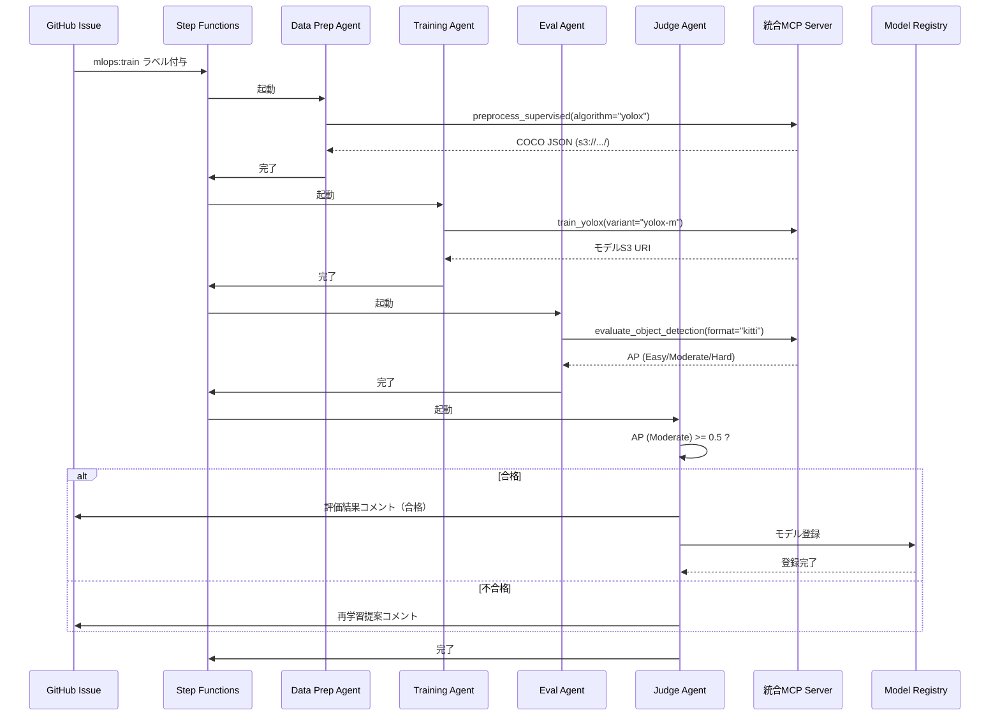

# MCP化設計書: MLOps専門機能のModel Context Protocol対応

**注**: 本ドキュメントで使用される技術用語・略語の定義は[用語集](../others/glossary.md)を参照してください。

---

## 1. MCP化の目的

### 1.1 現状の課題

現在の設計では、データ前処理・モデル学習・モデル評価などの専門機能がAWS Lambda/ECS Fargateに直接実装されており、以下の課題があります:

- **再利用性の欠如**: 各エージェントに機能が埋め込まれており、他プロジェクトで再利用できない
- **保守性の低下**: 新しいアルゴリズムや評価指標の追加時にLambda/ECSコードを修正する必要がある
- **テストの困難さ**: AWS環境依存のテストになり、ローカル開発が困難
- **ベンダーロックイン**: AWS特化の実装で、他クラウドへの移行が困難

### 1.2 MCP化のメリット

Model Context Protocol (MCP) として専門機能を実装することで:

- ✅ **再利用性向上**: 標準プロトコルに準拠し、他プロジェクトでも利用可能
- ✅ **保守性向上**: MCPサーバーとして独立しており、機能追加・変更が容易
- ✅ **テスト容易性**: ローカル環境で単体テスト可能
- ✅ **拡張性向上**: 新しいツール（アルゴリズム、評価指標）を容易に追加可能
- ✅ **ベンダーニュートラル**: クラウドプロバイダーに依存しない設計
- ✅ **標準化**: MCPという業界標準プロトコルに準拠

---

## 2. MCP化対象コンポーネント

### 2.1 統合MCPサーバーアプローチ

システムの主要機能を**1つの統合MLOps MCPサーバー**として実装します。各機能領域は独立した**capability（機能群）**として提供され、運用の簡素化とリソース効率を実現します。

#### 統合MLOps MCP Server

**責務**: MLOpsパイプラインの全専門機能を統合提供

**アーキテクチャ上のメリット**:

- ✅ **運用の簡素化**: 1つのサーバープロセスのみ管理
- ✅ **デプロイの簡素化**: 1つのコンテナ/Lambdaのみデプロイ
- ✅ **リソース効率**: メモリ・CPUを共有、オーバーヘッド削減
- ✅ **MCP接続の削減**: 1つのMCP接続で全ツールにアクセス可能
- ✅ **一貫性の向上**: バージョン管理・依存関係が統一
- ✅ **開発効率**: 共通ユーティリティ・設定の再利用

### 2.2 提供Capability（11個の機能群）

統合MCPサーバーは、以下の**11個のcapability**を提供します（各MCPエージェントと1対1対応）:

#### Capability 1: GitHub Integration

**対応エージェント**: Issue Detector Agent

**責務**: GitHub Issue検知・パース・ワークフロー起動

**提供ツール**:

- `detect_mlops_issue`: MLOps用Issueの検知
- `parse_issue_config`: Issue本文のYAML/JSON設定パース
- `validate_training_params`: 学習パラメータのバリデーション
- `start_workflow`: Step Functionsワークフローの起動

#### Capability 2: Workflow Optimization

**対応エージェント**: Workflow Optimizer Agent

**責務**: モデル特性分析・最適化提案・履歴ベース最適化

**提供ツール**:

- `analyze_model_characteristics`: モデル特性分析（データサイズ、アルゴリズム等）
- `generate_optimization_proposal`: 最適化提案生成
- `retrieve_similar_model_history`: 類似モデルの履歴取得
- `apply_optimizations`: 最適化の適用
- `track_optimization_history`: 最適化履歴の記録

#### Capability 3: Data Preparation

**対応エージェント**: Data Preparation Agent

**責務**: データ前処理・特徴量エンジニアリング

**提供ツール**:

- `load_dataset`: S3からデータセット読み込み
- `validate_data`: データバリデーション（欠損値、型チェック等）
- `preprocess_supervised`: 教師あり学習用前処理
- `preprocess_unsupervised`: 教師なし学習用前処理
- `preprocess_reinforcement`: 強化学習用前処理
- `feature_engineering`: 特徴量エンジニアリング
- `split_dataset`: データセット分割（train/validation/test）
- `apply_class_imbalance_handling`: クラス不均衡対策

#### Capability 4: Model Training

**対応エージェント**: Training Agent

**責務**: 機械学習モデルの学習・ハイパーパラメータ最適化

**提供ツール**:

- `create_training_job`: SageMaker学習ジョブ作成
- `train_supervised_classifier`: 教師あり学習（分類）
- `train_supervised_regressor`: 教師あり学習（回帰）
- `train_unsupervised_clustering`: 教師なし学習（クラスタリング）
- `train_unsupervised_dimensionality_reduction`: 次元削減
- `train_reinforcement`: 強化学習（PPO/DQN/A3C）
- `hyperparameter_optimization`: ハイパーパラメータ最適化（Grid/Random/Bayesian）
- `monitor_training_progress`: 学習進捗モニタリング
- `get_training_results`: 学習結果取得

#### Capability 5: Model Evaluation

**対応エージェント**: Evaluation Agent

**責務**: モデル評価・メトリクス計算・可視化・バイアス検出

**提供ツール**:

- `evaluate_classifier`: 分類モデル評価（Accuracy, Precision, Recall, F1, AUC-ROC）
- `evaluate_regressor`: 回帰モデル評価（RMSE, MAE, R², MAPE）
- `evaluate_clustering`: クラスタリング評価（Silhouette Score, Davies-Bouldin Index）
- `evaluate_reinforcement`: 強化学習評価（Episode Reward, Success Rate）
- `generate_confusion_matrix`: 混同行列生成
- `generate_roc_curve`: ROC曲線生成
- `calculate_shap_values`: SHAP値計算（モデル解釈性）
- `bias_check`: バイアス検出（SageMaker Clarify）
- `compare_models`: 複数モデル比較
- `create_evaluation_report`: 評価レポート生成

#### Capability 6: Model Packaging

**対応エージェント**: Packaging Agent

**責務**: モデルコンテナ化・ECR登録・最適化

**提供ツール**:

- `build_docker_image`: Dockerイメージビルド
- `push_to_ecr`: ECRへのプッシュ
- `create_model_package`: SageMakerモデルパッケージ作成
- `generate_api_spec`: 推論APIスペック生成
- `optimize_container`: コンテナ最適化（マルチステージビルド、ONNX変換等）

#### Capability 7: Model Deployment

**対応エージェント**: Deployment Agent

**責務**: モデルデプロイ・エンドポイント管理・トラフィック制御

**提供ツール**:

- `deploy_model_to_endpoint`: SageMakerエンドポイントへデプロイ
- `update_endpoint_traffic`: トラフィック配分更新（カナリアデプロイ）
- `configure_auto_scaling`: オートスケーリング設定
- `health_check_endpoint`: エンドポイントヘルスチェック
- `rollback_deployment`: デプロイメントロールバック

#### Capability 8: Model Monitoring

**対応エージェント**: Monitor Agent

**責務**: モデルパフォーマンス監視・ドリフト検出・アラート

**提供ツール**:

- `collect_system_metrics`: システムメトリクス収集（CPU/Memory/Latency）
- `collect_model_metrics`: モデルメトリクス収集（精度、予測分布等）
- `detect_data_drift`: データドリフト検出
- `detect_concept_drift`: コンセプトドリフト検出
- `trigger_cloudwatch_alarms`: CloudWatchアラーム発火
- `update_dashboard`: ダッシュボード更新

#### Capability 9: Retrain Management

**対応エージェント**: Retrain Agent

**責務**: 再学習トリガー判定・再学習ワークフロー起動

**提供ツール**:

- `check_retrain_triggers`: 再学習トリガー確認
- `evaluate_trigger_conditions`: トリガー条件評価（ドリフト閾値、スケジュール等）
- `create_retrain_issue`: 再学習Issue作成
- `start_retrain_workflow`: 再学習ワークフロー起動
- `schedule_periodic_retrain`: 定期再学習スケジュール設定

#### Capability 10: Notification

**対応エージェント**: Notification Agent

**責務**: 外部通知チャネル統合（Slack/Email/GitHub）

**提供ツール**:

- `send_slack_notification`: Slack通知送信
- `send_email_notification`: Email通知送信
- `send_github_notification`: GitHub Issue/PR通知
- `apply_notification_template`: 通知テンプレート適用

#### Capability 11: History Management

**対応エージェント**: History Writer Agent

**責務**: 学習履歴記録・GitHub履歴管理・バージョン追跡

**提供ツール**:

- `format_training_history`: 学習履歴フォーマット
- `commit_to_github`: GitHubリポジトリへコミット
- `post_issue_comment`: Issue進捗コメント投稿
- `track_version_history`: バージョン履歴追跡

### 2.3 Capability構成の設計方針

**11個のCapabilityに分割した理由**:

1. **責務の明確化**: 各Capabilityは単一の明確な責務を持つ（単一責任の原則）
2. **エージェントとの1対1対応**: MCP化された各エージェントに対応
3. **独立性**: 各Capabilityは独立してテスト・デプロイ・スケール可能
4. **保守性**: 機能追加・変更が該当Capabilityのみで完結

**統合MCPサーバーの主要メリット**:

- 🎯 **運用の簡素化**: 1つのサーバープロセス/コンテナのみ管理
- 🎯 **デプロイの簡素化**: 1つのデプロイパイプラインで完結
- 🎯 **リソース効率**: メモリ・CPUを共有、オーバーヘッド削減
- 🎯 **MCP接続の最小化**: 1つのMCP接続で全ツールにアクセス

**Capability依存関係図**:



**Capability間の依存関係**:

| Capability                  | 依存先                                              | 役割                 |
| --------------------------- | --------------------------------------------------- | -------------------- |
| 8. GitHub Integration       | 7. Workflow Optimization                            | エントリーポイント   |
| 7. Workflow Optimization    | 1. Data Preparation                                 | 最適化提案           |
| 1. Data Preparation         | 2. ML Training                                      | データ前処理         |
| 2. ML Training              | 3. ML Evaluation                                    | モデル学習           |
| 3. ML Evaluation            | 4. Model Packaging                                  | モデル評価           |
| 4. Model Packaging          | 5. Model Deployment                                 | モデルパッケージング |
| 5. Model Deployment         | 6. Monitoring                                       | デプロイメント       |
| 6. Monitoring               | 9. Retrain Orchestration                            | 監視                 |
| 9. Retrain Orchestration    | 1. Data Preparation（ループバック）                 | 再学習判定           |
| 10. Notification            | 全Capability（横断的）                              | 通知                 |
| 11. History Management      | 2, 3, 5（横断的）                                   | 履歴記録             |

### 2.4 将来の拡張候補

統合MCPサーバーには、将来的に以下のcapabilityを追加可能です:

**Capability 12: Experiment Tracking** 💡

- MLflow、Weights & Biases等の実験追跡ツール統合
- ハイパーパラメータチューニング履歴管理

**Capability 13: Data Versioning** 💡

- DVC、Delta Lake等のデータバージョニングツール統合
- データ系譜追跡、データ品質モニタリング

詳細は本ドキュメントのセクション15を参照

---

## 3. アーキテクチャ設計

### 3.1 システムアーキテクチャ（統合MLOps MCPサーバー）



### 3.2 エージェント・統合MCPサーバー連携フロー



---

## 4. 統合MCPサーバー詳細設計

### 4.1 Capability 1: Data Preparation

#### ツール定義例

**ツール名**: `preprocess_supervised`

**入力スキーマ**:

```json
{
  "name": "preprocess_supervised",
  "description": "教師あり学習用のデータ前処理を実行",
  "inputSchema": {
    "type": "object",
    "properties": {
      "dataset_s3_uri": {
        "type": "string",
        "description": "S3上の生データのURI"
      },
      "target_column": {
        "type": "string",
        "description": "目的変数のカラム名"
      },
      "task_type": {
        "type": "string",
        "enum": ["classification", "regression"],
        "description": "タスクタイプ"
      },
      "preprocessing_config": {
        "type": "object",
        "properties": {
          "normalize": {"type": "boolean"},
          "handle_missing": {"type": "string", "enum": ["drop", "mean", "median", "mode"]},
          "encode_categorical": {"type": "boolean"}
        }
      }
    },
    "required": ["dataset_s3_uri", "target_column", "task_type"]
  }
}
```

**出力例**:

```json
{
  "content": [
    {
      "type": "text",
      "text": "データ前処理が完了しました"
    },
    {
      "type": "resource",
      "resource": {
        "uri": "s3://mlops-bucket/processed/train-001/train.csv",
        "name": "処理済み学習データ",
        "mimeType": "text/csv"
      }
    }
  ],
  "metadata": {
    "num_samples": 10000,
    "num_features": 50,
    "target_distribution": {"class_0": 5000, "class_1": 5000}
  }
}
```

### 4.2 Capability 2: ML Training

#### ツール定義例 (ML Training)

**ツール名**: `train_supervised_classifier`

**入力スキーマ**:

```json
{
  "name": "train_supervised_classifier",
  "description": "教師あり学習（分類）モデルを学習",
  "inputSchema": {
    "type": "object",
    "properties": {
      "algorithm": {
        "type": "string",
        "enum": ["random_forest", "xgboost", "neural_network"],
        "description": "使用するアルゴリズム"
      },
      "train_data_s3_uri": {
        "type": "string",
        "description": "学習データのS3 URI"
      },
      "validation_data_s3_uri": {
        "type": "string",
        "description": "検証データのS3 URI"
      },
      "hyperparameters": {
        "type": "object",
        "description": "ハイパーパラメータ"
      },
      "training_job_name": {
        "type": "string",
        "description": "学習ジョブ名"
      }
    },
    "required": ["algorithm", "train_data_s3_uri", "training_job_name"]
  }
}
```

**出力例**:

```json
{
  "content": [
    {
      "type": "text",
      "text": "Random Forest分類モデルの学習が完了しました"
    },
    {
      "type": "resource",
      "resource": {
        "uri": "s3://mlops-bucket/models/train-001/model.pkl",
        "name": "学習済みモデル",
        "mimeType": "application/octet-stream"
      }
    }
  ],
  "metrics": {
    "train_accuracy": 0.92,
    "validation_accuracy": 0.87,
    "train_loss": 0.23,
    "validation_loss": 0.35,
    "training_time_seconds": 120.5
  }
}
```

### 4.3 Capability 3: ML Evaluation

#### ツール定義例 (ML Evaluation)

**ツール名**: `evaluate_classifier`

**入力スキーマ**:

```json
{
  "name": "evaluate_classifier",
  "description": "分類モデルを評価",
  "inputSchema": {
    "type": "object",
    "properties": {
      "model_s3_uri": {
        "type": "string",
        "description": "モデルのS3 URI"
      },
      "test_data_s3_uri": {
        "type": "string",
        "description": "テストデータのS3 URI"
      },
      "generate_plots": {
        "type": "boolean",
        "description": "プロットを生成するか",
        "default": true
      }
    },
    "required": ["model_s3_uri", "test_data_s3_uri"]
  }
}
```

**出力例**:

```json
{
  "content": [
    {
      "type": "text",
      "text": "モデル評価が完了しました"
    },
    {
      "type": "resource",
      "resource": {
        "uri": "s3://mlops-bucket/evaluations/train-001/confusion_matrix.png",
        "name": "混同行列",
        "mimeType": "image/png"
      }
    },
    {
      "type": "resource",
      "resource": {
        "uri": "s3://mlops-bucket/evaluations/train-001/roc_curve.png",
        "name": "ROC曲線",
        "mimeType": "image/png"
      }
    }
  ],
  "metrics": {
    "accuracy": 0.87,
    "precision": 0.85,
    "recall": 0.89,
    "f1_score": 0.87,
    "auc_roc": 0.91
  }
}
```

### 4.4 統合サーバーのツールルーティング

統合MCPサーバーは、受信したツール呼び出しを適切なcapabilityにルーティングします:

```python
# 統合MCPサーバーのツールルーティング例
class UnifiedMLOpsMCPServer:
    def __init__(self):
        self.capabilities = {
            'data_preparation': DataPreparationCapability(),
            'ml_training': MLTrainingCapability(),
            'ml_evaluation': MLEvaluationCapability(),
            'github_integration': GitHubIntegrationCapability(),
            'model_registry': ModelRegistryCapability(),
            'notification': NotificationCapability()
        }

    async def handle_tool_call(self, tool_name: str, arguments: dict):
        # ツール名からcapabilityを特定
        capability_name = self._get_capability_for_tool(tool_name)
        capability = self.capabilities[capability_name]

        # 該当capabilityでツールを実行
        return await capability.execute_tool(tool_name, arguments)
```

---

## 5. デプロイメント戦略

### 5.1 統合MCPサーバーのホスティング

#### オプション1: ECS Fargate（推奨）

統合MCPサーバーを1つのECS Fargateタスクとしてデプロイ

**メリット**:

- ✅ **運用の簡素化**: 1つのコンテナのみ管理
- ✅ **長時間実行可能**: Lambda 15分制限なし
- ✅ **依存関係の統一**: すべてのcapabilityが同じコンテナイメージを使用
- ✅ **リソース共有**: メモリ・CPUを効率的に共有

**デメリット**:

- ❌ 常時起動の場合、コスト高
- ❌ Lambdaより起動が遅い

**推奨構成**:

- CPU: 2 vCPU
- Memory: 8GB
- Auto Scaling: 最小1タスク、最大5タスク

#### オプション2: Lambda（軽量処理・開発環境向け）

統合MCPサーバーを1つのLambda関数としてデプロイ

**メリット**:

- ✅ **従量課金**: 使用時のみ課金
- ✅ **運用が簡単**: サーバーレス
- ✅ **コールドスタート最小化**: 1つの関数のみウォームアップ

**デメリット**:

- ❌ 15分のタイムアウト制限
- ❌ メモリ制限（最大10GB）
- ❌ 大規模データ処理には不向き

**推奨構成**:

- Memory: 4096MB - 10240MB
- Timeout: 15分
- Ephemeral storage: 10GB

#### オプション3: ハイブリッド（将来の最適化）

統合MCPサーバーで軽量処理を実行し、重い処理は別サービスへ委譲

- 統合MCP Server (Lambda): ツールルーティング、軽量処理
- SageMaker Training Job: 大規模学習（MCPサーバーがジョブを起動）
- SageMaker Processing Job: 大規模データ処理

### 5.2 MCP通信プロトコル

**推奨通信方式**: SSE (Server-Sent Events) モード

ECS Fargate/Lambda環境では、MCPサーバーをHTTP/SSEモードで運用することを推奨します。
stdio モードはローカルプロセス起動が前提であり、クラウド環境での常時稼働サーバーには適していません。

#### SSE通信（推奨: ECS/Lambda環境）

統合MCPサーバーをECS Service（常時起動）として運用し、HTTP/SSEで通信:

- Lambda AgentがHTTPリクエストでMCPサーバーにアクセス
- サーバー側はFastAPI等でHTTPエンドポイントを提供
- 複数のAgentから同時にアクセス可能
- スケーラブルで可用性が高い

**メリット**:

- ✅ ECS Fargateでの常時稼働に適している
- ✅ 複数のLambda Agentから同時アクセス可能
- ✅ Auto Scalingによる負荷分散が可能
- ✅ ヘルスチェック・モニタリングが容易

**SSE実装例**:

```python
# Lambda Agent側（MCP Client）
import os
import httpx

async def call_mcp_tool_via_sse(tool_name: str, arguments: dict) -> dict:
    """
    SSE経由でMCPツールを呼び出し
    """
    mcp_server_url = os.environ["MCP_SERVER_URL"]  # ECS Service URL

    async with httpx.AsyncClient(timeout=300.0) as client:
        response = await client.post(
            f"{mcp_server_url}/tools/{tool_name}",
            json=arguments,
            headers={"Content-Type": "application/json"}
        )
        response.raise_for_status()
        return response.json()

# 使用例
result = await call_mcp_tool_via_sse(
    tool_name="preprocess_supervised",
    arguments={
        "dataset_s3_uri": "s3://mlops-bucket/datasets/my-dataset-001/raw/",
        "target_column": "label",
        "task_type": "classification"
    }
)
```

```python
# MCP Server側（FastAPI実装例）
from fastapi import FastAPI, HTTPException
from pydantic import BaseModel
from typing import Dict, Any

app = FastAPI()

class ToolRequest(BaseModel):
    arguments: Dict[str, Any]

@app.post("/tools/{tool_name}")
async def execute_tool(tool_name: str, request: ToolRequest):
    """
    MCPツールを実行するHTTPエンドポイント
    """
    try:
        # Capability Routingでツールを実行
        capability_name = tool_name.split("_")[0]  # 例: "preprocess" → "data_preparation"
        capability = server.capabilities.get(capability_name)

        if not capability:
            raise HTTPException(status_code=404, detail=f"Capability not found: {capability_name}")

        result = await capability.execute_tool(tool_name, request.arguments)
        return {"status": "success", "result": result}

    except Exception as e:
        raise HTTPException(status_code=500, detail=str(e))

@app.get("/health")
async def health_check():
    """ヘルスチェックエンドポイント"""
    return {"status": "healthy"}
```

**通信方式選択フローチャート**:



**パフォーマンス比較**:

| 項目                     | stdio モード   | SSE モード       |
| ------------------------ | -------------- | ---------------- |
| 起動時間                 | 1-2秒/呼び出し | 常時稼働（0秒）  |
| 同時接続数               | 1（親プロセス） | 制限なし         |
| Auto Scaling対応         | ❌             | ✅               |
| ヘルスチェック           | ❌             | ✅（/health）    |
| 推奨環境                 | ローカル開発   | 本番（ECS/Lambda）|
| レイテンシ               | 低（プロセス内）| 中（HTTP）       |
| リソース効率             | 高（1プロセス）| 中（常駐）       |

#### stdio通信（参考: ローカル開発・テスト環境）

Lambda/ECS AgentがMCPサーバーを子プロセスとして起動:

**注**: stdio モードはローカル開発・テスト環境でのみ推奨。本番環境ではSSEモードを使用してください。

```python
# Lambda Agent側（MCP Client）
from mcp import ClientSession, StdioServerParameters
from mcp.client.stdio import stdio_client

async def call_mcp_tool():
    # 統合MCPサーバーを起動
    server_params = StdioServerParameters(
        command="python",
        args=["-m", "mcp_server"],  # 統合サーバー
        env={"AWS_REGION": "us-east-1"}
    )

    async with stdio_client(server_params) as (read, write):
        async with ClientSession(read, write) as session:
            await session.initialize()

            # Data Preparationツールを呼び出し
            result = await session.call_tool(
                "preprocess_supervised",
                arguments={
                    "dataset_s3_uri": "s3://...",
                    "target_column": "label",
                    "task_type": "classification"
                }
            )

            return result
```

**メリット**:

- ✅ 1つのサーバープロセスのみ起動
- ✅ すべてのcapabilityに同じセッションでアクセス可能
- ✅ 接続オーバーヘッド最小

---

## 6. 実装ディレクトリ構造（統合MCPサーバー対応）

```text
MLOps/
├── agents/                                # Lambda Agents（MCP Clients）
│   ├── issue_detector/                    # MCP Client実装
│   │   ├── handler.py                    # Lambda handler
│   │   └── mcp_client.py                 # 統合MCP Client
│   ├── data_preparation/                  # MCP Client実装
│   │   ├── handler.py
│   │   └── mcp_client.py                 # 統合MCP Client
│   ├── training/                          # MCP Client実装
│   │   ├── handler.py
│   │   └── mcp_client.py                 # 統合MCP Client
│   ├── evaluation/                        # MCP Client実装
│   │   ├── handler.py
│   │   └── mcp_client.py                 # 統合MCP Client
│   ├── judge/
│   ├── notification/                      # MCP Client実装
│   │   ├── handler.py
│   │   └── mcp_client.py                 # 統合MCP Client
│   ├── rollback/                          # MCP Client実装
│   │   ├── handler.py
│   │   └── mcp_client.py                 # 統合MCP Client
│   └── history_writer/                    # MCP Client実装
│       ├── handler.py
│       └── mcp_client.py                 # 統合MCP Client
│
├── mcp_server/                            # 統合MLOps MCP Server（単数形）
│   ├── __init__.py
│   ├── server.py                         # メインサーバー・ツールルーティング
│   ├── __main__.py                       # エントリーポイント
│   │
│   ├── capabilities/                      # 11個のCapability実装
│   │   ├── __init__.py
│   │   │
│   │   ├── data_preparation/             # Capability 1: Data Preparation
│   │   │   ├── __init__.py
│   │   │   ├── capability.py             # Capability定義
│   │   │   └── tools/
│   │   │       ├── __init__.py
│   │   │       ├── load_dataset.py
│   │   │       ├── validate_data.py
│   │   │       ├── preprocess_supervised.py
│   │   │       ├── preprocess_unsupervised.py
│   │   │       ├── preprocess_reinforcement.py
│   │   │       ├── feature_engineering.py
│   │   │       └── split_dataset.py
│   │   │
│   │   ├── ml_training/                  # Capability 2: ML Training
│   │   │   ├── __init__.py
│   │   │   ├── capability.py
│   │   │   └── tools/
│   │   │       ├── __init__.py
│   │   │       ├── supervised/
│   │   │       │   ├── random_forest.py
│   │   │       │   ├── xgboost.py
│   │   │       │   └── neural_network.py
│   │   │       ├── unsupervised/
│   │   │       │   ├── kmeans.py
│   │   │       │   ├── dbscan.py
│   │   │       │   ├── pca.py
│   │   │       │   └── tsne.py
│   │   │       └── reinforcement/
│   │   │           ├── ppo.py
│   │   │           ├── dqn.py
│   │   │           └── a3c.py
│   │   │
│   │   ├── ml_evaluation/                # Capability 3: ML Evaluation
│   │   │   ├── __init__.py
│   │   │   ├── capability.py
│   │   │   └── tools/
│   │   │       ├── __init__.py
│   │   │       ├── evaluate_classifier.py
│   │   │       ├── evaluate_regressor.py
│   │   │       ├── evaluate_clustering.py
│   │   │       ├── evaluate_reinforcement.py
│   │   │       ├── compare_models.py
│   │   │       └── visualization.py
│   │   │
│   │   ├── github_integration/           # Capability 4: GitHub Integration
│   │   │   ├── __init__.py
│   │   │   ├── capability.py
│   │   │   └── tools/
│   │   │       ├── __init__.py
│   │   │       ├── issue_management.py
│   │   │       ├── label_management.py
│   │   │       ├── repository_operations.py
│   │   │       ├── webhook_handler.py
│   │   │       └── parser.py
│   │   │
│   │   ├── model_registry/               # Capability 5: Model Registry
│   │   │   ├── __init__.py
│   │   │   ├── capability.py
│   │   │   └── tools/
│   │   │       ├── __init__.py
│   │   │       ├── model_registration.py
│   │   │       ├── version_management.py
│   │   │       ├── status_management.py
│   │   │       ├── rollback.py
│   │   │       └── search.py
│   │   │
│   │   └── notification/                 # Capability 6: Notification
│   │       ├── __init__.py
│   │       ├── capability.py
│   │       └── tools/
│   │           ├── __init__.py
│   │           ├── github_notifier.py
│   │           ├── slack_notifier.py
│   │           ├── email_notifier.py
│   │           ├── teams_notifier.py
│   │           ├── discord_notifier.py
│   │           └── template_manager.py
│   │
│   ├── common/                            # 共通ユーティリティ
│   │   ├── __init__.py
│   │   ├── s3_utils.py
│   │   ├── logger.py
│   │   └── config.py
│   │
│   ├── Dockerfile                        # ECS Fargate用Dockerイメージ
│   └── requirements.txt                  # すべてのcapabilityの依存関係を統合
│
├── tests/
│   ├── mcp_server/                       # 統合MCPサーバーのテスト
│   │   ├── test_server.py               # サーバー・ルーティングのテスト
│   │   ├── test_data_preparation.py
│   │   ├── test_ml_training.py
│   │   ├── test_ml_evaluation.py
│   │   ├── test_github_integration.py
│   │   ├── test_model_registry.py
│   │   └── test_notification.py
│   └── integration/
│       └── test_agent_mcp_integration.py
│
└── cdk/
    └── stacks/
        ├── unified_mcp_server_stack.py   # 統合MCPサーバー用ECS/Lambda
        └── ...
```

---

## 7. 実装戦略（統合MCPサーバー）

### 7.1 段階的実装アプローチ

統合MCPサーバーは**単一のサーバー**として実装しますが、capabilityごとに段階的に機能を追加します。

#### Phase 1: コアMLOps Capability実装（Week 1-6）

**Week 1-2: 統合サーバーの基盤 + Data Preparation Capability**

- [ ] 統合MCPサーバーの基本構造実装（`mcp_server/server.py`）
- [ ] ツールルーティング機構の実装
- [ ] Data Preparation Capabilityの実装
- [ ] Data Preparation AgentをMCPクライアント化
- [ ] 単体テスト・統合テスト
- [ ] デプロイ・動作確認

**Week 3-4: ML Training Capability追加**

- [ ] ML Training Capabilityの実装
- [ ] 統合サーバーへのツール登録
- [ ] Training AgentをMCPクライアント化
- [ ] 単体テスト・統合テスト
- [ ] デプロイ・動作確認

**Week 5-6: ML Evaluation Capability追加**

- [ ] ML Evaluation Capabilityの実装
- [ ] 統合サーバーへのツール登録
- [ ] Evaluation AgentをMCPクライアント化
- [ ] 単体テスト・統合テスト
- [ ] デプロイ・動作確認

#### Phase 2: 統合Capability実装（Week 7-12）

**Week 7-8: GitHub Integration Capability追加**

- [ ] GitHub Integration Capabilityの実装
- [ ] 統合サーバーへのツール登録
- [ ] Issue Detector AgentをMCPクライアント化
- [ ] History Writer AgentをMCPクライアント化
- [ ] 単体テスト・統合テスト
- [ ] デプロイ・動作確認

**Week 9-10: Model Registry Capability追加**

- [ ] Model Registry Capabilityの実装
- [ ] 統合サーバーへのツール登録
- [ ] Training AgentのMCPクライアントにモデル登録機能追加
- [ ] Rollback AgentをMCPクライアント化
- [ ] 単体テスト・統合テスト
- [ ] デプロイ・動作確認

**Week 11-12: Notification Capability追加**

- [ ] Notification Capabilityの実装
- [ ] 統合サーバーへのツール登録
- [ ] Notification AgentをMCPクライアント化
- [ ] Slack/Email/Teams/Discord通知機能の実装
- [ ] 通知テンプレート管理機能の実装
- [ ] 単体テスト・統合テスト
- [ ] デプロイ・動作確認

#### Phase 3: E2Eテスト・最適化（Week 13-14）

- [ ] E2Eテストの実施（全学習方式）
- [ ] 統合MCPサーバーの全Capabilityテスト
- [ ] パフォーマンステスト・最適化
- [ ] ドキュメント更新（README、アーキテクチャ設計書等）
- [ ] 運用手順書作成
- [ ] 実装完了報告書作成

### 7.2 後方互換性

実装期間中は以下の戦略を採用:

- 既存のLambda/ECS実装を残す
- 統合MCPサーバー版と既存実装を並行運用
- 環境変数で切り替え可能にする
- Capabilityごとに段階的に移行

---

## 8. メリット・デメリット評価

### 8.1 統合MCPサーバーのメリット

| 項目                     | 詳細                                                       |
| ------------------------ | ---------------------------------------------------------- |
| **再利用性**             | 統合MCPサーバーを他プロジェクトでも利用可能                |
| **保守性**               | 機能追加・変更が1つのサーバー内で完結                      |
| **テスト容易性**         | ローカル環境で全Capabilityを一度にテスト可能               |
| **拡張性**               | 新しいCapability・ツールを容易に追加                       |
| **標準化**               | MCPという業界標準プロトコルに準拠                          |
| **ベンダーニュートラル** | AWS以外のクラウドでも利用可能                              |
| **疎結合**               | Agent層とML処理層が完全に分離                              |
| **運用の簡素化** ⭐      | 1つのサーバープロセス/コンテナのみ管理                     |
| **デプロイの簡素化** ⭐  | 1つのデプロイパイプラインで完結                            |
| **リソース効率** ⭐      | メモリ・CPUを共有、オーバーヘッド削減                      |
| **MCP接続の最小化** ⭐   | 1つのMCP接続で全ツールにアクセス                           |
| **依存関係の統一** ⭐    | すべてのCapabilityで同じバージョンの依存ライブラリを使用   |

### 8.2 デメリット・課題

| 項目                    | 詳細                               | 対策                                   |
| ----------------------- | ---------------------------------- | -------------------------------------- |
| **レイテンシ増加**      | MCP通信のオーバーヘッド            | stdio通信で最小化、キャッシング活用    |
| **複雑性増加**          | MCPサーバーという新しい層が追加    | ドキュメント整備、開発者教育           |
| **初期開発コスト**      | 統合MCPサーバー実装に時間が必要    | 段階的移行、優先度付け                 |
| **運用コスト**          | ECS Fargateの運用コスト増          | Lambda代替、Auto Scaling活用           |
| **単一障害点** ⭐       | サーバーダウン時、全機能が停止     | ECS Auto Scaling、ヘルスチェック強化   |
| **依存関係の肥大化** ⭐ | すべてのCapabilityの依存関係を含む | マルチステージDockerビルドで最適化     |

### 8.3 11個の独立サーバーとの比較

| 項目                 | 統合MCPサーバー（1個）        | 独立MCPサーバー（11個）                |
| -------------------- | ----------------------------- | -------------------------------------- |
| **運用の簡素さ**     | ✅ 1プロセスのみ              | ❌ 11プロセス管理                      |
| **デプロイの簡素さ** | ✅ 1デプロイのみ              | ❌ 11デプロイ管理                      |
| **リソース効率**     | ✅ 共有により効率的           | ❌ 各サーバーでオーバーヘッド          |
| **MCP接続数**        | ✅ 1接続のみ                  | ❌ 11接続必要                          |
| **障害の隔離**       | ❌ 単一障害点                 | ✅ 1サーバーダウンでも他は動作         |
| **個別スケーリング** | ❌ 全Capability一緒にスケール | ✅ Capabilityごとに独立スケール        |
| **開発の独立性**     | △ 同じリポジトリで開発        | ✅ 完全に独立して開発可能              |

### 8.4 総合評価

**推奨**: 統合MCPサーバーアプローチを採用すべき

**理由**:

- ✅ 運用・デプロイの簡素化により、長期的な保守コストが大幅に削減
- ✅ リソース効率の向上により、インフラコストも削減
- ✅ 機械学習アルゴリズムは頻繁に追加・変更されるため、柔軟性が重要
- ✅ 標準プロトコル準拠により、将来的な技術選択肢が広がる
- ✅ 1つのMCP接続で全機能にアクセスでき、Agent側の実装が簡素化
- ⚠️ 単一障害点のリスクはあるが、ECS Auto Scalingとヘルスチェックで緩和可能
- ⚠️ 初期コストは高いが、中長期的にはROIが非常に高い

---

## 9. セキュリティ設計

### 9.1 認証・認可

#### MCP通信の認証

統合MCPサーバーへのアクセスは、以下の認証メカニズムで保護します:

**stdio通信モード（Lambda/ECS Agent → MCP Server）**:

- Lambda/ECS AgentがMCPサーバーを子プロセスとして起動するため、プロセス間通信は信頼される
- IAMロールベースの認証: Lambda/ECS AgentのIAMロールで権限を制御
- 環境変数による設定: AWS_REGION、AWS_PROFILE等

**SSE通信モード（HTTP経由）**:

- API Keyベースの認証: カスタムヘッダー `X-API-Key` で認証
- IAM認証: AWS SigV4署名による認証（API Gateway統合時）
- VPC内通信: プライベートサブネット内のみでアクセス可能

#### IAMロール設計

**Lambda Agent用IAMロール**:

```json
{
  "Version": "2012-10-17",
  "Statement": [
    {
      "Effect": "Allow",
      "Action": [
        "s3:GetObject",
        "s3:PutObject"
      ],
      "Resource": "arn:aws:s3:::mlops-bucket/*"
    },
    {
      "Effect": "Allow",
      "Action": [
        "sagemaker:CreateTrainingJob",
        "sagemaker:DescribeTrainingJob"
      ],
      "Resource": "*"
    },
    {
      "Effect": "Allow",
      "Action": [
        "secretsmanager:GetSecretValue"
      ],
      "Resource": "arn:aws:secretsmanager:*:*:secret:mlops/*"
    }
  ]
}
```

**MCP Server用IAMロール（ECS Task Role）**:

```json
{
  "Version": "2012-10-17",
  "Statement": [
    {
      "Effect": "Allow",
      "Action": [
        "s3:GetObject",
        "s3:PutObject",
        "s3:ListBucket"
      ],
      "Resource": [
        "arn:aws:s3:::mlops-bucket",
        "arn:aws:s3:::mlops-bucket/*"
      ]
    },
    {
      "Effect": "Allow",
      "Action": [
        "sagemaker:*"
      ],
      "Resource": "*",
      "Condition": {
        "StringEquals": {
          "aws:RequestedRegion": "us-east-1"
        }
      }
    },
    {
      "Effect": "Allow",
      "Action": [
        "secretsmanager:GetSecretValue"
      ],
      "Resource": "arn:aws:secretsmanager:*:*:secret:mlops/*"
    }
  ]
}
```

### 9.2 データ暗号化

#### 保存時の暗号化（Encryption at Rest）

**S3バケット暗号化**:

- **デフォルト暗号化**: SSE-S3（AES-256）を有効化
- **推奨**: SSE-KMS（AWS KMS管理キー）を使用し、キーローテーションを有効化
- **バケットポリシー**: 暗号化されていないオブジェクトのアップロードを拒否

```json
{
  "Version": "2012-10-17",
  "Statement": [
    {
      "Effect": "Deny",
      "Principal": "*",
      "Action": "s3:PutObject",
      "Resource": "arn:aws:s3:::mlops-bucket/*",
      "Condition": {
        "StringNotEquals": {
          "s3:x-amz-server-side-encryption": "aws:kms"
        }
      }
    }
  ]
}
```

**SageMaker Model Registry暗号化**:

- モデルアーティファクトはKMS暗号化されたS3に保存
- モデルメタデータは自動的にAWS管理キーで暗号化

#### 通信時の暗号化（Encryption in Transit）

**stdio通信**:

- ローカルプロセス間通信のため、TLSは不要
- ただし、Lambda/ECS Agent ↔ AWS SDK通信はHTTPS

**SSE/HTTP通信**:

- **必須**: TLS 1.2以上を使用
- Application Load Balancer（ALB）でTLS終端
- ALB → ECS TaskはVPC内HTTPSまたはHTTP（VPC内のため許容）

**AWS SDK通信**:

- すべてのAWS API呼び出しはHTTPS（TLS 1.2+）

### 9.3 シークレット管理

#### AWS Secrets Managerの使用

すべての機密情報はAWS Secrets Managerに保存:

**保存するシークレット**:

- `mlops/github-token`: GitHub Personal Access Token（Capaiblity 4用）
- `mlops/slack-webhook-url`: Slack Webhook URL（Capability 6用）
- `mlops/email-smtp-password`: Email SMTP認証情報（Capability 6用）
- `mlops/teams-webhook-url`: Microsoft Teams Webhook URL（Capability 6用）
- `mlops/discord-webhook-url`: Discord Webhook URL（Capability 6用）

**シークレット取得のベストプラクティス**:

```python
import boto3
import json
from functools import lru_cache

@lru_cache(maxsize=10)
def get_secret(secret_name: str) -> dict:
    """AWS Secrets Managerからシークレットを取得（キャッシュあり）"""
    client = boto3.client('secretsmanager')
    response = client.get_secret_value(SecretId=secret_name)
    return json.loads(response['SecretString'])

# 使用例
github_token = get_secret('mlops/github-token')['token']
```

**シークレットローテーション**:

- 推奨: 90日ごとにシークレットをローテーション
- Lambda関数を使用した自動ローテーション設定

### 9.4 ネットワークセキュリティ

#### VPC設計

**統合MCPサーバー（ECS Fargate）**:

- **配置**: プライベートサブネット
- **アウトバウンド**: NAT Gatewayまたはインターフェースエンドポイント経由
- **インバウンド**: Lambda/ECS Agentからのみアクセス可能（Security Group制限）

**Lambda Agent**:

- **配置**: VPC内プライベートサブネット（VPC Lambda）
- **アウトバウンド**: NAT Gatewayまたはインターフェースエンドポイント経由

**Security Group設定**:

```yaml
# MCP Server Security Group
MCPServerSG:
  Inbound:
    - Port: 8080 (SSEモードの場合のみ)
      Source: LambdaAgentSG
      Protocol: TCP
  Outbound:
    - Port: 443
      Destination: 0.0.0.0/0  # AWS APIs, GitHub API, Slack API等
      Protocol: TCP

# Lambda Agent Security Group
LambdaAgentSG:
  Outbound:
    - Port: 8080 (SSEモードの場合のみ)
      Destination: MCPServerSG
      Protocol: TCP
    - Port: 443
      Destination: 0.0.0.0/0  # AWS APIs
      Protocol: TCP
```

#### VPCエンドポイント

コスト削減とセキュリティ向上のため、以下のVPCエンドポイントを作成:

- **com.amazonaws.region.s3**: S3アクセス（Gateway Endpoint、無料）
- **com.amazonaws.region.secretsmanager**: Secrets Managerアクセス
- **com.amazonaws.region.sagemaker.api**: SageMaker APIアクセス
- **com.amazonaws.region.logs**: CloudWatch Logsアクセス

### 9.5 監査ログ

#### CloudTrailによる操作ログ記録

すべてのAWS API呼び出しをCloudTrailで記録:

- **対象**: S3、SageMaker、Secrets Manager、ECS等のAPI呼び出し
- **保存先**: S3バケット（KMS暗号化、90日保持）
- **ログ検証**: ログファイルの整合性検証を有効化

#### MCPツール呼び出しログ

すべてのMCPツール呼び出しをCloudWatch Logsに記録:

**ログフォーマット（JSON）**:

```json
{
  "timestamp": "2025-12-27T10:30:00.123Z",
  "level": "INFO",
  "capability": "ml_training",
  "tool_name": "train_supervised_classifier",
  "agent_id": "training-agent-001",
  "request_id": "req-abc123",
  "arguments": {
    "algorithm": "random_forest",
    "training_job_name": "train-20251227-001"
  },
  "duration_ms": 1234,
  "status": "success",
  "result_summary": "Training job started successfully"
}
```

**ログ保持期間**: 90日（NFR-006）

**機密情報のマスキング**:

- GitHub Token、Slack Webhook URL等の機密情報はログ出力時にマスキング
- 例: `"github_token": "ghp_***masked***"`

### 9.6 脆弱性管理

#### 依存ライブラリのスキャン

**CI/CDパイプラインでの自動スキャン**:

- **ツール**: Snyk、Dependabot、AWS Inspector
- **頻度**: プルリクエストごと、および毎日定期スキャン
- **対応**: Critical/High脆弱性は24時間以内に修正

**Dockerイメージスキャン**:

- **ツール**: Amazon ECR Image Scanning、Trivy
- **対象**: 統合MCPサーバーのDockerイメージ
- **頻度**: イメージプッシュ時、および毎日定期スキャン

#### セキュリティパッチ適用

**定期更新スケジュール**:

- **依存ライブラリ**: 月次で最新バージョンに更新
- **ベースイメージ**: 月次でセキュリティパッチ適用
- **緊急パッチ**: Critical脆弱性発見時は即座に対応

### 9.7 セキュリティチェックリスト

実装前・デプロイ前のチェックリスト:

**実装前**:

- [ ] IAMロールの最小権限原則（Least Privilege）を適用
- [ ] すべてのシークレットをAWS Secrets Managerに保存
- [ ] VPC内にリソースを配置（プライベートサブネット）
- [ ] Security Groupで必要最小限のポートのみ開放

**デプロイ前**:

- [ ] S3バケット暗号化（SSE-KMS）が有効
- [ ] CloudTrailが有効化されている
- [ ] VPCエンドポイントが設定されている
- [ ] 依存ライブラリの脆弱性スキャンに合格
- [ ] Dockerイメージの脆弱性スキャンに合格

**運用中**:

- [ ] CloudWatch Logsでツール呼び出しログを記録
- [ ] 定期的な脆弱性スキャン（日次）
- [ ] シークレットローテーション（90日ごと）
- [ ] セキュリティパッチ適用（月次）

---

## 10. 代替案との比較

### 10.1 Option A: 現状維持（Lambda/ECS直接実装）

**メリット**: 開発コスト低、シンプル
**デメリット**: 拡張性・保守性が低い
**推奨度**: ❌

### 10.2 Option B: 11個の独立MCPサーバー

**メリット**: 障害の隔離、個別スケーリング、開発の独立性
**デメリット**: 運用・デプロイの複雑化、リソースオーバーヘッド、11個のMCP接続が必要
**推奨度**: △（大規模チーム・高可用性要件がある場合）

### 10.3 Option C: 統合MCPサーバー（本提案）⭐

**メリット**: 運用の簡素化、デプロイの簡素化、リソース効率、1つのMCP接続のみ
**デメリット**: 単一障害点、初期開発コスト高
**推奨度**: ✅（推奨）

### 10.4 Option D: SageMaker Pipelines利用

**メリット**: AWSネイティブ、GUI管理可能
**デメリット**: ベンダーロックイン、柔軟性が低い
**推奨度**: △（AWS縛りOKなら選択肢）

### 10.5 Option E: Kubeflow Pipelines

**メリット**: ML特化、豊富な機能
**デメリット**: インフラ複雑、運用コスト高
**推奨度**: △（大規模組織向け）

---

## 11. 成功指標（KPI）

### 11.1 技術指標

| 指標                       | 目標値             | 測定方法           |
| -------------------------- | ------------------ | ------------------ |
| **コードカバレッジ**       | 80%以上            | pytest-cov         |
| **レイテンシ増加**         | 従来比+10%以内     | CloudWatch Metrics |
| **新アルゴリズム追加時間** | 4時間以内          | 実測               |
| **ローカルテスト成功率**   | 95%以上            | CI/CD統計          |

### 11.2 ビジネス指標

| 指標               | 目標値                  | 測定方法       |
| ------------------ | ----------------------- | -------------- |
| **開発速度向上**   | 新機能追加時間50%削減   | 開発チーム計測 |
| **再利用率**       | 3プロジェクト以上で利用 | 利用状況追跡   |
| **保守コスト削減** | 月次保守時間30%削減     | 保守ログ       |

---

## 12. リスク管理

### 12.1 リスク一覧

| リスク                          | 影響度 | 発生確率 | 対策                             |
| ------------------------------- | ------ | -------- | -------------------------------- |
| MCPサーバーのパフォーマンス問題 | 高     | 中       | 事前性能テスト、キャッシング実装 |
| 開発期間の遅延                  | 中     | 高       | 段階的移行、スコープ調整         |
| チーム学習コスト                | 中     | 中       | ドキュメント整備、ハンズオン実施 |
| ECS運用コスト増加               | 中     | 中       | Auto Scaling、Spot Instance活用  |

---

## 13. 次のステップ

### 13.1 即座に実施すべきこと

1. **POC実施**: Data Preparation MCPサーバーの小規模実装
2. **パフォーマンステスト**: レイテンシ・スループット測定
3. **コスト見積もり**: ECS Fargateのコスト試算

### 13.2 承認後のアクション

1. 詳細実装計画の策定
2. チーム体制の確立
3. Phase 1の実装開始

---

## 14. まとめ

### 14.1 統合MCPサーバーの設計概要

**1つの統合MLOps MCPサーバー** として実装し、**11個のCapability**を提供します（各MCPエージェントと1対1対応）:

1. **GitHub Integration** - Issue検知・パース・ワークフロー起動
2. **Workflow Optimization** - モデル特性分析・最適化提案
3. **Data Preparation** - データ前処理・特徴量エンジニアリング
4. **Model Training** - 機械学習モデルの学習
5. **Model Evaluation** - モデル評価・可視化・バイアス検出
6. **Model Packaging** - モデルコンテナ化・ECR登録
7. **Model Deployment** - モデルデプロイ・エンドポイント管理
8. **Model Monitoring** - パフォーマンス監視・ドリフト検出
9. **Retrain Management** - 再学習トリガー判定・ワークフロー起動
10. **Notification** - 外部通知チャネル統合
11. **History Management** - 学習履歴記録・GitHub履歴管理

**統合アプローチの主要メリット**:

- 🎯 **運用の簡素化**: 1つのサーバープロセス/コンテナのみ管理
- 🎯 **デプロイの簡素化**: 1つのデプロイパイプラインで完結
- 🎯 **リソース効率**: メモリ・CPUを共有、オーバーヘッド削減
- 🎯 **MCP接続の最小化**: 1つのMCP接続で全ツールにアクセス

この統合MCPサーバーで、**システムの約90%の機能をMCP化**します。

### 14.2 期待される効果

**従来の11個独立サーバーと比較した追加メリット**:

- ✅ **運用コスト削減**: 11プロセス→1プロセスにより、運用負荷が大幅に削減
- ✅ **デプロイ時間短縮**: 11デプロイ→1デプロイにより、リリースサイクル高速化
- ✅ **インフラコスト削減**: リソース共有により、メモリ・CPU使用量を最適化
- ✅ **Agent実装の簡素化**: 1つのMCP接続のみで全機能にアクセス可能

**共通メリット**:

- ✅ **再利用性**: 他のMLOpsプロジェクトでも利用可能
- ✅ **保守性**: 機能追加・変更が1つのサーバー内で完結
- ✅ **テスト容易性**: ローカル環境で全Capabilityを一度にテスト可能
- ✅ **拡張性**: 新しいCapability・ツールを容易に追加
- ✅ **標準化**: MCPという業界標準プロトコルに準拠
- ✅ **ベンダーニュートラル**: クラウドプロバイダーに非依存

### 14.3 追加で検討可能なCapability (Phase 3以降)

将来的に統合MCPサーバーに追加可能:

- **Experiment Tracking Capability** - 実験追跡ツール統合（MLflow、W&B等）
- **Data Versioning Capability** - データバージョニングツール統合（DVC、Delta Lake等）

詳細は本ドキュメントのセクション15を参照。

---

## 15. 拡張機能提案

### 15.1 将来的に追加可能なCapability

統合MCPサーバーには、将来的に以下のcapabilityを追加可能です:

#### Capability 12: Experiment Tracking 💡 オプション

**責務**: MLflow、Weights & Biases等の実験追跡ツール統合

**提供ツール**:

- `create_experiment` - 実験の作成
- `log_params` - パラメータのログ
- `log_metrics` - メトリクスのログ
- `log_artifacts` - アーティファクトのログ
- `search_experiments` - 実験検索
- `compare_experiments` - 実験比較
- `get_best_experiment` - 最良実験の取得

**メリット**:

- MLflow、Weights & Biases等の実験追跡ツールを標準インターフェースで利用
- 実験管理をMLOpsパイプラインから分離
- 複数の実験追跡ツールを並行利用可能

#### Capability 13: Data Versioning 💡 オプション

**責務**: DVC、Delta Lake等のデータバージョニングツール統合

**提供ツール**:

- `register_dataset` - データセット登録
- `version_dataset` - データセットのバージョン作成
- `get_dataset_version` - 特定バージョンの取得
- `list_dataset_versions` - バージョン一覧取得
- `track_data_lineage` - データ系譜の記録
- `get_data_lineage` - データ系譜の取得
- `validate_data_quality` - データ品質検証
- `calculate_data_statistics` - データ統計計算
- `detect_data_drift` - データドリフト検出

**メリット**:

- DVC、Delta Lake等のデータバージョニングツールを統一インターフェースで利用
- データセットの変更履歴を追跡
- データ品質メトリクスの自動計算

#### Capability 14: Simulator Integration 🚗 自動運転向け

**責務**: CARLA、AirSim、AWS RoboMaker等のシミュレータとの統合

**提供ツール**:

- `start_simulator` - シミュレータの起動
- `stop_simulator` - シミュレータの停止
- `configure_simulation` - シミュレーション設定（天候、時刻、交通量など）
- `spawn_vehicle` - 車両の配置
- `spawn_sensors` - センサー（カメラ、LiDAR、IMU）の配置
- `run_simulation` - シミュレーション実行
- `collect_sensor_data` - センサーデータの収集
- `export_simulation_data` - シミュレーションデータのエクスポート（KITTI形式など）
- `evaluate_in_simulation` - シミュレーション内でのモデル評価
- `load_scenario` - 事前定義されたシナリオのロード（高速道路、市街地、悪天候など）

**対応シミュレータ**:

- **CARLA**: オープンソースの自動運転シミュレータ（UE4ベース）
- **AirSim**: Microsoft製の自動運転・ドローンシミュレータ（UE4/Unityベース）
- **AWS RoboMaker**: AWSのロボット開発・シミュレーションプラットフォーム

**メリット**:

- 実車テスト前のシミュレーション評価が可能
- コストを抑えたデータ収集（危険シナリオ、稀なケース）
- CI/CDパイプラインでの自動シミュレーションテスト
- Sim-to-Realギャップの定量評価

**ユースケース**:

```yaml
# シミュレータでVADモデルを評価
tools:
  - start_simulator:
      simulator: "carla"
      map: "Town04"
      weather: "ClearNoon"
  - spawn_vehicle:
      blueprint: "vehicle.tesla.model3"
      position: [100, 200, 0.5]
  - spawn_sensors:
      vehicle_id: "ego_vehicle"
      sensors:
        - type: "rgb_camera"
          position: [2.0, 0, 1.5]
          fov: 90
        - type: "lidar"
          position: [0, 0, 2.0]
          channels: 64
  - load_scenario:
      scenario_id: "highway_dense_traffic"
  - run_simulation:
      duration: 300  # 5分間のシミュレーション
      model_endpoint: "vad-model-001"
  - evaluate_in_simulation:
      metrics: ["collision_rate", "route_completion", "comfort"]
```

#### Capability 15: Online Learning & Active Learning 🎯 自動運転向け

**責務**: オンライン学習、アクティブラーニング、継続的モデル更新

**提供ツール**:

**オンライン学習**:

- `initialize_online_learning` - オンライン学習の初期化
- `update_model_online` - ストリーミングデータでモデルを増分更新
- `evaluate_online_model` - オンライン更新されたモデルの評価
- `deploy_online_model` - オンライン更新されたモデルのデプロイ
- `rollback_online_update` - 更新のロールバック

**アクティブラーニング**:

- `calculate_uncertainty` - モデルの不確実性を計算（Entropy、BALD、Monte Carlo Dropoutなど）
- `select_samples_for_labeling` - ラベリング候補サンプルの選択
- `send_labeling_request` - ヒューマンラベラーへのラベリング依頼
- `receive_labels` - ラベル付きデータの受信
- `retrain_with_new_labels` - 新ラベルデータで再学習

**継続的学習（Continual Learning）**:

- `detect_distribution_shift` - データ分布のシフト検出
- `measure_forgetting` - 過去タスクの忘却度合い測定
- `apply_rehearsal` - リハーサル手法の適用（過去データの再学習）
- `elastic_weight_consolidation` - EWC（Elastic Weight Consolidation）の適用

**メリット**:

- 実運用環境でのモデル継続的改善
- ラベリングコストの削減（不確実性の高いサンプルのみラベリング）
- データドリフトへの自動対応
- Catastrophic Forgetting（破滅的忘却）の防止

**ユースケース**:

```yaml
# アクティブラーニングでラベリングコストを削減
tools:
  - calculate_uncertainty:
      model_endpoint: "yolox-kitti-001"
      dataset: "unlabeled_kitti_subset"
      method: "monte_carlo_dropout"
      iterations: 10
  - select_samples_for_labeling:
      top_k: 100  # 不確実性の高い上位100サンプル
      diversity_sampling: true  # 多様性を考慮
  - send_labeling_request:
      platform: "label_studio"
      task_type: "3d_bounding_box"
      samples: [list_of_image_ids]
  - receive_labels:
      task_id: "labeling_task_123"
  - retrain_with_new_labels:
      base_model: "yolox-kitti-001"
      new_data: "labeled_batch_001"
      epochs: 5
```

### 15.2 優先度付け

#### Phase 4: オプション機能（将来的に検討）

**Experiment Tracking Capability**:

- 理由: 高度な実験管理が必要な場合
- 工数: 2週間

**Data Versioning Capability**:

- 理由: データガバナンスが重要な場合
- 工数: 2週間

**Simulator Integration Capability (自動運転向け)**:

- 理由: 自動運転モデルのシミュレーション評価が必要な場合
- 工数: 3週間
- 前提: CARLA/AirSim環境の構築

**Online Learning & Active Learning Capability (自動運転向け)**:

- 理由: 実運用環境でのモデル継続的改善、ラベリングコスト削減が必要な場合
- 工数: 3週間

### 15.3 コスト・ベネフィット分析

| Capability                        | 開発工数 | 運用コスト増 | 再利用性 | 保守性向上 | 総合評価                |
| --------------------------------- | -------- | ------------ | -------- | ---------- | ----------------------- |
| Experiment Tracking               | 2週間    | 中           | ⭐⭐     | ⭐⭐       | 🔵 オプション           |
| Data Versioning                   | 2週間    | 中           | ⭐⭐     | ⭐⭐       | 🔵 オプション           |
| Simulator Integration             | 3週間    | 高           | ⭐⭐⭐   | ⭐⭐⭐     | 🟢 自動運転向け推奨     |
| Online Learning & Active Learning | 3週間    | 高           | ⭐⭐⭐   | ⭐⭐⭐     | 🟢 自動運転向け推奨     |

---

## 16. ユースケース: 自動運転向けコンピュータビジョン対応

本セクションでは、仕様書（[system_specification.md](../specifications/system_specification.md) セクション6）で定義された自動運転向けユースケースに対する、統合MCPサーバーの実装方針を示します。

### 16.1 対象ユースケース概要

自動運転領域では、以下3つの主要ユースケースをサポートします:

1. **YOLOX物体検出**: リアルタイム物体検出（2D Bounding Box）
2. **KITTI 3D物体検出**: 3D Bounding Boxを用いた高精度物体検出
3. **VAD (Vision-based Autonomous Driving)**: End-to-End自動運転制御

これらは既存の11 Capabilityで対応可能であり、新たなCapabilityの追加は不要です。

### 16.2 YOLOX対応設計

#### 16.2.1 使用するCapability

**Capability 3: Data Preparation**

YOLOXは独自のデータフォーマット（COCO JSON形式）を要求するため、KITTIフォーマットからの変換が必要です。

**ツール実装**: `preprocess_supervised`の拡張

```python
# mcp_server/capabilities/data_preparation/tools/preprocess_supervised.py

async def preprocess_supervised(
    dataset_s3_uri: str,
    target_column: str = None,
    task_type: str = "classification",
    algorithm: str = None,  # 新規パラメータ: アルゴリズム指定
    **kwargs
) -> dict:
    """
    教師あり学習用前処理

    algorithm="yolox"の場合:
    - KITTI形式のアノテーションをCOCO JSON形式に変換
    - クラスマッピング: KITTI 8クラス → COCO category_id
    - バウンディングボックス座標変換: KITTI (x1,y1,x2,y2) → COCO (x,y,w,h)
    """
    if algorithm == "yolox":
        # KITTI→YOLOX(COCO JSON)変換ロジック
        return await _kitti_to_yolox_format(dataset_s3_uri, **kwargs)
    else:
        # 既存の汎用的な前処理
        return await _generic_supervised_preprocessing(dataset_s3_uri, target_column, task_type)
```

**KITTIフォーマット変換詳細**:

```python
async def _kitti_to_yolox_format(dataset_s3_uri: str, **kwargs) -> dict:
    """
    KITTI Object Detection形式をYOLOX (COCO JSON)形式に変換

    KITTI形式:
    <class> <truncated> <occluded> <alpha> <x1> <y1> <x2> <y2> <h> <w> <l> <x> <y> <z> <ry>

    YOLOX (COCO JSON)形式:
    {
      "images": [{"id": 1, "file_name": "000000.png", "width": 1242, "height": 375}],
      "annotations": [{"image_id": 1, "category_id": 1, "bbox": [x, y, w, h]}],
      "categories": [{"id": 1, "name": "Car"}]
    }
    """
    # 実装省略
    pass
```

**Capability 2: ML Training**

YOLOXモデル学習をSageMakerで実行します。

**ツール実装**: `train_supervised`の拡張

```python
# mcp_server/capabilities/ml_training/tools/supervised/yolox.py

async def train_yolox(
    variant: str,  # yolox-nano/tiny/s/m/l/x
    dataset_s3_uri: str,
    hyperparameters: dict,
    **kwargs
) -> dict:
    """
    YOLOXモデルの学習

    SageMaker Training Job設定:
    - Container: YOLOX公式Dockerイメージ + 本システム拡張
    - Instance: ml.p3.2xlarge（GPU必須）
    - Framework: PyTorch 2.0+
    """
    # SageMaker Training Job起動
    training_job_name = f"yolox-{variant}-{timestamp}"

    estimator = PyTorch(
        entry_point="train_yolox.py",
        source_dir="s3://mlops-code/yolox/",
        image_uri=f"public.ecr.aws/yolox/{variant}:latest",
        instance_type="ml.p3.2xlarge",
        instance_count=1,
        hyperparameters={
            "variant": variant,
            "num_epochs": hyperparameters.get("num_epochs", 300),
            "batch_size": hyperparameters.get("batch_size", 64),
            "lr": hyperparameters.get("learning_rate", 0.001),
            "mosaic_prob": hyperparameters.get("mosaic_prob", 1.0),
        }
    )

    estimator.fit({"train": dataset_s3_uri})

    return {
        "training_job_name": training_job_name,
        "model_s3_uri": estimator.model_data
    }
```

**Capability 3: ML Evaluation**

KITTI Validation Setでの評価を実行します。

**ツール実装**: `evaluate_supervised`の拡張（KITTI AP計算対応）

```python
# mcp_server/capabilities/ml_evaluation/tools/supervised/object_detection.py

async def evaluate_object_detection(
    model_s3_uri: str,
    test_dataset_s3_uri: str,
    dataset_format: str = "coco",  # 新規: "coco", "kitti", "pascal_voc"
    **kwargs
) -> dict:
    """
    物体検出モデルの評価

    dataset_format="kitti"の場合:
    - KITTI公式評価基準に準拠
    - AP（Average Precision）を計算（Easy/Moderate/Hard別）
    - IoU閾値: 0.7（Car）、0.5（Pedestrian/Cyclist）
    """
    if dataset_format == "kitti":
        return await _evaluate_kitti_ap(model_s3_uri, test_dataset_s3_uri)
    else:
        return await _evaluate_coco_map(model_s3_uri, test_dataset_s3_uri)
```

#### 16.2.2 YOLOXワークフロー例

GitHub Issueから学習・評価までの流れ:

```yaml
# GitHub Issue本文
learning_type: supervised
algorithm: yolox
variant: yolox-m
dataset:
  name: kitti_object_detection
  s3_uri: s3://mlops-datasets/kitti/object/
hyperparameters:
  num_epochs: 300
  batch_size: 64
  learning_rate: 0.001
evaluation_threshold: 0.5  # AP (Moderate) 閾値
```

**Step Functions実行フロー**:

1. **Data Preparation Agent** → MCPツール `preprocess_supervised(algorithm="yolox")` 呼び出し
   - KITTI形式 → COCO JSON形式に変換
   - 出力: `s3://mlops-bucket/processed/yolox-kitti-001/train.json`

2. **Training Agent** → MCPツール `train_yolox(variant="yolox-m")` 呼び出し
   - SageMaker Training Jobでモデル学習
   - 出力: `s3://mlops-bucket/models/yolox-kitti-001/yolox_m_kitti.pth`

3. **Evaluation Agent** → MCPツール `evaluate_object_detection(dataset_format="kitti")` 呼び出し
   - KITTI Validation Setで評価
   - 出力: AP (Easy/Moderate/Hard)

4. **Judge Agent** → 評価結果を閾値判定
   - AP (Moderate) >= 0.5 → 合格 → Model Registry登録
   - AP (Moderate) < 0.5 → 不合格 → 再学習提案

**YOLOXワークフロー図**:



#### 16.2.3 パフォーマンス要件

YOLOXユースケースの処理時間目標:

| 処理ステップ               | 目標処理時間     | インスタンスタイプ | 備考                                   |
| -------------------------- | ---------------- | ------------------ | -------------------------------------- |
| データ前処理（KITTI→COCO） | 10分以内         | ml.m5.xlarge       | KITTI 7,481枚の変換                    |
| モデル学習（300epoch）     | 6時間以内        | ml.p3.2xlarge      | GPU: Tesla V100 1枚                    |
| 評価（Validation Set）     | 15分以内         | ml.p3.2xlarge      | 7,518枚の推論実行                      |
| モデルパッケージング       | 5分以内          | ml.m5.large        | ONNX変換含む                           |
| デプロイメント             | 15分以内         | -                  | Endpoint起動時間含む                   |
| 推論レイテンシ（P95）      | 50ms以内         | ml.g4dn.xlarge     | バッチサイズ1、TensorRT最適化          |

**コスト見積もり**:

| リソース                        | 月間使用量        | 単価（USD/時間） | 月額コスト（USD） |
| ------------------------------- | ----------------- | ---------------- | ----------------- |
| ml.p3.2xlarge（学習）           | 20時間/月         | $3.06            | $61.20            |
| ml.g4dn.xlarge（推論Endpoint）  | 730時間/月（常駐）| $0.526           | $383.98           |
| S3ストレージ（KITTI + モデル）  | 50GB              | $0.023/GB        | $1.15             |
| ECS Fargate（MCP Server）       | 730時間/月（常駐）| $0.04048/vCPU    | $29.55            |
| **合計**                        |                   |                  | **$475.88/月**    |

#### 16.2.4 エラーハンドリング戦略

YOLOXユースケースで想定されるエラーと対処法:

| エラーケース                          | 原因                                   | 対処法                                                  |
| ------------------------------------- | -------------------------------------- | ------------------------------------------------------- |
| KITTI→COCO JSON変換失敗               | アノテーション形式不正                 | バリデーション強化、エラーログ詳細化、変換スキップ     |
| GPU OOM (Out of Memory)               | バッチサイズ過大                       | バッチサイズ自動半減（64→32→16）、勾配蓄積             |
| AP閾値未達                            | ハイパーパラメータ不適切               | AutoML提案、過去履歴からの推奨値提示、再学習トリガー    |
| YOLOXコンテナイメージ取得失敗         | ECRアクセス権限不足                    | IAMロール修正、フォールバック用イメージ指定             |
| SageMaker Training Job失敗            | インスタンス制限、Spot中断             | リトライ（最大3回）、オンデマンドにフォールバック       |
| Validation Set評価エラー              | データ不整合、メモリ不足               | データ検証強化、評価バッチサイズ削減                    |
| Model Registry登録失敗                | 権限不足、ネットワークエラー           | IAMロール確認、リトライ（指数バックオフ）               |

**リトライ戦略**:

```python
async def train_yolox_with_retry(
    variant: str,
    dataset_s3_uri: str,
    hyperparameters: dict,
    max_retries: int = 3
) -> dict:
    """
    YOLOXモデル学習のリトライロジック
    """
    for attempt in range(max_retries):
        try:
            result = await train_yolox(variant, dataset_s3_uri, hyperparameters)
            return result

        except GPUOutOfMemoryError:
            # バッチサイズを半減してリトライ
            hyperparameters["batch_size"] = hyperparameters.get("batch_size", 64) // 2
            logger.warning(f"GPU OOM detected. Reducing batch_size to {hyperparameters['batch_size']}")

        except SpotInstanceInterruptionError:
            # オンデマンドにフォールバック
            hyperparameters["use_spot_instances"] = False
            logger.warning(f"Spot interruption. Falling back to on-demand instances")

        except Exception as e:
            if attempt == max_retries - 1:
                raise
            logger.error(f"Training failed (attempt {attempt + 1}/{max_retries}): {str(e)}")
            await asyncio.sleep(2 ** attempt)  # 指数バックオフ

    raise RuntimeError(f"Training failed after {max_retries} attempts")
```

### 16.3 KITTI 3D物体検出対応設計

#### 16.3.1 使用するCapability

**Capability 3: Data Preparation**

KITTI 3D Object Detectionは、2D画像に加えてLiDAR点群データ（.bin形式）を使用します。

**ツール拡張**: `preprocess_supervised`にLiDAR処理を追加

```python
async def preprocess_supervised(
    dataset_s3_uri: str,
    task_type: str = "classification",
    algorithm: str = None,
    use_lidar: bool = False,  # 新規パラメータ
    **kwargs
) -> dict:
    """
    use_lidar=Trueの場合:
    - LiDARバイナリファイル(.bin)の読み込み
    - カメラ-LiDAR座標系のキャリブレーション
    - 3D Bounding Boxのアノテーション抽出
    """
    if use_lidar:
        return await _preprocess_3d_object_detection(dataset_s3_uri, **kwargs)
    else:
        # 既存の2D処理
        return await _preprocess_supervised_2d(dataset_s3_uri, task_type, algorithm)
```

**データ構造**:

```text
s3://mlops-datasets/kitti/3d_object/
├── image_2/           # カメラ画像
│   └── 000000.png
├── velodyne/          # LiDAR点群データ
│   └── 000000.bin
├── label_2/           # 3Dアノテーション
│   └── 000000.txt
└── calib/             # キャリブレーション
    └── 000000.txt
```

**Capability 2: ML Training**

3D物体検出アルゴリズム（PointPillars、SECOND等）の学習をサポート。

**ツール実装**: `train_3d_object_detection`

```python
# mcp_server/capabilities/ml_training/tools/supervised/point_pillars.py

async def train_3d_object_detection(
    algorithm: str,  # "pointpillars", "second", "pv-rcnn"
    dataset_s3_uri: str,
    hyperparameters: dict,
    **kwargs
) -> dict:
    """
    3D物体検出モデルの学習

    対応アルゴリズム:
    - PointPillars: 高速（30Hz）、やや低精度
    - SECOND: バランス型
    - PV-RCNN: 高精度、やや低速
    """
    # 実装省略
    pass
```

#### 16.3.2 評価指標

KITTI 3D Object Detection Benchmarkの公式評価基準:

- **AP (Average Precision)**: 3D IoU閾値0.7（Car）、0.5（Pedestrian/Cyclist）
- **難易度別評価**: Easy / Moderate / Hard（遮蔽度・切れ具合・高さに基づく）
- **BEV AP (Bird's Eye View)**: 俯瞰視点でのAP

### 16.4 VAD (Vision-based Autonomous Driving)対応設計

#### 16.4.1 強化学習ワークフロー

VADはEnd-to-Endの自動運転制御であり、画像入力から車両制御出力（ステアリング角・加速度）を直接学習します。

**使用するCapability**:

**Capability 3: Data Preparation (強化学習用)**

**ツール実装**: `preprocess_reinforcement`の拡張

```python
# mcp_server/capabilities/data_preparation/tools/preprocess_reinforcement.py

async def preprocess_reinforcement(
    environment: str,  # "carla-v1", "airsim-v1"
    task: str = "lane_keeping",  # "lane_keeping", "obstacle_avoidance", "end_to_end"
    **kwargs
) -> dict:
    """
    強化学習用環境セットアップ

    environment="carla-v1"の場合:
    - CARLA Simulatorの起動（ECS Task）
    - シナリオ設定（天候、交通量、コース）
    - 観測空間設定（カメラ画像、車速、ステアリング角）
    - 行動空間設定（ステアリング角、スロットル、ブレーキ）
    - 報酬関数設定（車線中央維持、衝突回避、速度維持）
    """
    if environment.startswith("carla"):
        return await _setup_carla_environment(task, **kwargs)
    elif environment.startswith("airsim"):
        return await _setup_airsim_environment(task, **kwargs)
    else:
        raise ValueError(f"Unsupported environment: {environment}")
```

**Capability 2: ML Training (強化学習用)**

**ツール実装**: `train_reinforcement`の拡張（VAD対応）

```python
# mcp_server/capabilities/ml_training/tools/reinforcement/ppo.py

async def train_vad_with_ppo(
    environment: str,
    hyperparameters: dict,
    **kwargs
) -> dict:
    """
    VAD用PPO（Proximal Policy Optimization）学習

    SageMaker RL設定:
    - Container: RLライブラリ（Ray RLlib、Stable Baselines3）
    - Instance: ml.p3.2xlarge（GPU推奨）
    - Simulator: CARLA/AirSim（ECS別タスクとして起動）
    """
    # PPO学習ロジック
    training_job_name = f"vad-ppo-{environment}-{timestamp}"

    estimator = RLEstimator(
        entry_point="train_vad_ppo.py",
        source_dir="s3://mlops-code/vad/",
        toolkit=RLToolkit.RAY,
        framework=RLFramework.TENSORFLOW,
        instance_type="ml.p3.2xlarge",
        instance_count=1,
        hyperparameters={
            "rl.training.num_workers": hyperparameters.get("num_workers", 4),
            "rl.training.train_batch_size": hyperparameters.get("train_batch_size", 4000),
            "rl.training.gamma": hyperparameters.get("gamma", 0.99),
            "rl.training.lr": hyperparameters.get("learning_rate", 0.0003),
        },
        metric_definitions=[
            {"Name": "episode_reward_mean", "Regex": "episode_reward_mean: ([0-9\\.]+)"},
            {"Name": "success_rate", "Regex": "success_rate: ([0-9\\.]+)"},
        ]
    )

    estimator.fit()

    return {
        "training_job_name": training_job_name,
        "model_s3_uri": estimator.model_data,
        "final_episode_reward": "...",
        "success_rate": "..."
    }
```

**Capability 3: ML Evaluation (強化学習用)**

**ツール実装**: `evaluate_reinforcement`の拡張（VAD評価指標）

```python
# mcp_server/capabilities/ml_evaluation/tools/reinforcement/vad_evaluation.py

async def evaluate_vad_policy(
    model_s3_uri: str,
    environment: str,
    num_episodes: int = 100,
    **kwargs
) -> dict:
    """
    VADポリシーの評価

    評価指標:
    - Average Reward: エピソードごとの平均報酬
    - Success Rate: ゴール到達率
    - Collision Rate: 衝突発生率
    - Average Speed: 平均速度
    - Lane Keeping Accuracy: 車線中央維持精度
    - Smoothness: 操舵・加速度の滑らかさ
    """
    # シミュレータでポリシー評価
    results = await _run_vad_evaluation_episodes(
        model_s3_uri=model_s3_uri,
        environment=environment,
        num_episodes=num_episodes
    )

    return {
        "average_reward": results["rewards"].mean(),
        "success_rate": results["successes"].sum() / num_episodes,
        "collision_rate": results["collisions"].sum() / num_episodes,
        "average_speed": results["speeds"].mean(),
        "lane_keeping_accuracy": results["lane_deviations"].mean(),
        "smoothness_steering": results["steering_smoothness"],
        "smoothness_acceleration": results["acceleration_smoothness"],
    }
```

#### 16.4.2 VADワークフロー例

```yaml
# GitHub Issue本文（VAD学習）
learning_type: reinforcement
algorithm: ppo
environment: carla-v1
task: end_to_end_control
hyperparameters:
  gamma: 0.99
  learning_rate: 0.0003
  num_episodes: 1000
  train_batch_size: 4000
evaluation_threshold: 0.8  # Success Rate閾値
max_retry: 3
```

**Step Functions実行フロー**:

1. **Data Preparation Agent** → `preprocess_reinforcement(environment="carla-v1")`
   - CARLA Simulatorセットアップ（ECS Task起動）
   - 観測空間・行動空間・報酬関数設定

2. **Training Agent** → `train_vad_with_ppo(algorithm="ppo")`
   - SageMaker RL Training Jobでポリシー学習
   - シミュレータと連携しながら1000エピソード学習

3. **Evaluation Agent** → `evaluate_vad_policy(num_episodes=100)`
   - 100エピソードで評価
   - Success Rate、Collision Rate等を計算

4. **Judge Agent** → Success Rate >= 0.8 で合格判定

### 16.5 自動運転向けデータセット対応一覧

統合MCPサーバーがサポートする自動運転向けデータセット:

| データセット         | タスク                         | Capability        | 特記事項                                 |
| -------------------- | ------------------------------ | ----------------- | ---------------------------------------- |
| KITTI 2D Object      | 2D物体検出                     | Data Prep, Train  | COCO JSON変換対応                        |
| KITTI 3D Object      | 3D物体検出                     | Data Prep, Train  | LiDAR点群処理対応                        |
| BDD100K              | 2D物体検出、車線検出           | Data Prep, Train  | 多様な天候・時間帯データ                 |
| Waymo Open Dataset   | 3D物体検出、追跡               | Data Prep, Train  | 大規模データセット（1TB+）               |
| nuScenes             | 3D物体検出、追跡、セグメンテー | Data Prep, Train  | 全方位カメラ・LiDAR対応                  |
| CARLA Simulator      | 強化学習（VAD）                | Data Prep, RL     | シミュレータ連携（ECS Task起動）         |
| AirSim               | 強化学習（VAD）                | Data Prep, RL     | Unreal Engine/Unity対応                  |

### 16.6 自動運転向け機能要件のMCP実装マッピング

仕様書のFR-034～FR-039を、既存11 Capabilityでどう実現するかを示します:

| 機能要件ID | 要件名                           | 実装Capability          | 実装ツール                                   |
| ---------- | -------------------------------- | ----------------------- | -------------------------------------------- |
| FR-034     | KITTI データ前処理サポート       | Capability 3            | `preprocess_supervised(algorithm="yolox")`   |
| FR-035     | 時系列フレーム処理サポート       | Capability 3            | `preprocess_reinforcement` - 時系列入力対応  |
| FR-036     | 3D Bounding Box評価              | Capability 3 (Eval)     | `evaluate_object_detection(format="kitti")`  |
| FR-037     | 推論速度モニタリング             | Capability 6 (Monitor)  | `monitor_inference_latency`                  |
| FR-038     | LiDAR点群データ処理              | Capability 3 (Data)     | `preprocess_supervised(use_lidar=True)`      |
| FR-039     | シミュレータ環境連携（CARLA等）  | Capability 3 (Data)     | `preprocess_reinforcement(environment=...)`  |

**重要**: 既存の11 Capabilityで全要件を実現可能。新規Capabilityの追加は不要です。

### 16.7 将来的な拡張候補（自動運転向け）

仕様書のセクション15で提案された追加Capabilityは、Phase 4（将来検討）として位置づけます:

#### Phase 4: オプション機能

**Simulator Integration Capability**:

- **目的**: CARLA/AirSimの高度な制御
- **提供ツール**: `spawn_vehicle`、`set_weather`、`record_trajectory`等
- **工数**: 3週間
- **優先度**: 🟢 自動運転向け推奨

**Online Learning & Active Learning Capability**:

- **目的**: 実運用でのモデル継続改善、ラベリングコスト削減
- **提供ツール**: `calculate_uncertainty`、`select_samples_for_labeling`等
- **工数**: 3週間
- **優先度**: 🟢 自動運転向け推奨（ラベリングコスト削減に効果的）

これらは現状の11 Capabilityに含まれておらず、必要に応じて追加検討します。
