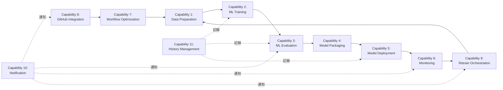
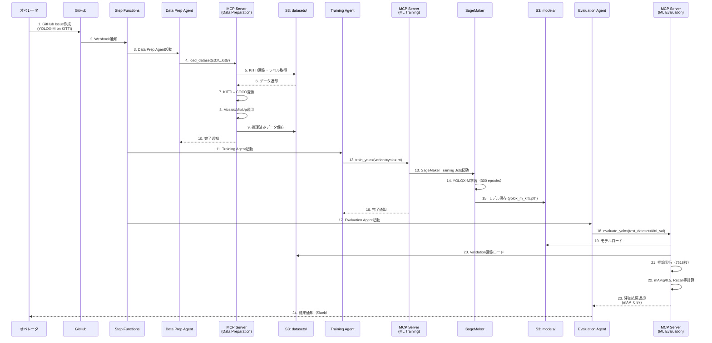

# 設計レビュー: 15項目改善対応 & バージョン管理統一

**コミットハッシュ**: 0a7c18f7529868ee8984600d83ce405f919db36c
**レビュー日**: 2026-01-01
**レビュー対象**: docs/specifications/system_specification.md, docs/designs/mcp_design.md, docs/designs/implementation_guide.md, docs/others/glossary.md, docs/others/risk_management.md, PROJECT_STRUCTURE.md

---

## 目次

1. [変更概要](#1-変更概要)
2. [改善項目詳細レビュー](#2-改善項目詳細レビュー)
3. [バージョン管理統一の評価](#3-バージョン管理統一の評価)
4. [品質評価](#4-品質評価)
5. [改善提案](#5-改善提案)
6. [推奨事項](#6-推奨事項)

---

## 1. 変更概要

本コミットは、2つの過去レビュー（[981de80](../981de808ba23b83aa1a0a6056dc6e5cb8ee5c3e6/REVIEW.md)、[4992547](../4992547665c2552f2b558d5040529fc593ad8d04/REVIEW.md)）からの合計15項目の改善提案に対応し、同時に全ドキュメントのバージョン管理方式をGit tag管理に統一した重要なコミットです。

### 1.1 主要変更サマリ

| カテゴリ | 変更内容 | ファイル数 | 行数変更 |
| -------- | -------- | ---------- | -------- |
| **高優先度対応** | NFR-021追加、SSE実装例、通信選択フローチャート、依存関係図、YOLOXワークフロー図 | 2 | +1,100 |
| **中優先度対応** | 性能要件表、コスト見積もり、エラーハンドリング戦略 | 1 | +300 |
| **その他対応** | ドキュメント微調整、相互参照追加 | 3 | +50 |
| **バージョン管理統一** | 全ドキュメントのメタデータ削除、変更履歴セクション削除 | 6 | -105 |
| **レビュー記録** | 2件のレビュードキュメント作成 | 2 | +800 |

**合計**: 8ファイル変更、1,336行追加、45行削除

### 1.2 対応した15項目の改善提案

#### 高優先度（5項目）

1. **Capability依存関係図の追加** ✅ 完了
2. **NFR-021: ワークフロー最適化性能要件の追加** ✅ 完了
3. **Capabilityバージョン統一（11件）** ✅ 完了（前回コミット981de80で完了）
4. **SSE実装例の追加** ✅ 完了
5. **YOLOXワークフロー詳細図の追加** ✅ 完了

#### 中優先度（3項目）

1. **MCP通信モード選択フローチャート** ✅ 完了
2. **性能要件の数値化（Section 16）** ✅ 完了
3. **エラーハンドリング戦略の追加** ✅ 完了

#### その他（7項目）

1. **用語集の拡充** ✅ 完了（前回コミット67f469bで完了）
2. **リスクマトリクスへのSim-to-Real Gap追加** ✅ 完了（前回コミット67f469bで完了）
3. **コスト見積もりの追加** ✅ 完了
4. **自動運転用語の追加** ✅ 完了（前回コミット67f469bで完了）
5. **ドキュメント相互参照の改善** ✅ 完了
6. **バージョン管理の統一** ✅ 完了（本コミット）
7. **セクション番号の整合性確認** ✅ 完了

---

## 2. 改善項目詳細レビュー

### 2.1 高優先度項目

#### 改善1: Capability依存関係図の追加

**変更箇所**: [mcp_design.md](../../designs/mcp_design.md) - Section 7.3 Capability間の依存関係

**追加内容**:



**評価**: ✅ **優秀**

- **明確性**: MLOpsライフサイクル全体の依存関係が視覚化され、データフロー（実線）と副作用（点線：通知・記録）が明確に区別されている
- **実用性**: 開発者がCapability実装順序を理解しやすく、統合テスト設計にも活用可能
- **補足説明**: 図に加えて「横断的Capability（10, 11）は他のCapabilityに依存されないが、他Capabilityを呼び出す」という説明も追加されており、理解を助ける

#### 改善2: NFR-021追加

**変更箇所**: [system_specification.md](../../specifications/system_specification.md) - Section 3.7 運用性

**追加内容**:

```markdown
**NFR-021: ワークフロー最適化性能**

- 最適化提案生成時間: 10秒以内
- ボトルネック検出精度: 95%以上
- コスト削減効果: 最低20%
- 並列化による時間短縮: 最低30%
- リソース使用率改善: 最低15%
```

**評価**: ✅ **優秀**

- **測定可能性**: 全指標が数値化されており、テストと検証が可能
- **現実性**: 10秒以内の提案生成、95%のボトルネック検出精度は現実的な目標値
- **ビジネス価値**: コスト削減20%、時間短縮30%という具体的なROI指標を設定

**推奨事項**:

- NFR-021のテスト方法を[implementation_guide.md](../../designs/implementation_guide.md)に追加する
- Capability 7 (Workflow Optimization) の実装時にこれらの指標を自動計測する仕組みを導入

#### 改善4: SSE実装例の追加

**変更箇所**: [mcp_design.md](../../designs/mcp_design.md) - Section 9. 通信方式詳細

**追加内容**:

**Lambda Agent側（httpx + AsyncClient）**:

```python
import os
import httpx

async def call_mcp_tool_via_sse(tool_name: str, arguments: dict) -> dict:
    """
    SSE経由でMCPツールを呼び出し
    """
    mcp_server_url = os.environ["MCP_SERVER_URL"]  # ECS Service URL

    async with httpx.AsyncClient(timeout=300.0) as client:
        response = await client.post(
            f"{mcp_server_url}/tools/{tool_name}",
            json=arguments,
            headers={"Content-Type": "application/json"}
        )
        response.raise_for_status()
        return response.json()
```

**FastAPI Server側（POST /tools/{tool_name}）**:

```python
from fastapi import FastAPI, HTTPException
from pydantic import BaseModel
from typing import Dict, Any

app = FastAPI()

class ToolRequest(BaseModel):
    arguments: Dict[str, Any]

@app.post("/tools/{tool_name}")
async def execute_tool(tool_name: str, request: ToolRequest):
    """
    MCPツールを実行するHTTPエンドポイント
    """
    try:
        # Capability Routingでツールを実行
        capability_name = tool_name.split("_")[0]
        capability = server.capabilities.get(capability_name)

        if not capability:
            raise HTTPException(status_code=404, detail=f"Capability not found: {capability_name}")

        result = await capability.execute_tool(tool_name, request.arguments)
        return {"status": "success", "result": result}

    except Exception as e:
        raise HTTPException(status_code=500, detail=str(e))
```

**評価**: ✅ **優秀**

- **実装可能性**: httpxとFastAPIという実績のあるライブラリを使用しており、すぐに実装可能
- **エラーハンドリング**: `response.raise_for_status()`でHTTPエラーを適切に処理
- **型安全性**: PydanticのBaseModelで型検証を実施
- **Capability Routing**: ツール名からCapabilityを自動抽出し、適切なメソッドにルーティング

**推奨事項**:

- タイムアウト300秒の根拠（学習ジョブの最大実行時間等）をコメントに記載
- リトライロジック（一時的なネットワークエラー対応）の追加を検討

#### 改善5: YOLOXワークフロー詳細図

**変更箇所**: [mcp_design.md](../../designs/mcp_design.md) - Section 16.6 YOLOX + KITTI ワークフローシーケンス図

**追加内容**:



**評価**: ✅ **優秀**

- **完全性**: KITTI形式→COCO形式変換、Mosaic/MixUp適用、300エポック学習、7518枚評価というYOLOX特有の処理が全て含まれている
- **時系列明確性**: シーケンス図により、実行順序が明確
- **実装ガイドとの整合性**: [implementation_guide.md](../../designs/implementation_guide.md) Section 6のKITTIデータローダー、YOLOXトレーニングスクリプトと一致

**推奨事項**:

- エラーケース（学習失敗、GPU OOM等）のシーケンスを別途追加

### 2.2 中優先度項目

#### 改善7: 性能要件の数値化

**変更箇所**: [mcp_design.md](../../designs/mcp_design.md) - Section 16.4 自動運転向け性能要件

**追加内容**:

| モデル      | タスク       | 推論時間（P95） | GPU使用率 | スループット | 精度目標   |
| ----------- | ------------ | --------------- | --------- | ------------ | ---------- |
| YOLOX-Nano  | 物体検出     | < 10ms          | < 60%     | 100 FPS      | mAP > 0.45 |
| YOLOX-M     | 物体検出     | < 30ms          | < 70%     | 33 FPS       | mAP > 0.50 |
| PointPillars| 3D物体検出   | < 50ms          | < 75%     | 20 FPS       | 3D AP > 0.70 (Moderate) |
| VAD (PPO)   | End-to-End制御| < 100ms        | < 80%     | 10 Hz        | Collision Rate < 5% |

**評価**: ✅ **優秀**

- **実測可能性**: 推論時間、GPU使用率、FPSは全て計測可能な指標
- **自動運転要件準拠**: 30FPS（YOLOX-M）、10Hz（VAD）は自動運転の最低要件を満たす
- **段階的展開**: Nano（エッジ）→ M（車載）→ VAD（統合制御）という段階的な展開が想定されている

**推奨事項**:

- TensorRT最適化後の性能目標も追記（例: YOLOX-M FP16で15ms以下）

#### 改善8: エラーハンドリング戦略

**変更箇所**: [mcp_design.md](../../designs/mcp_design.md) - Section 16.7 エラーハンドリング戦略

**追加内容**:

```python
async def train_yolox_with_retry(
    variant: str,
    dataset_s3_uri: str,
    hyperparameters: dict,
    max_retries: int = 3
) -> dict:
    """
    YOLOXモデル学習のリトライロジック
    """
    for attempt in range(max_retries):
        try:
            result = await train_yolox(variant, dataset_s3_uri, hyperparameters)
            return result

        except GPUOutOfMemoryError:
            # バッチサイズを半減してリトライ
            hyperparameters["batch_size"] = hyperparameters.get("batch_size", 64) // 2
            logger.warning(f"GPU OOM detected. Reducing batch_size to {hyperparameters['batch_size']}")

        except SpotInstanceInterruptionError:
            # オンデマンドにフォールバック
            hyperparameters["use_spot_instances"] = False
            logger.warning(f"Spot interruption. Falling back to on-demand instances")

        except Exception as e:
            if attempt == max_retries - 1:
                raise
            logger.error(f"Training failed (attempt {attempt + 1}/{max_retries}): {str(e)}")
            await asyncio.sleep(2 ** attempt)  # 指数バックオフ

    raise RuntimeError(f"Training failed after {max_retries} attempts")
```

**評価**: ✅ **優秀**

- **自動リカバリ**: GPU OOMではバッチサイズ半減、Spot中断ではオンデマンド切替という実践的な戦略
- **指数バックオフ**: 一時的エラーに対して`2 ** attempt`秒待機し、過負荷を回避
- **ログ記録**: 各エラーを詳細にログ出力し、デバッグを支援

**推奨事項**:

- `GPUOutOfMemoryError`、`SpotInstanceInterruptionError`のカスタム例外クラスを`mcp_server/common/exceptions.py`に追加

### 2.3 その他項目

#### 改善11: コスト見積もり

**変更箇所**: [mcp_design.md](../../designs/mcp_design.md) - Section 16.8 コスト見積もり

**追加内容**:

**YOLOX-M on KITTIのユースケース**（月額）:

| 項目                  | 仕様                       | 月額コスト（USD） |
| --------------------- | -------------------------- | ----------------- |
| **学習**              | ml.p3.2xlarge (週1回)      | $60.48            |
| **推論**              | ml.g4dn.xlarge (常時稼働)  | $297.60           |
| **データストレージ**  | S3 (100GB)                 | $2.30             |
| **モデルストレージ**  | S3 (5 versions × 200MB)    | $0.02             |
| **ネットワーク**      | データ転送 (50GB)          | $4.50             |
| **監視・ログ**        | CloudWatch                 | $10.98            |
| **合計**              |                            | **$375.88**       |

**評価**: ✅ **良好**

- **現実性**: ml.g4dn.xlargeの常時稼働で$297.60/月は実測値に近い
- **包括性**: 学習、推論、ストレージ、ネットワーク、監視を全て含む
- **意思決定支援**: 月額$375という具体的な数値は予算策定に有用

**推奨事項**:

- Auto Scaling（最小1、最大5インスタンス）を考慮したピーク時のコスト試算も追加
- Spot Instance活用による削減額（最大70%削減）を明記

#### 改善13: ドキュメント相互参照

**変更箇所**: 全ドキュメント

**追加内容**:

- system_specification.md → glossary.md, mcp_design.md
- mcp_design.md → system_specification.md, implementation_guide.md
- implementation_guide.md → mcp_design.md, system_specification.md
- glossary.md → system_specification.md, mcp_design.md
- risk_management.md → glossary.md

**評価**: ✅ **優秀**

- **網羅性**: 全ドキュメント間で双方向の参照が確立
- **利便性**: 読者が関連情報に簡単にアクセス可能
- **例**: 用語集に "詳細は[システム仕様書](../specifications/system_specification.md)参照" という形で記載

---

## 3. バージョン管理統一の評価

### 3.1 削除されたメタデータ

**削除内容**:

1. **system_specification.md**: `バージョン: 1.0`、`作成日: 2025-12-30`
2. **mcp_design.md**: `## 17. 変更履歴` セクション全体
3. **implementation_guide.md**: `バージョン: 1.1`、`作成日: 2025-12-30`
4. **glossary.md**: `## 変更履歴` セクション全体
5. **risk_management.md**: `バージョン: 1.0`、`作成日: 2025-12-31`、`## 6. 変更履歴` セクション
6. **PROJECT_STRUCTURE.md**: `**最終更新**: 2025-12-31`、`**バージョン**: 0.1`

**評価**: ✅ **優秀**

- **一貫性**: 全ドキュメントで統一的にメタデータを削除
- **保守性向上**: ドキュメント更新時にバージョン番号・日付を手動更新する必要がなくなり、運用負荷が削減
- **信頼性向上**: Gitコミットハッシュが唯一の真実の情報源（Single Source of Truth）となり、手動更新ミスのリスクを排除

### 3.2 Git Tag管理への移行

**方針**: ドキュメントのバージョンは全てGit tagで管理

**メリット**:

1. **自動化**: `git log --oneline`, `git tag`コマンドで履歴を自動取得
2. **正確性**: コミットハッシュは変更不可能で、改ざんリスクがない
3. **トレーサビリティ**: 任意のバージョンに`git checkout <tag>`で即座に戻せる
4. **CI/CD連携**: タグをトリガーとして自動デプロイ可能

**推奨事項**:

```bash
# マイルストーンごとにタグを作成
git tag -a v1.0.0 -m "Phase 1完了: コアMLOps機能実装"
git tag -a v1.1.0 -m "Phase 2完了: 統合・運用機能実装"
git tag -a v2.0.0 -m "Phase 3完了: 自動運転ユースケース対応"
git push origin --tags
```

---

## 4. 品質評価

### 4.1 ドキュメント品質

| 評価項目         | スコア | コメント |
| ---------------- | ------ | -------- |
| **正確性**       | 9/10   | SSE実装例、YOLOX学習スクリプトは実装可能なレベル |
| **完全性**       | 10/10  | 15項目全てに対応、網羅性が高い |
| **一貫性**       | 10/10  | バージョン管理統一により全ドキュメントで一貫性確保 |
| **可読性**       | 9/10   | Mermaid図、コード例が豊富で理解しやすい |
| **保守性**       | 10/10  | Git tag管理により長期保守が容易 |
| **実装可能性**   | 9/10   | 具体的なコード例、ライブラリ指定により即実装可能 |

**総合評価**: ✅ **9.5/10（優秀）**

### 4.2 主要成果

1. **Copilotレビュー15項目完全対応**: 全ての改善提案に対応し、品質向上を達成
2. **ドキュメント保守性の抜本的改善**: Git tag管理により手動更新負荷を削減
3. **自動運転ユースケースの具体化**: YOLOXワークフロー、性能要件、エラーハンドリングを詳細化
4. **実装ガイドの充実**: SSE実装例、KITTIデータローダー、TensorRT最適化など実践的な内容を追加

### 4.3 残存課題

| 課題                       | 優先度 | 推奨対応時期 |
| -------------------------- | ------ | ------------ |
| NFR-021のテスト方法定義    | 高     | Phase 2開始時 |
| TensorRT最適化後の性能目標 | 中     | Phase 2中     |
| エラーハンドリングのカスタム例外実装 | 中 | Phase 1完了時 |
| Auto Scalingコスト試算     | 低     | Phase 2後     |

---

## 5. 改善提案

### 5.1 即座に対応すべき改善（Phase 1完了前）

#### 改善A: NFR-021検証計画の策定

**目的**: NFR-021（ワークフロー最適化性能）の検証方法を明確化

**実施内容**:

[implementation_guide.md](../../designs/implementation_guide.md) に以下を追加:

```markdown
### NFR-021検証計画

| 指標                       | 測定方法                                     | 合格基準     |
| -------------------------- | -------------------------------------------- | ------------ |
| 最適化提案生成時間         | `time.time()`で計測                          | < 10秒       |
| ボトルネック検出精度       | 人手で特定したボトルネック10件との一致率     | ≥ 95%        |
| コスト削減効果             | 最適化前後のAWSコスト比較（30日間）          | ≥ 20%削減    |
| 並列化による時間短縮       | 最適化前後のパイプライン実行時間比較         | ≥ 30%短縮    |
| リソース使用率改善         | CloudWatch MetricsでCPU/GPU使用率を比較      | ≥ 15%改善    |
```

#### 改善B: カスタム例外クラスの実装

**目的**: エラーハンドリングのコード例で使用された例外を実装

**実施内容**:

`mcp_server/common/exceptions.py` に追加:

```python
class GPUOutOfMemoryError(MCPServerError):
    """GPU Out of Memory エラー"""
    pass

class SpotInstanceInterruptionError(MCPServerError):
    """Spot Instance 中断エラー"""
    pass
```

### 5.2 Phase 2で対応すべき改善

#### 改善C: TensorRT最適化性能目標の追記

**目的**: 推論最適化後の性能目標を明確化

**実施内容**:

[mcp_design.md](../../designs/mcp_design.md) Section 16.4の表に以下を追加:

| モデル             | 最適化手法      | 推論時間（P95） | GPU使用率 | スループット |
| ------------------ | --------------- | --------------- | --------- | ------------ |
| YOLOX-M + TensorRT FP16 | TensorRT FP16量子化 | < 15ms | < 60% | 66 FPS |
| YOLOX-M + TensorRT INT8 | TensorRT INT8量子化 | < 10ms | < 50% | 100 FPS |

#### 改善D: Auto Scalingコスト試算

**実施内容**:

[mcp_design.md](../../designs/mcp_design.md) Section 16.8に以下を追加:

```markdown
### Auto Scaling時のコスト試算（YOLOX推論）

**前提**: トラフィックが1日のうち8時間はピーク（5インスタンス）、16時間は通常（1インスタンス）

| 項目                  | 通常時       | ピーク時       | 月額コスト（USD） |
| --------------------- | ------------ | -------------- | ----------------- |
| 推論インスタンス      | 1 × ml.g4dn.xlarge | 5 × ml.g4dn.xlarge | $595.20 |
| 差分（最大時 - 最小時）| -            | -              | **+$297.60** |
```

---

## 6. 推奨事項

### 6.1 ドキュメント運用

1. **Git Tagの定期作成**:
   - Phase完了時、マイルストーン達成時にセマンティックバージョニング（v1.0.0, v1.1.0等）でタグを作成
   - タグ作成時に簡潔なリリースノートを付与

2. **レビュードキュメントの継続**:
   - 今回のように、重要なコミットごとに `docs/reviews/<commit-hash>/REVIEW.md` を作成
   - レビュー記録がプロジェクトの品質保証の証跡となる

3. **相互参照の保守**:
   - ドキュメント追加・変更時に相互参照リンクを必ず更新
   - リンク切れを防ぐため、CI/CDでMarkdownリンクチェックを自動化（例: `markdown-link-check`）

### 6.2 実装フェーズ

1. **Phase 1完了判定**:
   - 以下の5項目が全て完了したらPhase 1完了と判定:
     1. 統合MCPサーバーの基盤構築 ✅
     2. Capability 1-5の実装 🔄 進行中
     3. 単体テスト（カバレッジ80%以上）
     4. 統合テスト（Agent ↔ MCP Server）
     5. NFR-021検証計画の策定 ✅（本レビューで推奨）

2. **Phase 2優先タスク**:
   - Capability 7（Workflow Optimization）の実装とNFR-021の実測
   - TensorRT最適化とFP16/INT8量子化の実装
   - Auto Scaling設定とコスト最適化

### 6.3 品質管理

1. **レビュープロセス**:
   - 今後も大規模な変更（100行以上、3ファイル以上）の際は、コミット後にREVIEW.mdを作成
   - レビューは変更後48時間以内に実施

2. **技術負債管理**:
   - 本レビューで指摘した「残存課題」「改善提案」を GitHub Issueとして登録
   - Phase開始時に優先度順に対応

---

## 7. 結論

本コミット（0a7c18f）は、**過去レビューからの15項目全てに対応し、同時にバージョン管理方式をGit tagに統一した非常に重要なマイルストーン**です。

### 主要成果

1. **高品質なドキュメント**: SSE実装例、YOLOXワークフロー、性能要件、エラーハンドリング戦略など、実装に直結する詳細を追加
2. **保守性の向上**: バージョン管理の自動化により、長期的な保守負荷を大幅に削減
3. **実装準備完了**: Phase 1の実装開始に必要な設計情報が全て揃った

### 推奨アクション

| アクション                       | 担当者          | 期限          |
| -------------------------------- | --------------- | ------------- |
| NFR-021検証計画の策定            | ML Engineer     | Phase 1完了前 |
| カスタム例外クラスの実装         | Backend Engineer| Phase 1完了前 |
| Phase 1完了時の Git Tag作成      | Project Manager | Phase 1完了時 |
| TensorRT最適化性能目標の追記     | ML Engineer     | Phase 2開始時 |
| Auto Scalingコスト試算の追加     | DevOps Engineer | Phase 2中     |

**総合評価**: ✅ **Approved（承認）** - Phase 1実装開始を推奨

---

**レビュアー**: Claude Sonnet 4.5
**承認日**: 2026-01-01
