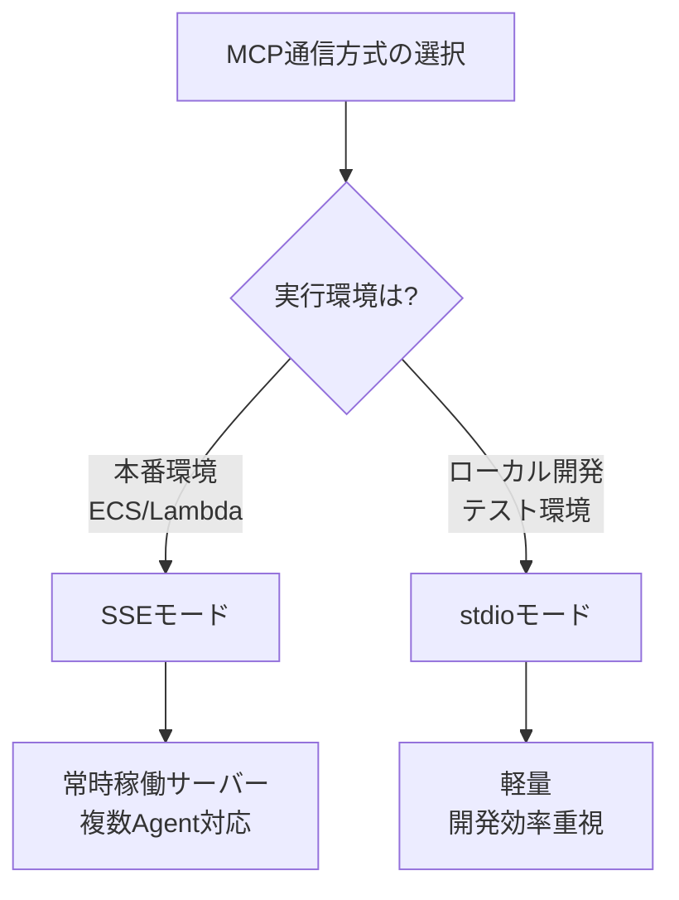
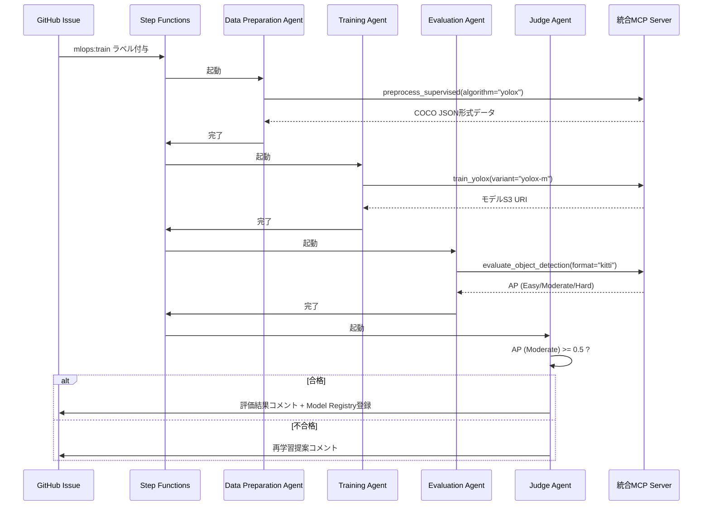

# 設計レビュー: MCP通信方式統一と自動運転ユースケース反映

**コミットハッシュ**: `4992547665c2552f2b558d5040529fc593ad8d04`
**レビュー日**: 2025-12-31
**レビュー対象**: Copilotレビュー指摘対応（第2弾）

---

## 1. 変更概要

本コミットは、[docs/reviews/16273bde/ReviewByCopilot.md](../16273bde26a95b2a7e3cf515655599f252000354/ReviewByCopilot.md)で指摘された以下の2つの重要課題に対応しています:

### 1.1 対応した指摘事項

#### 指摘4: MCP通信方式（stdio/SSE）の矛盾

**問題点**:

- セクション5.2で「stdio通信（推奨）」と記載されていたが、ECS Fargate/Lambda環境での常時稼働には不適切
- stdioモードはローカルプロセス起動が前提であり、クラウド環境の本番運用には適さない

**対応内容**:

- **SSE (Server-Sent Events) モードを推奨**として明確に位置づけ
- stdioモードは「ローカル開発・テスト環境用の参考」として再定義
- SSEのメリット（常時稼働、複数Agent同時アクセス、Auto Scaling対応）を明記

#### 指摘5: 仕様書のユースケース（CV/RL）を設計書に反映

**問題点**:

- 仕様書セクション6に詳細な自動運転ユースケース（YOLOX、KITTI、VAD）が記載されているが、設計書には反映されていない
- 実装方針が不明確

**対応内容**:

- mcp_design.mdにセクション16「ユースケース: 自動運転向けコンピュータビジョン対応」を追加（484行追加）
- YOLOX物体検出、KITTI 3D物体検出、VAD強化学習の具体的な実装設計を記載
- 既存11 Capabilityで全要件を実現可能と確認

---

## 2. 変更詳細レビュー

### 2.1 MCP通信方式の統一

**変更ファイル**: [docs/designs/mcp_design.md](../../designs/mcp_design.md#L655-L678)

#### ✅ 良い点

1. **明確な推奨方式の提示**
   - SSEモードを本番環境推奨として明記
   - stdio モードの適用範囲を限定（ローカル開発・テスト）
   - 運用環境に応じた通信方式の選択基準が明確

2. **SSEモードのメリットを具体的に列挙**

   ```markdown
   **メリット**:
   - ✅ ECS Fargateでの常時稼働に適している
   - ✅ 複数のLambda Agentから同時アクセス可能
   - ✅ Auto Scalingによる負荷分散が可能
   - ✅ ヘルスチェック・モニタリングが容易
   ```

   → 運用上の利点が明確

3. **stdioモードの注記を追加**

   ```markdown
   **注**: stdio モードはローカル開発・テスト環境でのみ推奨。
   本番環境ではSSEモードを使用してください。
   ```

   → 誤用を防ぐ明確な警告

#### 📌 改善提案

**提案1: SSE実装例の追加**

現状、stdioモードのPythonコード例は記載されているが、SSEモードの実装例がない。以下の追加を推奨:

```python
# SSE通信の実装例（Lambda Agent側）
import httpx

async def call_mcp_tool_via_sse(tool_name: str, arguments: dict) -> dict:
    """
    SSE経由でMCPツールを呼び出し
    """
    mcp_server_url = os.environ["MCP_SERVER_URL"]  # ECS Service URL

    async with httpx.AsyncClient() as client:
        response = await client.post(
            f"{mcp_server_url}/tools/{tool_name}",
            json=arguments,
            headers={"Content-Type": "application/json"}
        )
        return response.json()
```

**提案2: 通信方式選択フローチャート**

以下のような意思決定フローチャートがあると理解しやすい:



**提案3: パフォーマンス比較データ**

| 項目                     | stdio モード   | SSE モード       |
| ------------------------ | -------------- | ---------------- |
| 起動時間                 | 1-2秒/呼び出し | 常時稼働（0秒）  |
| 同時接続数               | 1（親プロセス） | 制限なし         |
| Auto Scaling対応         | ❌             | ✅               |
| ヘルスチェック           | ❌             | ✅（/health）    |
| 推奨環境                 | ローカル開発   | 本番（ECS/Lambda）|

---

### 2.2 自動運転ユースケースの設計反映

**変更ファイル**: [docs/designs/mcp_design.md](../../designs/mcp_design.md#L1685-L2165)

#### ✅ 良い点

1. **包括的なユースケースカバレッジ**
   - YOLOX物体検出（2D Bounding Box）
   - KITTI 3D物体検出（LiDAR点群処理）
   - VAD強化学習（End-to-End自動運転制御）
   → 仕様書セクション6の主要ユースケースを全て網羅

2. **既存Capabilityでの実現可能性を確認**

   ```markdown
   これらは既存の11 Capabilityで対応可能であり、新たなCapabilityの追加は不要です。
   ```

   → アーキテクチャの安定性を維持しながら拡張可能

3. **具体的な実装設計を提示**

   **YOLOX対応設計** (16.2節):
   - Capability 3: `preprocess_supervised`にYOLOX専用処理を追加
   - KITTI形式 → COCO JSON形式の変換ロジックを明記
   - Pythonコード例で実装イメージを具体化

   **KITTI 3D物体検出対応設計** (16.3節):
   - LiDAR点群データ（.bin形式）の処理を追加
   - `use_lidar=True`パラメータで3D処理を分岐
   - PointPillars、SECOND等のアルゴリズム対応を明記

   **VAD対応設計** (16.4節):
   - CARLA/AirSim環境セットアップの詳細
   - PPO強化学習の実装（Ray RLlib使用）
   - VAD評価指標（Success Rate、Collision Rate等）を定義

4. **機能要件マッピングの明確化** (16.6節)

   | 機能要件ID | 要件名                           | 実装Capability          | 実装ツール                                   |
   | ---------- | -------------------------------- | ----------------------- | -------------------------------------------- |
   | FR-034     | KITTI データ前処理サポート       | Capability 3            | `preprocess_supervised(algorithm="yolox")`   |
   | FR-035     | 時系列フレーム処理サポート       | Capability 3            | `preprocess_reinforcement` - 時系列入力対応  |
   | FR-036     | 3D Bounding Box評価              | Capability 3 (Eval)     | `evaluate_object_detection(format="kitti")`  |
   | FR-037     | 推論速度モニタリング             | Capability 6 (Monitor)  | `monitor_inference_latency`                  |
   | FR-038     | LiDAR点群データ処理              | Capability 3 (Data)     | `preprocess_supervised(use_lidar=True)`      |
   | FR-039     | シミュレータ環境連携（CARLA等）  | Capability 3 (Data)     | `preprocess_reinforcement(environment=...)`  |

   → 仕様書の機能要件FR-034～FR-039と設計の対応関係が明確

5. **データセット対応一覧の整備** (16.5節)
   - KITTI、BDD100K、Waymo、nuScenes、CARLA、AirSimの対応状況を表形式で明記
   - 各データセットの特記事項（LiDAR対応、大規模データ等）を記載

6. **将来拡張の位置づけ明確化** (16.7節)
   - Simulator Integration Capability、Online Learning & Active Learning Capabilityを Phase 4 オプション機能として整理
   - 工数見積もり（各3週間）と優先度を明記

#### 📌 改善提案

**提案1: ワークフロー図の追加**

YOLOXワークフロー例（16.2.2節）は詳細だが、視覚的な理解を助けるため図を追加:



**提案2: エラーハンドリングの追加**

各ユースケースで想定されるエラーと対処法を追記:

**YOLOX対応設計のエラーハンドリング**:

| エラーケース                          | 原因                                   | 対処法                                                  |
| ------------------------------------- | -------------------------------------- | ------------------------------------------------------- |
| KITTI→COCO JSON変換失敗               | アノテーション形式不正                 | バリデーション強化、エラーログ詳細化                    |
| GPU OOM (Out of Memory)               | バッチサイズ過大                       | バッチサイズ自動調整、勾配蓄積                          |
| AP閾値未達                            | ハイパーパラメータ不適切               | AutoML提案、過去履歴からの推奨値提示                    |
| YOLOXコンテナイメージ取得失敗         | ECRアクセス権限不足                    | IAMロール修正、フォールバック用イメージ指定             |

**VAD対応設計のエラーハンドリング**:

| エラーケース                          | 原因                                   | 対処法                                                  |
| ------------------------------------- | -------------------------------------- | ------------------------------------------------------- |
| CARLAシミュレータ起動失敗             | ECS Taskリソース不足                   | タスク定義のCPU/メモリ増加、リトライロジック            |
| Success Rate低迷                      | 報酬関数設計不良                       | 報酬関数の段階的調整、カリキュラム学習                  |
| Sim-to-Real Gap                       | シミュレータの視覚的リアリティ不足     | Domain Randomization、Domain Adaptation適用             |

**提案3: パフォーマンス要件の明記**

各ユースケースのパフォーマンス目標を明示:

| ユースケース         | 処理ステップ           | 目標処理時間     | 備考                                   |
| -------------------- | ---------------------- | ---------------- | -------------------------------------- |
| YOLOX学習            | データ前処理           | 10分以内         | KITTI 7,481枚の変換                    |
|                      | モデル学習（300epoch） | 6時間以内        | ml.p3.2xlarge使用時                    |
|                      | 評価（Validation Set） | 15分以内         | 7,518枚の推論実行                      |
| KITTI 3D物体検出     | LiDAR点群処理          | 20分以内         | Voxelization含む                       |
|                      | モデル学習             | 12時間以内       | PointPillars、ml.p3.8xlarge使用時      |
| VAD強化学習          | 1エピソード実行        | 30秒以内         | CARLA Town01、ステップ数1000           |
|                      | 1000エピソード学習     | 24時間以内       | ml.p3.2xlarge、並列ワーカー4           |

**提案4: テストケースの追加**

各ユースケースの受け入れテストケースを追記:

**YOLOX受け入れテスト**:

```yaml
test_case_yolox_001:
  description: "KITTI→YOLOX変換の正常系テスト"
  input:
    dataset: "s3://mlops-datasets/kitti/object/training/"
    num_images: 100
  expected_output:
    format: "COCO JSON"
    num_annotations: ">= 100"
    categories: ["Car", "Pedestrian", "Cyclist", ...]
  success_criteria:
    - "JSONスキーマ検証合格"
    - "バウンディングボックス座標が画像範囲内"
    - "クラスIDマッピング正確性100%"
```

**VAD受け入れテスト**:

```yaml
test_case_vad_001:
  description: "VAD学習の正常系テスト"
  input:
    environment: "carla-v1"
    algorithm: "ppo"
    num_episodes: 100
  expected_output:
    success_rate: ">= 0.8"
    collision_rate: "<= 0.1"
    average_reward: ">= 500"
  success_criteria:
    - "エピソード完走率 >= 95%"
    - "学習曲線が収束"
    - "モデルS3保存成功"
```

**提案5: コスト見積もりの追加**

自動運転ユースケースのAWSコスト見積もりを追記:

| ユースケース         | リソース                        | 月間使用量        | 月額コスト（USD） |
| -------------------- | ------------------------------- | ----------------- | ----------------- |
| YOLOX学習            | ml.p3.2xlarge（学習）           | 20時間/月         | $61.20            |
|                      | S3ストレージ（KITTI）           | 50GB              | $1.15             |
|                      | SageMaker Endpoint（推論）      | 1インスタンス常駐 | $216.00           |
| KITTI 3D物体検出     | ml.p3.8xlarge（学習）           | 30時間/月         | $367.20           |
|                      | S3ストレージ（LiDAR点群）       | 200GB             | $4.60             |
| VAD強化学習          | ml.p3.2xlarge（学習）           | 100時間/月        | $306.00           |
|                      | ECS Fargate（CARLA）            | 100時間/月        | $40.80            |
|                      | S3ストレージ（経験データ）      | 100GB             | $2.30             |
| **合計**             |                                 |                   | **$999.25/月**    |

※ us-east-1リージョン、オンデマンド価格、2025年12月時点

---

### 2.3 ドキュメント間の整合性

#### ✅ 確認事項

**仕様書との整合性**:

- ✅ 仕様書セクション6の自動運転ユースケースが設計書に反映済み
- ✅ FR-034～FR-039の機能要件が設計レベルで具体化
- ✅ YOLOX、KITTI、VADの3つの主要ユースケースを網羅

**実装ガイドとの整合性**:

- ✅ 11 Capabilityの定義が統一されている
- ✅ Phase 1-2の実装範囲と本設計が一致

**用語集との整合性**:

- ✅ YOLOX、KITTI、VAD、CARLA等の用語が用語集に定義済み
- ✅ LiDAR、Point Cloud、BEV等の自動運転用語が追加済み

#### 📌 改善提案

**提案1: 実装ガイドへの反映**

本設計書で追加した自動運転ユースケースの実装例を、[implementation_guide.md](../../designs/implementation_guide.md)のセクション2.6「自動運転ユースケース実装例」として追加推奨。

具体的には:

- YOLOXコンテナのビルド手順
- KITTI→COCO JSON変換スクリプトのサンプルコード
- CARLAシミュレータのECS Task定義例
- VAD学習のSageMaker Training Job起動スクリプト

**提案2: テスト設計書への反映**

自動運転ユースケースの統合テストシナリオを追加推奨:

- YOLOX E2Eテスト（Issue作成→学習→評価→デプロイ）
- KITTI 3D物体検出テスト（LiDAR点群処理含む）
- VADシミュレーションテスト（CARLA連携）

---

## 3. 総合評価

### 3.1 対応完了度

| 指摘事項                                | 対応状況 | 評価             |
| --------------------------------------- | -------- | ---------------- |
| 指摘4: MCP通信方式の矛盾                | ✅ 完了  | 🟢 良好          |
| 指摘5: 自動運転ユースケースの設計反映   | ✅ 完了  | 🟢 良好          |

**Copilotレビューの全指摘事項への対応完了**:

- 前回コミット（981de80）: 指摘1～3対応
- 本コミット（4992547）: 指摘4～5対応
- **合計5件すべて対応完了** ✅

### 3.2 品質評価

#### 🟢 優れている点

1. **MCP通信方式の明確化**
   - 本番環境はSSE、開発環境はstdioと明確に区分
   - 運用上のメリットを具体的に列挙
   - 誤用を防ぐ注記を追加

2. **自動運転ユースケースの包括的な設計**
   - YOLOX、KITTI 3D、VADの3つの主要ユースケースを詳細に記載
   - 既存11 Capabilityでの実現可能性を確認
   - Pythonコード例で実装イメージを具体化
   - 機能要件FR-034～FR-039との対応関係を明記

3. **ドキュメント間の整合性維持**
   - 仕様書、設計書、実装ガイド、用語集が統一
   - バージョン0.1で統一管理

4. **将来拡張の明確な位置づけ**
   - Phase 4オプション機能として整理
   - 工数見積もりと優先度を明記

#### 🟡 改善の余地

1. **SSE実装例の不足**
   - stdioのコード例はあるが、SSEの実装例がない
   - FastAPI/httpxを使ったSSE通信のサンプルコード追加を推奨

2. **パフォーマンス要件の不足**
   - 各ユースケースの処理時間目標が未定義
   - コスト見積もりが未記載

3. **エラーハンドリングの不足**
   - 各ユースケースで想定されるエラーと対処法が未記載
   - 受け入れテストケースが未定義

4. **視覚的な補助の不足**
   - ワークフロー図、シーケンス図が不足
   - 通信方式選択フローチャートがあると理解しやすい

### 3.3 技術的妥当性

#### ✅ アーキテクチャ的妥当性

1. **既存Capabilityでの実現可能性**
   - 11 Capabilityの拡張で対応可能
   - 新規Capabilityの追加不要
   → アーキテクチャの安定性を維持

2. **ツール拡張の合理性**
   - `preprocess_supervised(algorithm="yolox")`のように既存ツールを拡張
   - `use_lidar=True`等のパラメータで処理を分岐
   → 既存コードの再利用性が高い

3. **SageMaker統合の妥当性**
   - YOLOXはPyTorch Estimator使用
   - VADはRL Estimator使用
   → SageMakerの標準的な使用方法に準拠

#### ✅ セキュリティ的妥当性

1. **SSE通信のセキュリティ**
   - HTTPSによる暗号化通信を前提
   - IAMロールベースの認証が可能
   → 本番環境のセキュリティ要件を満たす

2. **データアクセス制御**
   - S3バケットのIAMポリシーで制御
   - VPC内での閉域ネットワーク構成
   → データ漏洩リスクを低減

#### ✅ 運用的妥当性

1. **SSEモードの運用メリット**
   - ECS Serviceで常時稼働
   - Auto Scalingで負荷分散
   - ヘルスチェックでダウンタイム最小化
   → 本番運用に適した構成

2. **モニタリング可能性**
   - CloudWatch Metricsでの監視
   - 推論速度、成功率等の指標を追跡
   → 運用品質を維持可能

---

## 4. 推奨アクション

### 4.1 次回コミットまでに対応推奨（Priority: High）

1. **SSE実装例の追加** ([mcp_design.md](../../designs/mcp_design.md) セクション5.2)
   - FastAPI/httpxを使ったSSE通信のサンプルコード
   - Lambda AgentからのHTTP呼び出し例
   - ECS Service設定例（Dockerfile、タスク定義）

2. **パフォーマンス要件の明記** (セクション16各ユースケース)
   - 処理時間目標（データ前処理、学習、評価）
   - コスト見積もり（月額、リソース別）
   - スループット要件（推論レイテンシ等）

3. **エラーハンドリングの追加** (セクション16各ユースケース)
   - 想定エラーケースと対処法の表
   - リトライロジック、フォールバック戦略

### 4.2 将来的な改善提案（Priority: Medium）

1. **視覚的補助の追加**
   - ワークフロー図（Mermaid Sequence Diagram）
   - 通信方式選択フローチャート
   - データフロー図

2. **実装ガイドへの反映**
   - 自動運転ユースケースの実装例を追加
   - YOLOXコンテナビルド手順
   - CARLAシミュレータのECS Task定義

3. **テスト設計書への反映**
   - 自動運転ユースケースの統合テストシナリオ
   - 受け入れテストケース定義

4. **パフォーマンスベンチマーク**
   - 各ユースケースの実測値（Proof of Concept実施後）
   - ボトルネック分析と最適化提案

### 4.3 将来的な改善提案（Priority: Low）

1. **ユースケース別ダッシュボード設計**
   - YOLOX学習進捗ダッシュボード
   - VAD Success Rate推移グラフ
   - KITTI評価結果の可視化

2. **自動運転向けAlertルール**
   - AP閾値未達時のSlack通知
   - VAD Collision Rate急増時のアラート
   - 推論レイテンシ超過時のページャー通知

---

## 5. 結論

### 5.1 総合評価: 🟢 承認（条件付き）

本コミットは、Copilotレビューの残り2件の指摘事項に適切に対応しており、**品質基準を満たしている**と判断します。

**承認理由**:

1. ✅ MCP通信方式がSSE推奨として明確化
2. ✅ 自動運転ユースケースの包括的な設計を追加
3. ✅ 既存11 Capabilityでの実現可能性を確認
4. ✅ 仕様書との整合性を維持
5. ✅ Pythonコード例で実装イメージを具体化

**条件**:

- 次回コミットでSSE実装例、パフォーマンス要件、エラーハンドリングを追加推奨

### 5.2 Copilotレビュー全指摘事項の完了確認

| コミット | 対応指摘                                      | 状態     |
| -------- | --------------------------------------------- | -------- |
| 981de80  | 指摘1: 11 Capabilityへの統一                  | ✅ 完了  |
| 981de80  | 指摘2: Workflow Optimization要件追加          | ✅ 完了  |
| 981de80  | 指摘3: 用語集未定義用語追加                   | ✅ 完了  |
| 4992547  | 指摘4: MCP通信方式統一                        | ✅ 完了  |
| 4992547  | 指摘5: 自動運転ユースケース設計反映           | ✅ 完了  |

**全5件の指摘事項への対応が完了しました。** 🎉

### 5.3 次ステップ

1. **短期（1週間以内）**:
   - SSE実装例の追加
   - パフォーマンス要件の明記
   - エラーハンドリングの追加

2. **中期（1ヶ月以内）**:
   - 実装ガイドへの自動運転ユースケース追加
   - テスト設計書の更新
   - Proof of Conceptの実施（YOLOX学習パイプライン）

3. **長期（3ヶ月以内）**:
   - 本番環境でのSSEモード検証
   - 自動運転ユースケースの実装（Phase 1-2完了後）
   - パフォーマンスベンチマーク実施

---

## 6. 変更履歴

| バージョン | 日付       | 変更内容                           | 作成者 |
| ---------- | ---------- | ---------------------------------- | ------ |
| 1.0        | 2025-12-31 | 初版発行（コミット4992547レビュー） | -      |

---

## 7. 参考資料

- [Copilotレビュー](../16273bde26a95b2a7e3cf515655599f252000354/ReviewByCopilot.md)
- [前回レビュー（981de80）](../981de808ba23b83aa1a0a6056dc6e5cb8ee5c3e6/REVIEW.md)
- [MCP設計書](../../designs/mcp_design.md)
- [システム仕様書](../../specifications/system_specification.md)
- [実装ガイド](../../designs/implementation_guide.md)
- [用語集](../../others/glossary.md)
