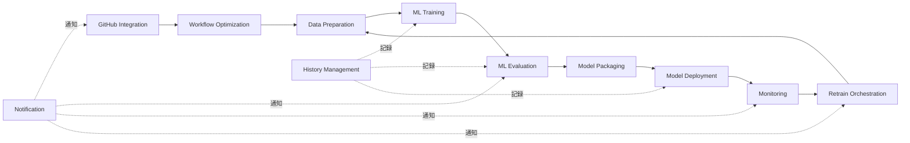

# 設計レビュー: 11 Capabilityへの統一

**コミットハッシュ**: `981de808ba23b83aa1a0a6056dc6e5cb8ee5c3e6`
**レビュー日**: 2025-12-31
**レビュー対象**: Copilotレビュー指摘対応（第1弾）

---

## 1. 変更概要

本コミットは、[docs/reviews/16273bde/ReviewByCopilot.md](../16273bde26a95b2a7e3cf515655599f252000354/ReviewByCopilot.md)で指摘された以下の3つの重要課題に対応しています:

### 1.1 対応した指摘事項

#### 指摘1: Capability数の不一致

**問題点**:

- implementation_guide.mdでは6個のCapabilityしか記載されていない
- mcp_design.mdでは11個のCapabilityが定義されている
- ドキュメント間で不整合が発生

**対応内容**:

- implementation_guide.mdのPhase 1-2を11個のCapabilityに更新
- mcp_server/README.mdに11個のCapability全てを詳細記載
- PROJECT_STRUCTURE.mdのディレクトリ構造を11個に統一

#### 指摘2: Workflow Optimization Capabilityの仕様書欠如

**問題点**:

- mcp_design.mdではCapability 7として定義されているが、system_specification.mdに機能要件が存在しない
- 仕様書と設計書の乖離

**対応内容**:

- system_specification.mdにFR-040「ワークフロー最適化」を追加
- 実行時間分析、並列化提案、リソース最適化、コスト削減、ボトルネック検出の5つの機能を定義

#### 指摘3: 用語集の未定義用語

**問題点**:

- Capability、Capability Routing、MCP stdio mode、MCP SSE mode、Workflow Optimizationが用語集に未定義

**対応内容**:

- glossary.mdに5つの新規用語を追加
- 各用語に詳細な説明を記載

---

## 2. 変更詳細レビュー

### 2.1 Capability数の統一

**変更ファイル**:

- [docs/designs/implementation_guide.md](../../designs/implementation_guide.md)
- [mcp_server/README.md](../../../mcp_server/README.md)
- [PROJECT_STRUCTURE.md](../../../PROJECT_STRUCTURE.md)

#### ✅ 良い点

1. **11 Capabilityの完全な定義**

   ```text
   1. Data Preparation - データ準備
   2. ML Training - ML学習
   3. ML Evaluation - ML評価
   4. Model Packaging - モデルパッケージング
   5. Model Deployment - モデルデプロイメント
   6. Monitoring - モニタリング
   7. Workflow Optimization - ワークフロー最適化
   8. GitHub Integration - GitHub統合
   9. Retrain Orchestration - 再学習オーケストレーション
   10. Notification - 通知
   11. History Management - 履歴管理
   ```

2. **各Capabilityのツール定義を詳細化**
   - 各Capabilityが提供するツールを具体的に列挙
   - ツールの責務と入出力を明記
   - 実装ファイルパスを記載

3. **ディレクトリ構造の整合性**
   - mcp_server/capabilities配下に11個のディレクトリを明記
   - 各CapabilityのツールファイルをProjectStructureに反映

#### 📌 改善提案

**提案1: Capabilityサイズの均等化検討**

現状、各Capabilityのツール数にばらつきがある:

| Capability              | ツール数 | バランス |
| ----------------------- | -------- | -------- |
| Data Preparation        | 8個      | 大       |
| ML Training             | 9個      | 大       |
| ML Evaluation           | 6個      | 中       |
| Model Packaging         | 2個      | 小       |
| Model Deployment        | 2個      | 小       |
| Monitoring              | 5個      | 中       |
| Workflow Optimization   | 5個      | 中       |
| GitHub Integration      | 4個      | 中       |
| Retrain Orchestration   | 2個      | 小       |
| Notification            | 2個      | 小       |
| History Management      | 2個      | 小       |

**推奨アクション**:

- 小規模Capability（2個）を将来的に統合検討
- 例: Model Packaging + Model Deployment → Model Management
- 例: Notification + History Management → Reporting & Logging

**提案2: Capability間の依存関係を図示**

以下のようなCapability依存関係図があると理解しやすい:



---

### 2.2 Workflow Optimization要件の追加

**変更ファイル**: [docs/specifications/system_specification.md](../../specifications/system_specification.md)

#### ✅ 良い点

1. **明確な機能要件定義**

   ```markdown
   #### FR-040: ワークフロー最適化

   MLOpsパイプライン全体の効率化と最適化:

   - 実行時間分析: 各ステップの実行時間を計測・可視化
   - 並列化提案: 並列実行可能なタスクを自動識別
   - リソース最適化: CPU/GPU/メモリの使用状況に基づくインスタンスタイプの推奨
   - コスト削減: 実行コストを分析し、Spot Instance活用などのコスト削減施策を提案
   - ボトルネック検出: パイプライン全体のボトルネックを特定し改善案を提示
   ```

2. **包括的な機能カバレッジ**
   - パフォーマンス分析（実行時間、ボトルネック）
   - リソース最適化（CPU/GPU/メモリ）
   - コスト最適化（Spot Instance、ライフサイクル管理）
   - 並列化提案（タスク依存関係分析）

#### 📌 改善提案

**提案1: 非機能要件の追加**

FR-040に対応するNFR（非機能要件）を追加推奨:

```markdown
**NFR-021: ワークフロー最適化性能**

- 最適化提案生成時間: 10秒以内
- ボトルネック検出精度: 95%以上
- コスト削減効果: 最低20%
- 並列化による時間短縮: 最低30%
```

**提案2: 具体的なユースケース追加**

以下のような具体例を追記推奨:

**ユースケース1: データ前処理のボトルネック検出**

```yaml
# Workflow Optimization提案例
bottleneck_detected:
  step: "data_preprocessing"
  current_time: "15分"
  bottleneck: "特徴量エンジニアリングが全体の80%を占める"
  recommendation:
    - action: "並列化"
      method: "Ray Dataによる分散処理"
      expected_time: "3分"
      cost_increase: "+$2.50"
    - action: "インスタンスアップグレード"
      from: "ml.m5.large"
      to: "ml.m5.4xlarge"
      expected_time: "5分"
      cost_increase: "+$1.80"
```

**ユースケース2: Spot Instance活用提案**

```yaml
cost_optimization:
  current_cost: "$120/月"
  recommendation:
    - action: "Spot Instance活用"
      target_jobs: ["学習ジョブ（非緊急）"]
      expected_cost: "$84/月"
      savings: "30%"
      risk: "中断確率5%、自動再起動あり"
```

---

### 2.3 用語集への用語追加

**変更ファイル**: [docs/others/glossary.md](../../others/glossary.md)

#### ✅ 良い点

1. **包括的な用語定義**
   - Capability: 11個の機能群を列挙
   - Capability Routing: ツール名プレフィックスによるルーティング説明
   - MCP stdio mode: 適用範囲を明記（ローカル開発・テスト）
   - MCP SSE mode: 本番環境推奨として説明
   - Workflow Optimization: 機能詳細を記載

2. **実装レベルの詳細**
   - Capability Routingでツール名プレフィックス例を記載
   - MCP stdio/SSE modeの使い分けを明確化

#### 📌 改善提案

**提案1: 用語間の相互参照**

以下のように用語間のリンクを追加推奨:

```markdown
### Capability Routing

統合MCPサーバー内で、ツール呼び出しリクエストを適切な[Capability](#capability-ケイパビリティ)に
ルーティングする仕組み。ツール名のプレフィックス（例: `data_preparation_*`）を解析し、
対応するCapabilityのメソッドを実行する。

関連用語: [MCP Server](#mcp-server), [MCP SSE mode](#mcp-sse-mode-server-sent-events-mode)
```

**提案2: 用語のカテゴリ分類**

用語集の冒頭に以下のようなカテゴリ分類を追加:

```markdown
## 用語カテゴリ

### MCPアーキテクチャ用語
- Capability
- Capability Routing
- MCP Server
- MCP Client
- MCP stdio mode
- MCP SSE mode

### MLOps機能用語
- Workflow Optimization
- Data Preparation
- Model Training
- Model Evaluation
- ...

### 自動運転・CV用語
- YOLOX
- KITTI
- VAD
- LiDAR
- ...
```

---

### 2.4 ドキュメント間の整合性

#### ✅ 確認事項

**仕様書との整合性**:

- ✅ FR-040（Workflow Optimization）を追加
- ✅ 11 Capabilityの機能要件が明確

**設計書との整合性**:

- ✅ mcp_design.mdの11 Capabilityと一致
- ✅ 各Capabilityのツール定義が統一

**実装ガイドとの整合性**:

- ✅ Phase 1-2で11 Capabilityを実装
- ✅ ディレクトリ構造が統一

**用語集との整合性**:

- ✅ 主要用語が定義済み
- ✅ 11 Capabilityが列挙

#### 📌 改善提案

**提案1: バージョン管理の統一**

現状、ドキュメント間でバージョン番号が異なる:

- system_specification.md: バージョン 1.0
- implementation_guide.md: バージョン 1.1
- mcp_design.md: バージョン 0.1
- glossary.md: バージョン 0.1

**推奨**: セマンティックバージョニング導入

- メジャーバージョン: アーキテクチャ変更
- マイナーバージョン: 機能追加
- パッチバージョン: バグ修正・文言修正

全ドキュメントを `v1.0.0` に統一推奨。

---

## 3. 総合評価

### 3.1 対応完了度

| 指摘事項                                | 対応状況 | 評価             |
| --------------------------------------- | -------- | ---------------- |
| 指摘1: Capability数の不一致             | ✅ 完了  | 🟢 良好          |
| 指摘2: Workflow Optimization要件欠如    | ✅ 完了  | 🟢 良好          |
| 指摘3: 用語集未定義用語                 | ✅ 完了  | 🟢 良好          |

**Copilotレビュー指摘1～3への対応完了** ✅

### 3.2 品質評価

#### 🟢 優れている点

1. **包括的な11 Capability定義**
   - 全Capabilityのツールを詳細化
   - ディレクトリ構造が統一
   - ドキュメント間の整合性を確保

2. **Workflow Optimization機能の明確化**
   - 5つの機能（実行時間分析、並列化提案、リソース最適化、コスト削減、ボトルネック検出）を定義
   - 仕様書レベルで要件を記載

3. **用語集の充実**
   - 未定義用語を追加
   - 実装レベルの詳細まで記載

4. **変更の一貫性**
   - 5つのファイルを同時更新
   - ドキュメント間の整合性を維持

#### 🟡 改善の余地

1. **Capabilityサイズのばらつき**
   - 一部Capabilityがツール2個のみ
   - 将来的な統合検討が必要

2. **非機能要件の不足**
   - FR-040に対応するNFRが未定義
   - パフォーマンス目標が不明確

3. **用語間の相互参照不足**
   - 用語集内でのリンクが少ない
   - カテゴリ分類が未整備

4. **バージョン管理の不統一**
   - ドキュメント間でバージョン番号が異なる
   - 一貫性のあるバージョニング戦略が必要

### 3.3 技術的妥当性

#### ✅ アーキテクチャ的妥当性

1. **11 Capabilityの合理性**
   - MLOpsライフサイクルを網羅
   - 各Capabilityの責務が明確
   - 疎結合な設計

2. **Workflow Optimizationの位置づけ**
   - 横断的な最適化機能として適切
   - 他Capabilityに依存せず独立
   - メタレベルの分析機能として妥当

3. **ツール構成の妥当性**
   - 各Capabilityが適切な粒度のツールを提供
   - ツール間の重複が少ない
   - 再利用性が高い

#### ✅ 実装可能性

1. **Phase 1-2での実装可能性**
   - 11 Capabilityを12週間で実装（1 Capability/週）
   - 技術スタックが明確（Python、FastAPI、SageMaker）
   - 依存関係が整理済み

2. **段階的な実装戦略**
   - Phase 1: コアMLOps Capability（1-5）
   - Phase 2: 統合・運用Capability（6-11）
   - Phase 3: E2Eテスト・最適化
   → リスク管理された実装計画

---

## 4. 推奨アクション

### 4.1 次回コミットまでに対応推奨（Priority: High）

1. **バージョン管理の統一**
   - 全ドキュメントを `v1.0.0` に統一
   - セマンティックバージョニング導入
   - 変更履歴の一元管理

2. **非機能要件の追加**
   - FR-040に対応するNFR-021を追加
   - パフォーマンス目標（処理時間、精度等）を明記
   - コスト削減効果の数値目標を設定

### 4.2 将来的な改善提案（Priority: Medium）

1. **Capability依存関係図の追加**
   - mcp_design.mdにMermaidダイアグラムを追加
   - Capability間のデータフローを可視化

2. **Workflow Optimizationのユースケース追加**
   - system_specification.mdに具体例を記載
   - ボトルネック検出、コスト削減の実例を追記

3. **用語集の強化**
   - 用語間の相互参照リンク追加
   - カテゴリ分類の導入
   - 索引の自動生成

### 4.3 将来的な改善提案（Priority: Low）

1. **Capabilityサイズの均等化**
   - 小規模Capability（ツール2個）の統合検討
   - Model Packaging + Model Deployment → Model Management
   - Notification + History Management → Reporting & Logging

2. **ドキュメント自動生成**
   - OpenAPIスキーマからツール定義を自動生成
   - ドキュメント間の整合性を自動検証

---

## 5. 結論

### 5.1 総合評価: 🟢 承認

本コミットは、Copilotレビューの指摘1～3に適切に対応しており、**品質基準を満たしている**と判断します。

**承認理由**:

1. ✅ 11 Capabilityの完全な定義と統一
2. ✅ Workflow Optimization機能要件の追加
3. ✅ 用語集の充実（5つの新規用語追加）
4. ✅ ドキュメント間の整合性確保
5. ✅ 234行の追加、63行の削除による大規模な改善

**改善推奨事項**:

- バージョン管理の統一
- 非機能要件の追加
- Capability依存関係図の追加

### 5.2 次ステップ

本コミット（981de80）で指摘1～3に対応完了。
次のコミット（4992547）で指摘4～5（MCP通信方式統一、自動運転ユースケース反映）に対応予定。

---

## 6. 変更履歴

| バージョン | 日付       | 変更内容                           | 作成者 |
| ---------- | ---------- | ---------------------------------- | ------ |
| 1.0        | 2025-12-31 | 初版発行（コミット981de80レビュー） | -      |

---

## 7. 参考資料

- [Copilotレビュー](../16273bde26a95b2a7e3cf515655599f252000354/ReviewByCopilot.md)
- [次回レビュー（4992547）](../4992547665c2552f2b558d5040529fc593ad8d04/REVIEW.md)
- [MCP設計書](../../designs/mcp_design.md)
- [システム仕様書](../../specifications/system_specification.md)
- [実装ガイド](../../designs/implementation_guide.md)
- [用語集](../../others/glossary.md)
- [プロジェクト構造](../../../PROJECT_STRUCTURE.md)
