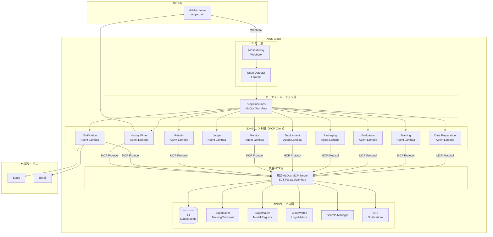

# システム仕様書: GitHub Issue駆動型MLOpsシステム

**バージョン**: 1.0
**作成日**: 2025-12-30

**注**: 本ドキュメントで使用される技術用語・略語の定義は[用語集](../others/glossary.md)を参照してください。

---

## 1. プロジェクト概要

### 1.1 目的

GitHub Issueをトリガーとして、AWS Step FunctionsとAmazon SageMakerを活用したエージェントベースのMLOpsパイプラインを構築する。

### 1.2 システム名

GitHub-Driven MLOps Pipeline with Agent-based Orchestration

### 1.3 対象ユーザー

- データサイエンティスト
- MLエンジニア
- DevOpsエンジニア

---

## 2. 機能要件

### 2.1 MLOpsワークフロー要件

本システムは、以下の7段階のMLOpsライフサイクルを実現します。

#### 2.1.1 📥 フェーズ1: データ収集・前処理

**FR-001: データソース統合**

- S3、RDS、DynamoDB、外部API等の複数データソースからのデータ取得
- データカタログ（AWS Glue Data Catalog）によるメタデータ管理
- データ取得ジョブのスケジュール実行

**FR-002: データクリーニング**

- 欠損値処理（削除、平均値補完、中央値補完、モード補完）
- 異常値検出と除去（IQR法、Z-score法）
- 重複データの検出と削除
- データ品質レポートの生成

**FR-003: 特徴量エンジニアリング**

- 特徴量生成（集約、結合、変換）
- 特徴量選択（相関分析、重要度ベース選択）
- カテゴリカル変数のエンコーディング（One-Hot、Label、Target）
- 数値変数の正規化・標準化
- 特徴量定義ドキュメントの自動生成

**FR-004: データバージョニング**

- S3バージョニングによるデータ履歴管理
- DVC（Data Version Control）統合（オプション）
- データセット分割（train/validation/test）のバージョン管理
- データ系譜（Data Lineage）の記録

#### 2.1.2 🧪 フェーズ2: モデル開発（実験）

**FR-005: 実験管理**

- MLflow Tracking / SageMaker Experiments統合
- 実験パラメータの記録（ハイパーパラメータ、データセットバージョン、コードバージョン）
- 実験メトリクスの記録（精度、損失、学習時間等）
- 実験成果物の管理（モデル、ログ、可視化結果）

**FR-006: ハイパーパラメータ最適化**

- Grid Search（全探索）
- Random Search（ランダム探索）
- Bayesian Optimization（ベイズ最適化）
- SageMaker Automatic Model Tuning統合
- 最適パラメータの自動選択

**FR-007: 学習方式選択**

システムは以下の3種類の学習方式をサポート：

1. **教師あり学習（Supervised Learning）**
   - 分類（Classification）: Random Forest, XGBoost, Neural Network
   - 回帰（Regression）: Linear Regression, XGBoost, Neural Network

2. **教師なし学習（Unsupervised Learning）**
   - クラスタリング（Clustering）: K-Means, DBSCAN
   - 次元削減（Dimensionality Reduction）: PCA, t-SNE

3. **強化学習（Reinforcement Learning）**
   - PPO (Proximal Policy Optimization)
   - DQN (Deep Q-Network)
   - A3C (Asynchronous Advantage Actor-Critic)

**FR-008: SageMaker学習ジョブ実行**

- SageMaker Training Jobの起動と監視
- 分散学習のサポート
- 学習進捗のリアルタイム監視
- 学習ログのCloudWatch Logsへの出力
- GPU/CPU リソースの動的割り当て

#### 2.1.3 🧹 フェーズ3: モデル検証・テスト

**FR-009: モデル精度評価**

- 評価指標の算出：
  - 分類: Accuracy, Precision, Recall, F1-Score, AUC-ROC
  - 回帰: RMSE, MAE, R², MAPE
  - クラスタリング: Silhouette Score, Davies-Bouldin Index
  - 強化学習: Average Reward, Episode Length
- 混同行列、ROC曲線、学習曲線の生成
- 評価レポートの自動生成

**FR-010: バイアスチェック**

- 公平性評価（Fairness Indicators）
- グループ間の精度差分析
- バイアス検出レポートの生成
- SageMaker Clarify統合

**FR-011: データドリフト検知準備**

- ベースライン統計の記録（平均、分散、分布等）
- 特徴量分布の保存
- ドリフト検知用メタデータの生成

**FR-012: CI/CD自動テスト**

- ユニットテスト（モデル関数、前処理関数）
- 統合テスト（パイプライン全体）
- モデル性能テスト（最低精度保証）
- テストカバレッジ: 80%以上
- テストレポートの生成

**FR-013: モデル説明可能性**

- SHAP（SHapley Additive exPlanations）による特徴量重要度分析
- LIME（Local Interpretable Model-agnostic Explanations）
- モデル説明レポートの生成

#### 2.1.4 📦 フェーズ4: モデルパッケージング

**FR-014: モデルAPI化**

- REST API エンドポイントの生成
- gRPC サポート（オプション）
- API仕様書の自動生成（OpenAPI/Swagger）
- 推論レスポンスタイムの最適化

**FR-015: モデルコンテナ化**

- Dockerイメージの自動生成
- SageMaker Inference Container対応
- マルチステージビルドによるイメージサイズ最適化
- 依存関係の明確化（requirements.txt、Dockerfile）

**FR-016: モデルレジストリ管理**

- SageMaker Model Registry / MLflow Model Registry統合
- モデルメタデータの記録（精度、パラメータ、学習日時等）
- セマンティックバージョニング（v1.0.0、v1.1.0等）
- モデル系譜（Model Lineage）の記録
- 最低5世代のモデル保持

#### 2.1.5 🚀 フェーズ5: デプロイ（リリース）

**FR-017: デプロイ戦略**

- **A/Bテスト**: 新旧モデルを並行稼働し効果を比較
- **カナリアリリース**: 一部トラフィック（10%→50%→100%）で段階的展開
- **ブルー/グリーンデプロイメント**: 新環境構築後に切り替え
- デプロイ戦略の選択はGitHub Issueで指定可能

**FR-018: 本番環境デプロイ**

- SageMaker Endpoint へのデプロイ
- ECS Fargate / Lambda へのデプロイ（オプション）
- Auto Scaling設定（負荷に応じた自動スケール）
- ヘルスチェックの実装

**FR-019: CI/CD パイプライン**

- GitHub Actions / AWS CodePipeline統合
- Infrastructure as Code（CloudFormation、CDK、Terraform）
- 自動デプロイメント（承認後）
- デプロイメントログの記録

**FR-020: ロールバック機能**

- ワンクリックロールバック
- 自動ロールバック（エラー率が閾値を超えた場合）
- ロールバック履歴の記録

#### 2.1.6 🔍 フェーズ6: モニタリング（運用）

**FR-021: システムメトリクス監視**

- レスポンスタイム（P50、P95、P99）の監視
- エラー率（4xx、5xx）の監視
- スループット（RPS: Requests Per Second）の監視
- リソース使用率（CPU、メモリ、GPU）の監視
- CloudWatch Dashboard による可視化

**FR-022: モデルメトリクス監視**

- 推論精度の劣化検知
- データドリフト検知（入力データ分布の変化）
- コンセプトドリフト検知（入力と出力の関係の変化）
- 予測分布の変化検知
- SageMaker Model Monitor統合

**FR-023: アラート設定**

- CloudWatch Alarms設定
- Slack / Email / PagerDuty への通知
- GitHub Issueの自動作成（重大な問題発生時）
- アラート閾値のカスタマイズ

**FR-024: ダッシュボード**

- リアルタイムメトリクス可視化
- 過去データとの比較グラフ
- Grafana統合（オプション）

#### 2.1.7 🔄 フェーズ7: 継続的改善（再トレーニング）

**FR-025: 自動再トレーニングトリガー**

- **データ変更トリガー**: 新しいデータがS3に追加された時
- **コード変更トリガー**: モデルコードがGitにプッシュされた時
- **スケジュールトリガー**: 週次、月次等の定期実行
- **メトリクス劣化トリガー**: 精度が閾値を下回った時
- **ドリフト検知トリガー**: データドリフトが検出された時

**FR-026: 自動再学習パイプライン**

- Step Functions / Apache Airflow によるパイプライン自動実行
- 新データでの自動学習
- 新旧モデルの自動比較
- 改善が認められた場合のみ自動デプロイ

**FR-027: モデルバージョン管理**

- セマンティックバージョニング（v1.0.0 → v1.1.0 → v2.0.0）
- バージョン間の差分レポート
- パフォーマンス比較レポート（旧モデル vs 新モデル）

**FR-028: フィードバックループ**

- 本番推論データの収集
- ラベル付けされたデータの学習データへの追加
- 継続的なモデル改善

#### 2.1.8 トリガー機能

**FR-029: GitHub Issue検知**

- GitHubリポジトリに特定のラベル（例: `mlops:train`）が付いたIssueが作成されたら自動的にMLパイプラインを起動
- Issue内に学習パラメータ（モデル種類、学習方法、ハイパーパラメータ、デプロイ戦略等）を記載
- Webhookまたはポーリングによる検知

#### 2.1.9 オーケストレーション機能

**FR-030: Step Functions統合**

- AWS Step Functionsによる7段階ワークフローの制御
- ステート管理（データ収集→実験→検証→パッケージング→デプロイ→モニタリング→再学習）
- エラーハンドリングとリトライロジック
- 各フェーズ間のデータ受け渡し

**FR-031: Agentベースアーキテクチャ**

- 各処理を独立したエージェント（Lambda/Container）として実装
- エージェント間の疎結合な連携
- スケーラビリティの確保
- MCP（Model Context Protocol）による標準化された通信

**FR-032: 対話型調整機能**

- 適合率が閾値未満の場合、オペレータに通知（Slack/Email/GitHub Comment）
- オペレータがGitHub Issueコメントで学習設定を調整
- 調整内容を元に自動再学習を実行
- 最大再学習回数の設定（デフォルト: 3回）

**FR-033: 学習履歴のGitHub保存**

- 学習結果（精度、パラメータ、実行時間等）をMarkdown形式で生成
- GitHubリポジトリの`training_history/`ディレクトリにコミット
- 元のIssueへのコメントとして結果を投稿
- バージョン管理による履歴追跡

---

## 3. 非機能要件

### 3.1 パフォーマンス

**NFR-001: 応答時間**

- Issue検知からデータ準備開始まで: 5分以内
- 学習完了から評価結果通知まで: 10分以内（小規模データセットの場合）
- 推論レスポンスタイム: P95で100ms以内
- モデルデプロイ時間: 15分以内

**NFR-002: スケーラビリティ**

- 同時実行可能な学習ジョブ数: 10ジョブ以上
- データサイズ: 最大1TB
- 推論エンドポイント: Auto Scalingで最大100インスタンス
- 並列実験実行数: 最大20実験

**NFR-003: スループット**

- 推論エンドポイント: 最小1000 RPS
- データ前処理: 100GB/時間以上
- モデル評価: 1万件/分以上

### 3.2 可用性

**NFR-004: システム稼働率**

- 目標稼働率: 99.5%以上（学習パイプライン）
- 推論エンドポイント稼働率: 99.9%以上
- 学習失敗時の自動リトライ: 最大3回
- デプロイ失敗時の自動ロールバック

**NFR-005: 災害対策**

- マルチAZ構成
- S3クロスリージョンレプリケーション（重要データ）
- RPO（Recovery Point Objective）: 1時間
- RTO（Recovery Time Objective）: 4時間

### 3.3 セキュリティ

**NFR-006: アクセス制御**

- IAMロールベースのアクセス制御（最小権限の原則）
- S3バケットの暗号化（SSE-KMS）
- データ転送時のTLS 1.2以上使用
- VPC内での閉域ネットワーク構成

**NFR-007: 認証・認可**

- GitHub Tokenの安全な管理（AWS Secrets Manager）
- API Key/トークンのローテーション（90日ごと）
- MFA（多要素認証）の強制
- サービス間通信の相互認証

**NFR-008: 監査**

- CloudTrailによる全操作ログの記録
- 学習履歴の改ざん防止（署名付きコミット）
- アクセスログの保持（最低1年間）
- 定期的なセキュリティ監査

**NFR-009: コンプライアンス**

- GDPR対応（個人データ削除機能）
- データ匿名化機能
- バイアス検出とレポーティング

### 3.4 保守性

**NFR-010: ログ管理**

- CloudWatch Logsへの統合
- 構造化ログ（JSON形式）
- ログ保持期間: 90日間（アーカイブは1年間）
- ログレベル: DEBUG, INFO, WARN, ERROR

**NFR-011: モニタリング**

- CloudWatch Metricsでの監視
- カスタムメトリクスの記録
- 異常検知時のアラート通知
- ダッシュボードによる可視化

**NFR-012: デバッグ性**

- 分散トレーシング（AWS X-Ray）
- エラー時のコンテキスト情報記録
- 再現可能なテスト環境

**NFR-013: ドキュメント**

- API仕様書の自動生成
- アーキテクチャダイアグラムの保守
- ランブック（障害対応手順書）の整備

### 3.5 テスト容易性

**NFR-014: テスト自動化**

- ユニットテストカバレッジ: 80%以上
- 統合テストの自動実行
- CI/CDパイプラインでの自動テスト
- モックデータによるテスト環境

**NFR-015: テスト環境**

- 本番相当のステージング環境
- データのサニタイズ機能
- テストデータの自動生成

### 3.6 移植性

**NFR-016: クラウド非依存設計**

- MCP（Model Context Protocol）による標準化
- コンテナ化によるポータビリティ
- IaC（Infrastructure as Code）による環境再現性
- オープンソースツールの優先使用

**NFR-017: ベンダーロックイン回避**

- マルチクラウド対応を考慮した設計
- データエクスポート機能
- 標準フォーマットでのデータ保存

### 3.7 運用性

**NFR-018: デプロイメント**

- ゼロダウンタイムデプロイメント
- カナリアリリースによる段階的展開
- 自動ロールバック機能
- デプロイメント履歴の記録

**NFR-019: バックアップ**

- 日次自動バックアップ
- バックアップの定期的なリストアテスト
- バックアップ保持期間: 30日間

**NFR-020: コスト最適化**

- 未使用リソースの自動削除
- Spot Instanceの活用（学習ジョブ）
- S3ライフサイクルポリシー
- コスト異常検知アラート

---

## 4. システム制約

### 4.1 技術制約

- **CON-001**: AWS環境での実装
- **CON-002**: SageMaker対応のフレームワーク使用（TensorFlow, PyTorch, scikit-learn等）
- **CON-003**: Python 3.11以上
- **CON-004**: MCP（Model Context Protocol）v1.0以上
- **CON-005**: Docker対応環境

### 4.2 ビジネス制約

- **CON-006**: Phase 1開発期間: 6週間（コアMLOps機能）
- **CON-007**: Phase 2開発期間: 6週間（統合機能）
- **CON-008**: Phase 3開発期間: 2週間（E2Eテスト・最適化）
- **CON-009**: 月間AWS利用予算: $XXX（要調整）

### 4.3 運用制約

- **CON-010**: 本番環境は24時間365日稼働
- **CON-011**: メンテナンスウィンドウ: 週次2時間（日曜深夜）
- **CON-012**: 変更管理プロセスの遵守

---

## 5. アーキテクチャ設計

### 5.1 システムアーキテクチャ図



### 5.2 エージェントベースアーキテクチャ

本システムは、各処理を独立したエージェント（Agent）として実装し、統合MLOps MCPサーバーを介してAWSサービスや外部サービスと連携します。

**エージェント一覧（11個）**:

| エージェント名             | 責務                               | MCP化    |
| -------------------------- | ---------------------------------- | -------- |
| 1. Issue Detector Agent    | GitHub Issueの検知とパース         | ✅ MCP   |
| 2. Data Preparation Agent  | 学習データの準備と前処理           | ✅ MCP   |
| 3. Training Agent          | SageMakerを使った学習実行          | ✅ MCP   |
| 4. Evaluation Agent        | モデルの評価                       | ✅ MCP   |
| 5. Judge Agent             | 評価結果の判定と次アクション決定   | ❌ Lambda |
| 6. Packaging Agent         | モデルのコンテナ化とレジストリ登録 | ✅ MCP   |
| 7. Deployment Agent        | モデルのデプロイとロールバック     | ✅ MCP   |
| 8. Monitor Agent           | モデルとシステムのモニタリング     | ✅ MCP   |
| 9. Retrain Agent           | 自動再学習トリガー管理             | ✅ MCP   |
| 10. Notification Agent     | オペレータへの通知                 | ✅ MCP   |
| 11. History Writer Agent   | 学習履歴のGitHub保存               | ✅ MCP   |

**MCP化率**: 10/11エージェント（約91%）

### 5.3 統合MLOps MCPサーバー設計

**1つの統合MLOps MCPサーバー**として実装し、**11個のCapability（機能群）**を提供します。

#### Capability一覧

1. **GitHub Integration** - Issue検知・パース・ワークフロー起動
2. **Workflow Optimization** - モデル特性分析・最適化提案（将来実装）
3. **Data Preparation** - データ前処理・特徴量エンジニアリング
4. **Model Training** - 機械学習モデルの学習
5. **Model Evaluation** - モデル評価・可視化・バイアス検出
6. **Model Packaging** - モデルコンテナ化・ECR登録
7. **Model Deployment** - モデルデプロイ・エンドポイント管理
8. **Model Monitoring** - パフォーマンス監視・ドリフト検出
9. **Retrain Management** - 再学習トリガー判定・ワークフロー起動
10. **Notification** - 外部通知チャネル統合
11. **History Management** - 学習履歴記録・GitHub履歴管理

#### 統合アプローチのメリット

- 🎯 **運用の簡素化**: 1つのサーバープロセス/コンテナのみ管理
- 🎯 **デプロイの簡素化**: 1つのデプロイパイプラインで完結
- 🎯 **リソース効率**: メモリ・CPUを共有、オーバーヘッド削減
- 🎯 **MCP接続の最小化**: 1つのMCP接続で全ツールにアクセス

### 5.4 データフロー設計

#### S3バケット構造

```text
s3://mlops-bucket/
├── datasets/
│   ├── {dataset_id}/
│   │   ├── raw/
│   │   │   ├── data.csv
│   │   │   └── metadata.json
│   │   ├── processed/
│   │   │   ├── train/
│   │   │   ├── validation/
│   │   │   └── test/
│   │   └── versions/
│   │       ├── v1.0.0/
│   │       └── v1.1.0/
│   └── ...
├── models/
│   ├── {model_id}/
│   │   ├── {version}/
│   │   │   ├── model.tar.gz
│   │   │   ├── model_metadata.json
│   │   │   └── inference_code/
│   │   └── ...
│   └── ...
├── evaluations/
│   ├── {training_id}/
│   │   ├── results.json
│   │   ├── confusion_matrix.png
│   │   ├── roc_curve.png
│   │   └── shap_values.pkl
│   └── ...
└── logs/
    ├── {training_id}/
    │   ├── preprocessing.log
    │   ├── training.log
    │   └── evaluation.log
    └── ...
```

### 5.5 セキュリティ設計

#### IAMロール設計

**Lambda Execution Role（エージェント用）**

```json
{
  "Version": "2012-10-17",
  "Statement": [
    {
      "Effect": "Allow",
      "Action": [
        "s3:GetObject",
        "s3:PutObject",
        "s3:ListBucket"
      ],
      "Resource": [
        "arn:aws:s3:::mlops-bucket/*"
      ]
    },
    {
      "Effect": "Allow",
      "Action": [
        "sagemaker:CreateTrainingJob",
        "sagemaker:DescribeTrainingJob",
        "sagemaker:CreateModel",
        "sagemaker:CreateModelPackage",
        "sagemaker:CreateEndpoint",
        "sagemaker:UpdateEndpoint",
        "sagemaker:DescribeEndpoint"
      ],
      "Resource": "*"
    },
    {
      "Effect": "Allow",
      "Action": [
        "logs:CreateLogGroup",
        "logs:CreateLogStream",
        "logs:PutLogEvents"
      ],
      "Resource": "arn:aws:logs:*:*:*"
    },
    {
      "Effect": "Allow",
      "Action": [
        "secretsmanager:GetSecretValue"
      ],
      "Resource": "arn:aws:secretsmanager:*:*:secret:mlops/*"
    },
    {
      "Effect": "Allow",
      "Action": [
        "states:StartExecution"
      ],
      "Resource": "arn:aws:states:*:*:stateMachine:mlops-workflow"
    }
  ]
}
```

#### シークレット管理

AWS Secrets Managerで以下のシークレットを管理:

- **GitHub Token**: `mlops/github-token`
- **Slack Webhook URL**: `mlops/slack-webhook`
- **Email SMTP Credentials**: `mlops/email-smtp`
- **API Keys**: `mlops/api-keys`

#### ネットワークセキュリティ

- **Lambda/ECS**: VPC内で実行（プライベートサブネット）
- **SageMaker**: VPC Modeで実行
- **S3**: VPCエンドポイント経由でアクセス
- **Secrets Manager**: VPCエンドポイント経由でアクセス
- **Security Group**: 最小限のインバウンド/アウトバウンドルール

#### データ暗号化

- **S3バケット**: SSE-KMS暗号化
- **通信**: TLS 1.2以上
- **SageMaker**: モデルとデータの暗号化

#### 監査ログ

- **CloudTrail**: 全API操作の記録
- **CloudWatch Logs**: エージェント実行ログ
- **アクセスログ保持**: 最低1年間

### 5.6 技術スタック

#### AWSサービス

| サービス                 | 用途                             |
| ------------------------ | -------------------------------- |
| AWS Lambda               | エージェント実装（軽量処理）     |
| Amazon ECS Fargate       | 統合MCPサーバー、大規模処理      |
| AWS Step Functions       | ワークフローオーケストレーション |
| Amazon SageMaker         | 機械学習モデルの学習・評価・デプロイ |
| Amazon S3                | データ・モデル保存               |
| SageMaker Model Registry | モデルバージョン管理             |
| Amazon SNS               | 通知                             |
| AWS Secrets Manager      | シークレット管理                 |
| Amazon CloudWatch        | モニタリング・ロギング           |
| AWS CloudTrail           | 監査ログ                         |
| Amazon API Gateway       | Webhook受信                      |
| Amazon EventBridge       | イベント駆動処理                 |
| Amazon ECR               | Dockerイメージレジストリ         |

#### プログラミング言語・フレームワーク

- **Python 3.11+**: Lambda/エージェント実装、統合MCPサーバー
- **Boto3**: AWS SDK
- **MCP Python SDK**: MCP Protocol実装
- **PyGithub**: GitHub API連携
- **scikit-learn**: 機械学習（教師あり・教師なし）
- **XGBoost**: 勾配ブースティング
- **TensorFlow/PyTorch**: ディープラーニング
- **Ray RLlib**: 強化学習
- **AWS CDK**: IaC
- **pytest**: テストフレームワーク

---

## 6. 変更履歴

| バージョン | 日付       | 変更内容                                       | 作成者 |
| ---------- | ---------- | ---------------------------------------------- | ------ |
| 1.0        | 2025-12-30 | 要件仕様書とアーキテクチャ設計書を統合 | -      |

---

## 7. 用語集

- **MLOps**: Machine Learning Operations（機械学習運用）
- **SageMaker**: Amazon SageMaker（AWSの機械学習プラットフォーム）
- **Step Functions**: AWS Step Functions（サーバーレスワークフローサービス）
- **Model Registry**: モデルバージョン管理システム
- **MCP**: Model Context Protocol（モデルコンテキストプロトコル）
- **SMOTE**: Synthetic Minority Over-sampling Technique（クラス不均衡データのリバランス手法）
- **データドリフト**: 本番環境での入力データ分布が学習時と異なる現象
- **コンセプトドリフト**: 入力と出力の関係性が時間とともに変化する現象
- **Spot Instance**: AWSの余剰リソースを利用した低コストインスタンス（最大90%割引）
- **カナリアリリース**: 一部トラフィックで新バージョンを段階的に展開するデプロイ戦略
