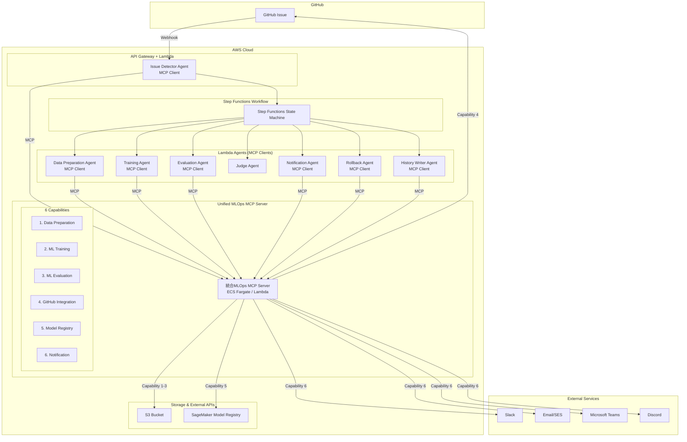
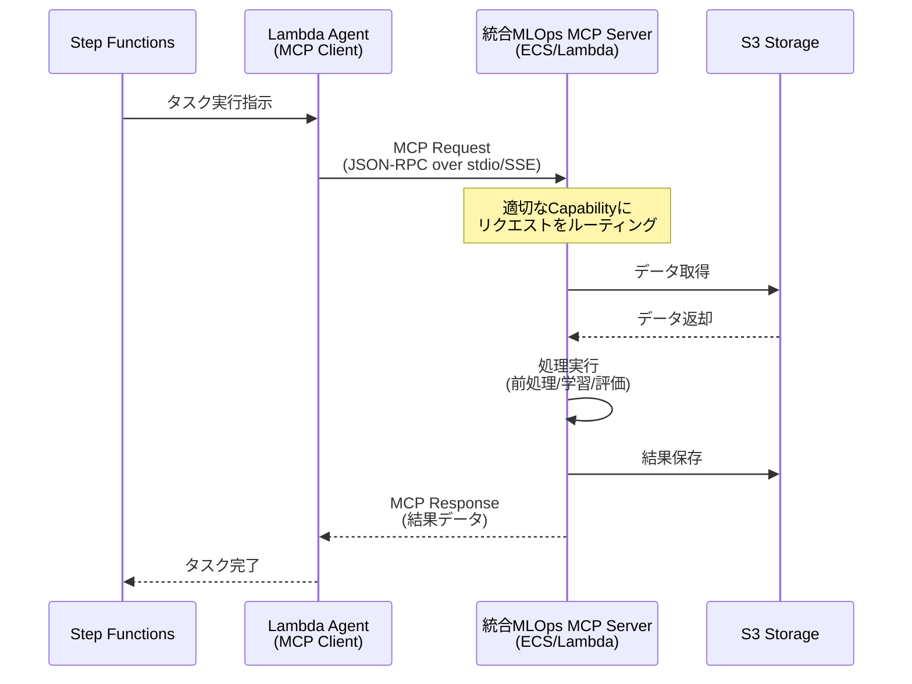

# MCP化設計書: MLOps専門機能のModel Context Protocol対応

## 1. MCP化の目的

### 1.1 現状の課題
現在の設計では、データ前処理・モデル学習・モデル評価などの専門機能がAWS Lambda/ECS Fargateに直接実装されており、以下の課題があります:

- **再利用性の欠如**: 各エージェントに機能が埋め込まれており、他プロジェクトで再利用できない
- **保守性の低下**: 新しいアルゴリズムや評価指標の追加時にLambda/ECSコードを修正する必要がある
- **テストの困難さ**: AWS環境依存のテストになり、ローカル開発が困難
- **ベンダーロックイン**: AWS特化の実装で、他クラウドへの移行が困難

### 1.2 MCP化のメリット
Model Context Protocol (MCP) として専門機能を実装することで:

- ✅ **再利用性向上**: 標準プロトコルに準拠し、他プロジェクトでも利用可能
- ✅ **保守性向上**: MCPサーバーとして独立しており、機能追加・変更が容易
- ✅ **テスト容易性**: ローカル環境で単体テスト可能
- ✅ **拡張性向上**: 新しいツール（アルゴリズム、評価指標）を容易に追加可能
- ✅ **ベンダーニュートラル**: クラウドプロバイダーに依存しない設計
- ✅ **標準化**: MCPという業界標準プロトコルに準拠

---

## 2. MCP化対象コンポーネント

### 2.1 統合MCPサーバーアプローチ

システムの主要機能を**1つの統合MLOps MCPサーバー**として実装します。各機能領域は独立した**capability（機能群）**として提供され、運用の簡素化とリソース効率を実現します。

#### 統合MLOps MCP Server

**責務**: MLOpsパイプラインの全専門機能を統合提供

**アーキテクチャ上のメリット**:
- ✅ **運用の簡素化**: 1つのサーバープロセスのみ管理
- ✅ **デプロイの簡素化**: 1つのコンテナ/Lambdaのみデプロイ
- ✅ **リソース効率**: メモリ・CPUを共有、オーバーヘッド削減
- ✅ **MCP接続の削減**: 1つのMCP接続で全ツールにアクセス可能
- ✅ **一貫性の向上**: バージョン管理・依存関係が統一
- ✅ **開発効率**: 共通ユーティリティ・設定の再利用

### 2.2 提供Capability（6つの機能群）

統合MCPサーバーは、以下の**6つのcapability**を提供します:

#### Capability 1: Data Preparation

**責務**: データ前処理・特徴量エンジニアリング

**提供ツール**:
- `load_dataset`: S3からデータセットを読み込む
- `validate_data`: データのバリデーション（欠損値、型チェック等）
- `preprocess_supervised`: 教師あり学習用の前処理（正規化、エンコーディング等）
- `preprocess_unsupervised`: 教師なし学習用の前処理
- `preprocess_reinforcement`: 強化学習用の前処理
- `split_dataset`: データセットの分割（train/validation/test）
- `feature_engineering`: 特徴量エンジニアリング
- `save_processed_data`: 処理済みデータをS3に保存

#### Capability 2: ML Training

**責務**: 機械学習モデルの学習

**提供ツール**:
- `train_supervised_classifier`: 教師あり学習（分類）
  - `random_forest_classifier`
  - `xgboost_classifier`
  - `neural_network_classifier`
- `train_supervised_regressor`: 教師あり学習（回帰）
  - `linear_regression`
  - `xgboost_regressor`
  - `neural_network_regressor`
- `train_unsupervised_clustering`: 教師なし学習（クラスタリング）
  - `kmeans_clustering`
  - `dbscan_clustering`
  - `autoencoder_clustering`
- `train_unsupervised_dimension_reduction`: 教師なし学習（次元削減）
  - `pca_reduction`
  - `tsne_reduction`
- `train_reinforcement`: 強化学習
  - `ppo_training`
  - `dqn_training`
  - `a3c_training`
- `get_training_metrics`: 学習中のメトリクスを取得
- `save_model`: 学習済みモデルをS3に保存

#### Capability 3: ML Evaluation

**責務**: モデルの評価・可視化

**提供ツール**:
- `load_model`: S3からモデルをロード
- `evaluate_classifier`: 分類モデルの評価
  - メトリクス: Accuracy, Precision, Recall, F1-Score, AUC-ROC
  - 出力: Confusion Matrix, ROC Curve
- `evaluate_regressor`: 回帰モデルの評価
  - メトリクス: RMSE, MAE, R², MAPE
  - 出力: Residual Plot, Prediction vs Actual Plot
- `evaluate_clustering`: クラスタリングモデルの評価
  - メトリクス: Silhouette Score, Davies-Bouldin Index, Inertia
  - 出力: Cluster Visualization
- `evaluate_reinforcement`: 強化学習モデルの評価
  - メトリクス: Episode Reward, Success Rate, Average Steps
  - 出力: Reward Curve, Episode Length Distribution
- `compare_models`: 複数モデルの比較
- `generate_evaluation_report`: 評価レポートの生成（Markdown/JSON）
- `save_evaluation_results`: 評価結果をS3に保存

#### Capability 4: GitHub Integration

**責務**: GitHub連携機能の統合

**提供ツール**:

**Issue管理**:

- `get_issue`: Issueの取得
- `create_issue`: Issueの作成
- `update_issue`: Issueの更新
- `add_issue_comment`: Issueにコメント追加
- `get_issue_comments`: Issueのコメント一覧取得
- `parse_issue_body`: Issue本文のYAML/JSONパース

**ラベル管理**:

- `get_issue_labels`: Issueのラベル取得
- `add_label`: ラベル追加
- `remove_label`: ラベル削除

**リポジトリ操作**:

- `create_file`: ファイル作成（履歴保存用）
- `update_file`: ファイル更新
- `commit_changes`: 変更のコミット
- `create_pull_request`: プルリクエスト作成

**Webhook**:

- `validate_webhook_signature`: Webhook署名の検証
- `parse_webhook_payload`: Webhookペイロードのパース

**影響を受けるエージェント**:

- Issue Detector Agent → MCPクライアント化
- Notification Agent → MCPクライアント化
- History Writer Agent → MCPクライアント化

#### Capability 5: Model Registry

**責務**: モデルバージョン管理・レジストリ操作

**提供ツール**:

**モデル登録**:

- `register_model`: モデルの登録
- `update_model_metadata`: モデルメタデータの更新
- `delete_model`: モデルの削除

**モデルバージョン管理**:

- `list_model_versions`: モデルバージョン一覧取得
- `get_model_version`: 特定バージョンの取得
- `promote_model_version`: モデルバージョンの昇格（Staging → Production）
- `archive_model_version`: モデルバージョンのアーカイブ

**モデルステータス管理**:

- `approve_model`: モデルの承認
- `reject_model`: モデルの却下
- `get_model_status`: モデルステータスの取得

**ロールバック**:

- `rollback_model`: 前バージョンへのロールバック
- `get_rollback_history`: ロールバック履歴の取得

**モデル検索**:

- `search_models`: モデル検索
- `filter_models_by_metrics`: メトリクスでフィルタリング
- `get_best_model`: 最良モデルの取得

**影響を受けるエージェント**:

- Training Agent → MCPクライアント化（モデル登録部分）
- Rollback Agent → MCPクライアント化

#### Capability 6: Notification

**責務**: 通知チャネルの統合管理

**提供ツール**:

**GitHub通知**:

- `notify_github_issue`: GitHub Issueにコメント投稿
- `update_github_issue_status`: Issueのステータス更新

**Slack通知**:

- `send_slack_message`: Slackメッセージ送信
- `send_slack_thread_reply`: スレッド返信
- `send_slack_dm`: DM送信

**Email通知**:

- `send_email`: Email送信
- `send_email_with_attachment`: 添付ファイル付きEmail送信

**Microsoft Teams通知**:

- `send_teams_message`: Teamsメッセージ送信

**Discord通知**:

- `send_discord_message`: Discordメッセージ送信

**通知テンプレート**:

- `render_notification_template`: テンプレートレンダリング
- `get_notification_templates`: テンプレート一覧取得

**影響を受けるエージェント**:

- Notification Agent → MCPクライアント化（通知チャネル部分）

### 2.3 将来の拡張候補

統合MCPサーバーには、将来的に以下のcapabilityを追加可能です:

**Capability 7: Experiment Tracking** 💡
- MLflow、Weights & Biases等の実験追跡ツール統合
- ハイパーパラメータチューニング履歴管理

**Capability 8: Data Versioning** 💡
- DVC、Delta Lake等のデータバージョニングツール統合
- データ系譜追跡、データ品質モニタリング

詳細は [mcp_extended_design.md](mcp_extended_design.md) を参照

---

## 3. アーキテクチャ設計

### 3.1 システムアーキテクチャ（統合MLOps MCPサーバー）



### 3.2 エージェント・統合MCPサーバー連携フロー



---

## 4. 統合MCPサーバー詳細設計

### 4.1 Capability 1: Data Preparation

#### ツール定義例

**ツール名**: `preprocess_supervised`

**入力スキーマ**:
```json
{
  "name": "preprocess_supervised",
  "description": "教師あり学習用のデータ前処理を実行",
  "inputSchema": {
    "type": "object",
    "properties": {
      "dataset_s3_uri": {
        "type": "string",
        "description": "S3上の生データのURI"
      },
      "target_column": {
        "type": "string",
        "description": "目的変数のカラム名"
      },
      "task_type": {
        "type": "string",
        "enum": ["classification", "regression"],
        "description": "タスクタイプ"
      },
      "preprocessing_config": {
        "type": "object",
        "properties": {
          "normalize": {"type": "boolean"},
          "handle_missing": {"type": "string", "enum": ["drop", "mean", "median", "mode"]},
          "encode_categorical": {"type": "boolean"}
        }
      }
    },
    "required": ["dataset_s3_uri", "target_column", "task_type"]
  }
}
```

**出力例**:
```json
{
  "content": [
    {
      "type": "text",
      "text": "データ前処理が完了しました"
    },
    {
      "type": "resource",
      "resource": {
        "uri": "s3://mlops-bucket/processed/train-001/train.csv",
        "name": "処理済み学習データ",
        "mimeType": "text/csv"
      }
    }
  ],
  "metadata": {
    "num_samples": 10000,
    "num_features": 50,
    "target_distribution": {"class_0": 5000, "class_1": 5000}
  }
}
```

### 4.2 Capability 2: ML Training

#### ツール定義例

**ツール名**: `train_supervised_classifier`

**入力スキーマ**:
```json
{
  "name": "train_supervised_classifier",
  "description": "教師あり学習（分類）モデルを学習",
  "inputSchema": {
    "type": "object",
    "properties": {
      "algorithm": {
        "type": "string",
        "enum": ["random_forest", "xgboost", "neural_network"],
        "description": "使用するアルゴリズム"
      },
      "train_data_s3_uri": {
        "type": "string",
        "description": "学習データのS3 URI"
      },
      "validation_data_s3_uri": {
        "type": "string",
        "description": "検証データのS3 URI"
      },
      "hyperparameters": {
        "type": "object",
        "description": "ハイパーパラメータ"
      },
      "training_job_name": {
        "type": "string",
        "description": "学習ジョブ名"
      }
    },
    "required": ["algorithm", "train_data_s3_uri", "training_job_name"]
  }
}
```

**出力例**:
```json
{
  "content": [
    {
      "type": "text",
      "text": "Random Forest分類モデルの学習が完了しました"
    },
    {
      "type": "resource",
      "resource": {
        "uri": "s3://mlops-bucket/models/train-001/model.pkl",
        "name": "学習済みモデル",
        "mimeType": "application/octet-stream"
      }
    }
  ],
  "metrics": {
    "train_accuracy": 0.92,
    "validation_accuracy": 0.87,
    "train_loss": 0.23,
    "validation_loss": 0.35,
    "training_time_seconds": 120.5
  }
}
```

### 4.3 Capability 3: ML Evaluation

#### ツール定義例

**ツール名**: `evaluate_classifier`

**入力スキーマ**:
```json
{
  "name": "evaluate_classifier",
  "description": "分類モデルを評価",
  "inputSchema": {
    "type": "object",
    "properties": {
      "model_s3_uri": {
        "type": "string",
        "description": "モデルのS3 URI"
      },
      "test_data_s3_uri": {
        "type": "string",
        "description": "テストデータのS3 URI"
      },
      "generate_plots": {
        "type": "boolean",
        "description": "プロットを生成するか",
        "default": true
      }
    },
    "required": ["model_s3_uri", "test_data_s3_uri"]
  }
}
```

**出力例**:
```json
{
  "content": [
    {
      "type": "text",
      "text": "モデル評価が完了しました"
    },
    {
      "type": "resource",
      "resource": {
        "uri": "s3://mlops-bucket/evaluations/train-001/confusion_matrix.png",
        "name": "混同行列",
        "mimeType": "image/png"
      }
    },
    {
      "type": "resource",
      "resource": {
        "uri": "s3://mlops-bucket/evaluations/train-001/roc_curve.png",
        "name": "ROC曲線",
        "mimeType": "image/png"
      }
    }
  ],
  "metrics": {
    "accuracy": 0.87,
    "precision": 0.85,
    "recall": 0.89,
    "f1_score": 0.87,
    "auc_roc": 0.91
  }
}
```

### 4.4 統合サーバーのツールルーティング

統合MCPサーバーは、受信したツール呼び出しを適切なcapabilityにルーティングします:

```python
# 統合MCPサーバーのツールルーティング例
class UnifiedMLOpsMCPServer:
    def __init__(self):
        self.capabilities = {
            'data_preparation': DataPreparationCapability(),
            'ml_training': MLTrainingCapability(),
            'ml_evaluation': MLEvaluationCapability(),
            'github_integration': GitHubIntegrationCapability(),
            'model_registry': ModelRegistryCapability(),
            'notification': NotificationCapability()
        }

    async def handle_tool_call(self, tool_name: str, arguments: dict):
        # ツール名からcapabilityを特定
        capability_name = self._get_capability_for_tool(tool_name)
        capability = self.capabilities[capability_name]

        # 該当capabilityでツールを実行
        return await capability.execute_tool(tool_name, arguments)
```

---

## 5. デプロイメント戦略

### 5.1 統合MCPサーバーのホスティング

#### オプション1: ECS Fargate（推奨）

統合MCPサーバーを1つのECS Fargateタスクとしてデプロイ

**メリット**:
- ✅ **運用の簡素化**: 1つのコンテナのみ管理
- ✅ **長時間実行可能**: Lambda 15分制限なし
- ✅ **依存関係の統一**: すべてのcapabilityが同じコンテナイメージを使用
- ✅ **リソース共有**: メモリ・CPUを効率的に共有

**デメリット**:
- ❌ 常時起動の場合、コスト高
- ❌ Lambdaより起動が遅い

**推奨構成**:
- CPU: 2 vCPU
- Memory: 8GB
- Auto Scaling: 最小1タスク、最大5タスク

#### オプション2: Lambda（軽量処理・開発環境向け）

統合MCPサーバーを1つのLambda関数としてデプロイ

**メリット**:
- ✅ **従量課金**: 使用時のみ課金
- ✅ **運用が簡単**: サーバーレス
- ✅ **コールドスタート最小化**: 1つの関数のみウォームアップ

**デメリット**:
- ❌ 15分のタイムアウト制限
- ❌ メモリ制限（最大10GB）
- ❌ 大規模データ処理には不向き

**推奨構成**:
- Memory: 4096MB - 10240MB
- Timeout: 15分
- Ephemeral storage: 10GB

#### オプション3: ハイブリッド（将来の最適化）

統合MCPサーバーで軽量処理を実行し、重い処理は別サービスへ委譲

- 統合MCP Server (Lambda): ツールルーティング、軽量処理
- SageMaker Training Job: 大規模学習（MCPサーバーがジョブを起動）
- SageMaker Processing Job: 大規模データ処理

### 5.2 MCP通信プロトコル

#### stdio通信（推奨）

Lambda/ECS AgentがMCPサーバーを子プロセスとして起動:

```python
# Lambda Agent側（MCP Client）
from mcp import ClientSession, StdioServerParameters
from mcp.client.stdio import stdio_client

async def call_mcp_tool():
    # 統合MCPサーバーを起動
    server_params = StdioServerParameters(
        command="python",
        args=["-m", "mcp_server"],  # 統合サーバー
        env={"AWS_REGION": "us-east-1"}
    )

    async with stdio_client(server_params) as (read, write):
        async with ClientSession(read, write) as session:
            await session.initialize()

            # Data Preparationツールを呼び出し
            result = await session.call_tool(
                "preprocess_supervised",
                arguments={
                    "dataset_s3_uri": "s3://...",
                    "target_column": "label",
                    "task_type": "classification"
                }
            )

            return result
```

**メリット**:
- ✅ 1つのサーバープロセスのみ起動
- ✅ すべてのcapabilityに同じセッションでアクセス可能
- ✅ 接続オーバーヘッド最小

#### SSE通信（代替案）

統合MCPサーバーをECS Service（常時起動）として運用し、HTTP/SSEで通信:

- Lambda AgentがHTTPリクエストでMCPサーバーにアクセス
- サーバー側はFastAPI等でHTTPエンドポイントを提供
- 複数のAgentから同時にアクセス可能

---

## 6. 実装ディレクトリ構造（統合MCPサーバー対応）

```
MLOps/
├── agents/                                # Lambda Agents（MCP Clients）
│   ├── issue_detector/                    # MCP Client実装
│   │   ├── handler.py                    # Lambda handler
│   │   └── mcp_client.py                 # 統合MCP Client
│   ├── data_preparation/                  # MCP Client実装
│   │   ├── handler.py
│   │   └── mcp_client.py                 # 統合MCP Client
│   ├── training/                          # MCP Client実装
│   │   ├── handler.py
│   │   └── mcp_client.py                 # 統合MCP Client
│   ├── evaluation/                        # MCP Client実装
│   │   ├── handler.py
│   │   └── mcp_client.py                 # 統合MCP Client
│   ├── judge/
│   ├── notification/                      # MCP Client実装
│   │   ├── handler.py
│   │   └── mcp_client.py                 # 統合MCP Client
│   ├── rollback/                          # MCP Client実装
│   │   ├── handler.py
│   │   └── mcp_client.py                 # 統合MCP Client
│   └── history_writer/                    # MCP Client実装
│       ├── handler.py
│       └── mcp_client.py                 # 統合MCP Client
│
├── mcp_server/                            # 統合MLOps MCP Server（単数形）
│   ├── __init__.py
│   ├── server.py                         # メインサーバー・ツールルーティング
│   ├── __main__.py                       # エントリーポイント
│   │
│   ├── capabilities/                      # 6つのCapability実装
│   │   ├── __init__.py
│   │   │
│   │   ├── data_preparation/             # Capability 1: Data Preparation
│   │   │   ├── __init__.py
│   │   │   ├── capability.py             # Capability定義
│   │   │   └── tools/
│   │   │       ├── __init__.py
│   │   │       ├── load_dataset.py
│   │   │       ├── validate_data.py
│   │   │       ├── preprocess_supervised.py
│   │   │       ├── preprocess_unsupervised.py
│   │   │       ├── preprocess_reinforcement.py
│   │   │       ├── feature_engineering.py
│   │   │       └── split_dataset.py
│   │   │
│   │   ├── ml_training/                  # Capability 2: ML Training
│   │   │   ├── __init__.py
│   │   │   ├── capability.py
│   │   │   └── tools/
│   │   │       ├── __init__.py
│   │   │       ├── supervised/
│   │   │       │   ├── random_forest.py
│   │   │       │   ├── xgboost.py
│   │   │       │   └── neural_network.py
│   │   │       ├── unsupervised/
│   │   │       │   ├── kmeans.py
│   │   │       │   ├── dbscan.py
│   │   │       │   ├── pca.py
│   │   │       │   └── tsne.py
│   │   │       └── reinforcement/
│   │   │           ├── ppo.py
│   │   │           ├── dqn.py
│   │   │           └── a3c.py
│   │   │
│   │   ├── ml_evaluation/                # Capability 3: ML Evaluation
│   │   │   ├── __init__.py
│   │   │   ├── capability.py
│   │   │   └── tools/
│   │   │       ├── __init__.py
│   │   │       ├── evaluate_classifier.py
│   │   │       ├── evaluate_regressor.py
│   │   │       ├── evaluate_clustering.py
│   │   │       ├── evaluate_reinforcement.py
│   │   │       ├── compare_models.py
│   │   │       └── visualization.py
│   │   │
│   │   ├── github_integration/           # Capability 4: GitHub Integration
│   │   │   ├── __init__.py
│   │   │   ├── capability.py
│   │   │   └── tools/
│   │   │       ├── __init__.py
│   │   │       ├── issue_management.py
│   │   │       ├── label_management.py
│   │   │       ├── repository_operations.py
│   │   │       ├── webhook_handler.py
│   │   │       └── parser.py
│   │   │
│   │   ├── model_registry/               # Capability 5: Model Registry
│   │   │   ├── __init__.py
│   │   │   ├── capability.py
│   │   │   └── tools/
│   │   │       ├── __init__.py
│   │   │       ├── model_registration.py
│   │   │       ├── version_management.py
│   │   │       ├── status_management.py
│   │   │       ├── rollback.py
│   │   │       └── search.py
│   │   │
│   │   └── notification/                 # Capability 6: Notification
│   │       ├── __init__.py
│   │       ├── capability.py
│   │       └── tools/
│   │           ├── __init__.py
│   │           ├── github_notifier.py
│   │           ├── slack_notifier.py
│   │           ├── email_notifier.py
│   │           ├── teams_notifier.py
│   │           ├── discord_notifier.py
│   │           └── template_manager.py
│   │
│   ├── common/                            # 共通ユーティリティ
│   │   ├── __init__.py
│   │   ├── s3_utils.py
│   │   ├── logger.py
│   │   └── config.py
│   │
│   ├── Dockerfile                        # ECS Fargate用Dockerイメージ
│   └── requirements.txt                  # すべてのcapabilityの依存関係を統合
│
├── tests/
│   ├── mcp_server/                       # 統合MCPサーバーのテスト
│   │   ├── test_server.py               # サーバー・ルーティングのテスト
│   │   ├── test_data_preparation.py
│   │   ├── test_ml_training.py
│   │   ├── test_ml_evaluation.py
│   │   ├── test_github_integration.py
│   │   ├── test_model_registry.py
│   │   └── test_notification.py
│   └── integration/
│       └── test_agent_mcp_integration.py
│
└── cdk/
    └── stacks/
        ├── unified_mcp_server_stack.py   # 統合MCPサーバー用ECS/Lambda
        └── ...
```

---

## 7. 実装戦略（統合MCPサーバー）

### 7.1 段階的実装アプローチ

統合MCPサーバーは**単一のサーバー**として実装しますが、capabilityごとに段階的に機能を追加します。

#### Phase 1: コアMLOps Capability実装（Week 1-6）

**Week 1-2: 統合サーバーの基盤 + Data Preparation Capability**

- [ ] 統合MCPサーバーの基本構造実装（`mcp_server/server.py`）
- [ ] ツールルーティング機構の実装
- [ ] Data Preparation Capabilityの実装
- [ ] Data Preparation AgentをMCPクライアント化
- [ ] 単体テスト・統合テスト
- [ ] デプロイ・動作確認

**Week 3-4: ML Training Capability追加**

- [ ] ML Training Capabilityの実装
- [ ] 統合サーバーへのツール登録
- [ ] Training AgentをMCPクライアント化
- [ ] 単体テスト・統合テスト
- [ ] デプロイ・動作確認

**Week 5-6: ML Evaluation Capability追加**

- [ ] ML Evaluation Capabilityの実装
- [ ] 統合サーバーへのツール登録
- [ ] Evaluation AgentをMCPクライアント化
- [ ] 単体テスト・統合テスト
- [ ] デプロイ・動作確認

#### Phase 2: 統合Capability実装（Week 7-12）

**Week 7-8: GitHub Integration Capability追加**

- [ ] GitHub Integration Capabilityの実装
- [ ] 統合サーバーへのツール登録
- [ ] Issue Detector AgentをMCPクライアント化
- [ ] History Writer AgentをMCPクライアント化
- [ ] 単体テスト・統合テスト
- [ ] デプロイ・動作確認

**Week 9-10: Model Registry Capability追加**

- [ ] Model Registry Capabilityの実装
- [ ] 統合サーバーへのツール登録
- [ ] Training AgentのMCPクライアントにモデル登録機能追加
- [ ] Rollback AgentをMCPクライアント化
- [ ] 単体テスト・統合テスト
- [ ] デプロイ・動作確認

**Week 11-12: Notification Capability追加**

- [ ] Notification Capabilityの実装
- [ ] 統合サーバーへのツール登録
- [ ] Notification AgentをMCPクライアント化
- [ ] Slack/Email/Teams/Discord通知機能の実装
- [ ] 通知テンプレート管理機能の実装
- [ ] 単体テスト・統合テスト
- [ ] デプロイ・動作確認

#### Phase 3: E2Eテスト・最適化（Week 13-14）

- [ ] E2Eテストの実施（全学習方式）
- [ ] 統合MCPサーバーの全Capabilityテスト
- [ ] パフォーマンステスト・最適化
- [ ] ドキュメント更新（README、アーキテクチャ設計書等）
- [ ] 運用手順書作成
- [ ] 実装完了報告書作成

### 7.2 後方互換性

実装期間中は以下の戦略を採用:

- 既存のLambda/ECS実装を残す
- 統合MCPサーバー版と既存実装を並行運用
- 環境変数で切り替え可能にする
- Capabilityごとに段階的に移行

---

## 8. メリット・デメリット評価

### 8.1 統合MCPサーバーのメリット

| 項目 | 詳細 |
|------|------|
| **再利用性** | 統合MCPサーバーを他プロジェクトでも利用可能 |
| **保守性** | 機能追加・変更が1つのサーバー内で完結 |
| **テスト容易性** | ローカル環境で全Capabilityを一度にテスト可能 |
| **拡張性** | 新しいCapability・ツールを容易に追加 |
| **標準化** | MCPという業界標準プロトコルに準拠 |
| **ベンダーニュートラル** | AWS以外のクラウドでも利用可能 |
| **疎結合** | Agent層とML処理層が完全に分離 |
| **運用の簡素化** ⭐ | 1つのサーバープロセス/コンテナのみ管理 |
| **デプロイの簡素化** ⭐ | 1つのデプロイパイプラインで完結 |
| **リソース効率** ⭐ | メモリ・CPUを共有、オーバーヘッド削減 |
| **MCP接続の最小化** ⭐ | 1つのMCP接続で全ツールにアクセス |
| **依存関係の統一** ⭐ | すべてのCapabilityで同じバージョンの依存ライブラリを使用 |

### 8.2 デメリット・課題

| 項目 | 詳細 | 対策 |
|------|------|------|
| **レイテンシ増加** | MCP通信のオーバーヘッド | stdio通信で最小化、キャッシング活用 |
| **複雑性増加** | MCPサーバーという新しい層が追加 | ドキュメント整備、開発者教育 |
| **初期開発コスト** | 統合MCPサーバー実装に時間が必要 | 段階的移行、優先度付け |
| **運用コスト** | ECS Fargateの運用コスト増 | Lambda代替、Auto Scaling活用 |
| **単一障害点** ⭐ | サーバーダウン時、全機能が停止 | ECS Auto Scaling、ヘルスチェック強化 |
| **依存関係の肥大化** ⭐ | すべてのCapabilityの依存関係を含む | マルチステージDockerビルドで最適化 |

### 8.3 6個の独立サーバーとの比較

| 項目 | 統合MCPサーバー（1個） | 独立MCPサーバー（6個） |
|------|------|------|
| **運用の簡素さ** | ✅ 1プロセスのみ | ❌ 6プロセス管理 |
| **デプロイの簡素さ** | ✅ 1デプロイのみ | ❌ 6デプロイ管理 |
| **リソース効率** | ✅ 共有により効率的 | ❌ 各サーバーでオーバーヘッド |
| **MCP接続数** | ✅ 1接続のみ | ❌ 6接続必要 |
| **障害の隔離** | ❌ 単一障害点 | ✅ 1サーバーダウンでも他は動作 |
| **個別スケーリング** | ❌ 全Capability一緒にスケール | ✅ Capabilityごとに独立スケール |
| **開発の独立性** | △ 同じリポジトリで開発 | ✅ 完全に独立して開発可能 |

### 8.4 総合評価

**推奨**: 統合MCPサーバーアプローチを採用すべき

**理由**:
- ✅ 運用・デプロイの簡素化により、長期的な保守コストが大幅に削減
- ✅ リソース効率の向上により、インフラコストも削減
- ✅ 機械学習アルゴリズムは頻繁に追加・変更されるため、柔軟性が重要
- ✅ 標準プロトコル準拠により、将来的な技術選択肢が広がる
- ✅ 1つのMCP接続で全機能にアクセスでき、Agent側の実装が簡素化
- ⚠️ 単一障害点のリスクはあるが、ECS Auto Scalingとヘルスチェックで緩和可能
- ⚠️ 初期コストは高いが、中長期的にはROIが非常に高い

---

## 9. 代替案との比較

### 9.1 Option A: 現状維持（Lambda/ECS直接実装）

**メリット**: 開発コスト低、シンプル
**デメリット**: 拡張性・保守性が低い
**推奨度**: ❌

### 9.2 Option B: 6個の独立MCPサーバー

**メリット**: 障害の隔離、個別スケーリング、開発の独立性
**デメリット**: 運用・デプロイの複雑化、リソースオーバーヘッド、6つのMCP接続が必要
**推奨度**: △（大規模チーム・高可用性要件がある場合）

### 9.3 Option C: 統合MCPサーバー（本提案）⭐

**メリット**: 運用の簡素化、デプロイの簡素化、リソース効率、1つのMCP接続のみ
**デメリット**: 単一障害点、初期開発コスト高
**推奨度**: ✅（推奨）

### 9.4 Option D: SageMaker Pipelines利用

**メリット**: AWSネイティブ、GUI管理可能
**デメリット**: ベンダーロックイン、柔軟性が低い
**推奨度**: △（AWS縛りOKなら選択肢）

### 9.5 Option E: Kubeflow Pipelines

**メリット**: ML特化、豊富な機能
**デメリット**: インフラ複雑、運用コスト高
**推奨度**: △（大規模組織向け）

---

## 10. 成功指標（KPI）

### 10.1 技術指標

| 指標 | 目標値 | 測定方法 |
|------|--------|---------|
| **コードカバレッジ** | 80%以上 | pytest-cov |
| **レイテンシ増加** | 従来比+10%以内 | CloudWatch Metrics |
| **新アルゴリズム追加時間** | 4時間以内 | 実測 |
| **ローカルテスト成功率** | 95%以上 | CI/CD統計 |

### 10.2 ビジネス指標

| 指標 | 目標値 | 測定方法 |
|------|--------|---------|
| **開発速度向上** | 新機能追加時間50%削減 | 開発チーム計測 |
| **再利用率** | 3プロジェクト以上で利用 | 利用状況追跡 |
| **保守コスト削減** | 月次保守時間30%削減 | 保守ログ |

---

## 11. リスク管理

### 11.1 リスク一覧

| リスク | 影響度 | 発生確率 | 対策 |
|--------|--------|---------|------|
| MCPサーバーのパフォーマンス問題 | 高 | 中 | 事前性能テスト、キャッシング実装 |
| 開発期間の遅延 | 中 | 高 | 段階的移行、スコープ調整 |
| チーム学習コスト | 中 | 中 | ドキュメント整備、ハンズオン実施 |
| ECS運用コスト増加 | 中 | 中 | Auto Scaling、Spot Instance活用 |

---

## 12. 次のステップ

### 12.1 即座に実施すべきこと
1. **POC実施**: Data Preparation MCPサーバーの小規模実装
2. **パフォーマンステスト**: レイテンシ・スループット測定
3. **コスト見積もり**: ECS Fargateのコスト試算

### 12.2 承認後のアクション
1. 詳細実装計画の策定
2. チーム体制の確立
3. Phase 1の実装開始

---

## 13. まとめ

### 13.1 統合MCPサーバーの設計概要

**1つの統合MLOps MCPサーバー** として実装し、**6つのCapability**を提供します (合計14週間):

1. **Data Preparation Capability** - データ前処理・特徴量エンジニアリング
2. **ML Training Capability** - 機械学習モデルの学習
3. **ML Evaluation Capability** - モデルの評価・可視化
4. **GitHub Integration Capability** - GitHub連携機能の統合
5. **Model Registry Capability** - モデルバージョン管理・レジストリ操作
6. **Notification Capability** - 通知チャネルの統合管理

**統合アプローチの主要メリット**:
- 🎯 **運用の簡素化**: 1つのサーバープロセス/コンテナのみ管理
- 🎯 **デプロイの簡素化**: 1つのデプロイパイプラインで完結
- 🎯 **リソース効率**: メモリ・CPUを共有、オーバーヘッド削減
- 🎯 **MCP接続の最小化**: 1つのMCP接続で全ツールにアクセス

この統合MCPサーバーで、**システムの約90%の機能をMCP化**します。

### 13.2 期待される効果

**従来の6個独立サーバーと比較した追加メリット**:
- ✅ **運用コスト削減**: 6プロセス→1プロセスにより、運用負荷が大幅に削減
- ✅ **デプロイ時間短縮**: 6デプロイ→1デプロイにより、リリースサイクル高速化
- ✅ **インフラコスト削減**: リソース共有により、メモリ・CPU使用量を最適化
- ✅ **Agent実装の簡素化**: 1つのMCP接続のみで全機能にアクセス可能

**共通メリット**:
- ✅ **再利用性**: 他のMLOpsプロジェクトでも利用可能
- ✅ **保守性**: 機能追加・変更が1つのサーバー内で完結
- ✅ **テスト容易性**: ローカル環境で全Capabilityを一度にテスト可能
- ✅ **拡張性**: 新しいCapability・ツールを容易に追加
- ✅ **標準化**: MCPという業界標準プロトコルに準拠
- ✅ **ベンダーニュートラル**: クラウドプロバイダーに非依存

### 13.3 追加で検討可能なCapability (Phase 3以降)

将来的に統合MCPサーバーに追加可能:

- **Experiment Tracking Capability** - 実験追跡ツール統合（MLflow、W&B等）
- **Data Versioning Capability** - データバージョニングツール統合（DVC、Delta Lake等）

詳細は [mcp_extended_design.md](mcp_extended_design.md) を参照。

---

## 14. 変更履歴

| バージョン | 日付 | 変更内容 | 作成者 |
| --- | --- | --- | --- |
| 0.1 | 2025-12-27 | 初版発行（統合MLOps MCPサーバー設計） | - |
