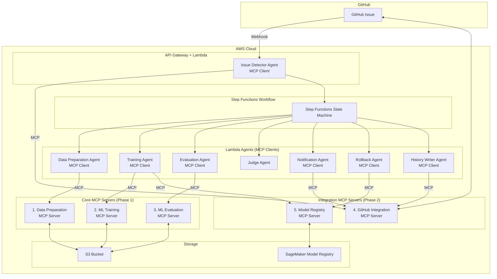

# MCP化設計書: MLOps専門機能のModel Context Protocol対応

## 1. MCP化の目的

### 1.1 現状の課題
現在の設計では、データ前処理・モデル学習・モデル評価などの専門機能がAWS Lambda/ECS Fargateに直接実装されており、以下の課題があります:

- **再利用性の欠如**: 各エージェントに機能が埋め込まれており、他プロジェクトで再利用できない
- **保守性の低下**: 新しいアルゴリズムや評価指標の追加時にLambda/ECSコードを修正する必要がある
- **テストの困難さ**: AWS環境依存のテストになり、ローカル開発が困難
- **ベンダーロックイン**: AWS特化の実装で、他クラウドへの移行が困難

### 1.2 MCP化のメリット
Model Context Protocol (MCP) として専門機能を実装することで:

- ✅ **再利用性向上**: 標準プロトコルに準拠し、他プロジェクトでも利用可能
- ✅ **保守性向上**: MCPサーバーとして独立しており、機能追加・変更が容易
- ✅ **テスト容易性**: ローカル環境で単体テスト可能
- ✅ **拡張性向上**: 新しいツール（アルゴリズム、評価指標）を容易に追加可能
- ✅ **ベンダーニュートラル**: クラウドプロバイダーに依存しない設計
- ✅ **標準化**: MCPという業界標準プロトコルに準拠

---

## 2. MCP化対象コンポーネント

### 2.1 MCPサーバー構成

システムの主要機能をMCP化し、以下の**5つのコアMCPサーバー**を構築します:

#### Phase 1-2: コアMCPサーバー（必須 + 強く推奨）

#### MCP Server 1: Data Preparation Server
**責務**: データ前処理・特徴量エンジニアリング

**提供ツール**:
- `load_dataset`: S3からデータセットを読み込む
- `validate_data`: データのバリデーション（欠損値、型チェック等）
- `preprocess_supervised`: 教師あり学習用の前処理（正規化、エンコーディング等）
- `preprocess_unsupervised`: 教師なし学習用の前処理
- `preprocess_reinforcement`: 強化学習用の前処理
- `split_dataset`: データセットの分割（train/validation/test）
- `feature_engineering`: 特徴量エンジニアリング
- `save_processed_data`: 処理済みデータをS3に保存

#### MCP Server 2: ML Training Server
**責務**: 機械学習モデルの学習

**提供ツール**:
- `train_supervised_classifier`: 教師あり学習（分類）
  - `random_forest_classifier`
  - `xgboost_classifier`
  - `neural_network_classifier`
- `train_supervised_regressor`: 教師あり学習（回帰）
  - `linear_regression`
  - `xgboost_regressor`
  - `neural_network_regressor`
- `train_unsupervised_clustering`: 教師なし学習（クラスタリング）
  - `kmeans_clustering`
  - `dbscan_clustering`
  - `autoencoder_clustering`
- `train_unsupervised_dimension_reduction`: 教師なし学習（次元削減）
  - `pca_reduction`
  - `tsne_reduction`
- `train_reinforcement`: 強化学習
  - `ppo_training`
  - `dqn_training`
  - `a3c_training`
- `get_training_metrics`: 学習中のメトリクスを取得
- `save_model`: 学習済みモデルをS3に保存

#### MCP Server 3: ML Evaluation Server
**責務**: モデルの評価・可視化

**提供ツール**:
- `load_model`: S3からモデルをロード
- `evaluate_classifier`: 分類モデルの評価
  - メトリクス: Accuracy, Precision, Recall, F1-Score, AUC-ROC
  - 出力: Confusion Matrix, ROC Curve
- `evaluate_regressor`: 回帰モデルの評価
  - メトリクス: RMSE, MAE, R², MAPE
  - 出力: Residual Plot, Prediction vs Actual Plot
- `evaluate_clustering`: クラスタリングモデルの評価
  - メトリクス: Silhouette Score, Davies-Bouldin Index, Inertia
  - 出力: Cluster Visualization
- `evaluate_reinforcement`: 強化学習モデルの評価
  - メトリクス: Episode Reward, Success Rate, Average Steps
  - 出力: Reward Curve, Episode Length Distribution
- `compare_models`: 複数モデルの比較
- `generate_evaluation_report`: 評価レポートの生成（Markdown/JSON）
- `save_evaluation_results`: 評価結果をS3に保存

#### MCP Server 4: GitHub Integration Server ⭐ 新規追加

**責務**: GitHub連携機能の統合

**提供ツール**:

**Issue管理**:

- `get_issue`: Issueの取得
- `create_issue`: Issueの作成
- `update_issue`: Issueの更新
- `add_issue_comment`: Issueにコメント追加
- `get_issue_comments`: Issueのコメント一覧取得
- `parse_issue_body`: Issue本文のYAML/JSONパース

**ラベル管理**:

- `get_issue_labels`: Issueのラベル取得
- `add_label`: ラベル追加
- `remove_label`: ラベル削除

**リポジトリ操作**:

- `create_file`: ファイル作成（履歴保存用）
- `update_file`: ファイル更新
- `commit_changes`: 変更のコミット
- `create_pull_request`: プルリクエスト作成

**Webhook**:

- `validate_webhook_signature`: Webhook署名の検証
- `parse_webhook_payload`: Webhookペイロードのパース

**影響を受けるエージェント**:

- Issue Detector Agent → MCPクライアント化
- Notification Agent → MCPクライアント化
- History Writer Agent → MCPクライアント化

#### MCP Server 5: Model Registry Server ⭐ 新規追加

**責務**: モデルバージョン管理・レジストリ操作

**提供ツール**:

**モデル登録**:

- `register_model`: モデルの登録
- `update_model_metadata`: モデルメタデータの更新
- `delete_model`: モデルの削除

**モデルバージョン管理**:

- `list_model_versions`: モデルバージョン一覧取得
- `get_model_version`: 特定バージョンの取得
- `promote_model_version`: モデルバージョンの昇格（Staging → Production）
- `archive_model_version`: モデルバージョンのアーカイブ

**モデルステータス管理**:

- `approve_model`: モデルの承認
- `reject_model`: モデルの却下
- `get_model_status`: モデルステータスの取得

**ロールバック**:

- `rollback_model`: 前バージョンへのロールバック
- `get_rollback_history`: ロールバック履歴の取得

**モデル検索**:

- `search_models`: モデル検索
- `filter_models_by_metrics`: メトリクスでフィルタリング
- `get_best_model`: 最良モデルの取得

**影響を受けるエージェント**:

- Training Agent → MCPクライアント化（モデル登録部分）
- Rollback Agent → MCPクライアント化

#### Phase 3: 追加MCPサーバー（オプション）

以下のMCPサーバーは将来的に追加可能:

**MCP Server 6: Notification Server** 💡

- Slack/Email/Teams/Discord等の通知チャネル統合
- 通知テンプレート管理

**MCP Server 7: Experiment Tracking Server** 💡

- MLflow、Weights & Biases等の実験追跡ツール統合
- ハイパーパラメータチューニング履歴管理

**MCP Server 8: Data Versioning Server** 💡

- DVC、Delta Lake等のデータバージョニングツール統合
- データ系譜追跡、データ品質モニタリング

詳細は [mcp_extended_design.md](mcp_extended_design.md) を参照

---

## 3. アーキテクチャ設計

### 3.1 システムアーキテクチャ（5つのMCPサーバー統合版）



### 3.2 エージェント・MCPサーバー連携フロー

```mermaid
sequenceDiagram
    participant SF as Step Functions
    participant Agent as Lambda Agent<br/>(MCP Client)
    participant MCP as MCP Server<br/>(ECS/Lambda)
    participant S3 as S3 Storage

    SF->>Agent: タスク実行指示
    Agent->>MCP: MCP Request<br/>(JSON-RPC over stdio/SSE)
    MCP->>S3: データ取得
    S3-->>MCP: データ返却
    MCP->>MCP: 処理実行<br/>(前処理/学習/評価)
    MCP->>S3: 結果保存
    MCP-->>Agent: MCP Response<br/>(結果データ)
    Agent-->>SF: タスク完了
```



---

## 4. MCPサーバー詳細設計

### 4.1 Data Preparation MCP Server

#### ツール定義例

**ツール名**: `preprocess_supervised`

**入力スキーマ**:
```json
{
  "name": "preprocess_supervised",
  "description": "教師あり学習用のデータ前処理を実行",
  "inputSchema": {
    "type": "object",
    "properties": {
      "dataset_s3_uri": {
        "type": "string",
        "description": "S3上の生データのURI"
      },
      "target_column": {
        "type": "string",
        "description": "目的変数のカラム名"
      },
      "task_type": {
        "type": "string",
        "enum": ["classification", "regression"],
        "description": "タスクタイプ"
      },
      "preprocessing_config": {
        "type": "object",
        "properties": {
          "normalize": {"type": "boolean"},
          "handle_missing": {"type": "string", "enum": ["drop", "mean", "median", "mode"]},
          "encode_categorical": {"type": "boolean"}
        }
      }
    },
    "required": ["dataset_s3_uri", "target_column", "task_type"]
  }
}
```

**出力例**:
```json
{
  "content": [
    {
      "type": "text",
      "text": "データ前処理が完了しました"
    },
    {
      "type": "resource",
      "resource": {
        "uri": "s3://mlops-bucket/processed/train-001/train.csv",
        "name": "処理済み学習データ",
        "mimeType": "text/csv"
      }
    }
  ],
  "metadata": {
    "num_samples": 10000,
    "num_features": 50,
    "target_distribution": {"class_0": 5000, "class_1": 5000}
  }
}
```

### 4.2 ML Training MCP Server

#### ツール定義例

**ツール名**: `train_supervised_classifier`

**入力スキーマ**:
```json
{
  "name": "train_supervised_classifier",
  "description": "教師あり学習（分類）モデルを学習",
  "inputSchema": {
    "type": "object",
    "properties": {
      "algorithm": {
        "type": "string",
        "enum": ["random_forest", "xgboost", "neural_network"],
        "description": "使用するアルゴリズム"
      },
      "train_data_s3_uri": {
        "type": "string",
        "description": "学習データのS3 URI"
      },
      "validation_data_s3_uri": {
        "type": "string",
        "description": "検証データのS3 URI"
      },
      "hyperparameters": {
        "type": "object",
        "description": "ハイパーパラメータ"
      },
      "training_job_name": {
        "type": "string",
        "description": "学習ジョブ名"
      }
    },
    "required": ["algorithm", "train_data_s3_uri", "training_job_name"]
  }
}
```

**出力例**:
```json
{
  "content": [
    {
      "type": "text",
      "text": "Random Forest分類モデルの学習が完了しました"
    },
    {
      "type": "resource",
      "resource": {
        "uri": "s3://mlops-bucket/models/train-001/model.pkl",
        "name": "学習済みモデル",
        "mimeType": "application/octet-stream"
      }
    }
  ],
  "metrics": {
    "train_accuracy": 0.92,
    "validation_accuracy": 0.87,
    "train_loss": 0.23,
    "validation_loss": 0.35,
    "training_time_seconds": 120.5
  }
}
```

### 4.3 ML Evaluation MCP Server

#### ツール定義例

**ツール名**: `evaluate_classifier`

**入力スキーマ**:
```json
{
  "name": "evaluate_classifier",
  "description": "分類モデルを評価",
  "inputSchema": {
    "type": "object",
    "properties": {
      "model_s3_uri": {
        "type": "string",
        "description": "モデルのS3 URI"
      },
      "test_data_s3_uri": {
        "type": "string",
        "description": "テストデータのS3 URI"
      },
      "generate_plots": {
        "type": "boolean",
        "description": "プロットを生成するか",
        "default": true
      }
    },
    "required": ["model_s3_uri", "test_data_s3_uri"]
  }
}
```

**出力例**:
```json
{
  "content": [
    {
      "type": "text",
      "text": "モデル評価が完了しました"
    },
    {
      "type": "resource",
      "resource": {
        "uri": "s3://mlops-bucket/evaluations/train-001/confusion_matrix.png",
        "name": "混同行列",
        "mimeType": "image/png"
      }
    },
    {
      "type": "resource",
      "resource": {
        "uri": "s3://mlops-bucket/evaluations/train-001/roc_curve.png",
        "name": "ROC曲線",
        "mimeType": "image/png"
      }
    }
  ],
  "metrics": {
    "accuracy": 0.87,
    "precision": 0.85,
    "recall": 0.89,
    "f1_score": 0.87,
    "auc_roc": 0.91
  }
}
```

---

## 5. デプロイメント戦略

### 5.1 MCPサーバーのホスティング

#### オプション1: ECS Fargate（推奨）
**メリット**:
- 長時間実行可能（Lambda 15分制限なし）
- コンテナ化により依存関係を完全に管理
- スケーラビリティ高い

**デメリット**:
- Lambdaより起動が遅い
- コスト高（常時起動の場合）

**推奨用途**: 大規模データ処理、長時間学習

#### オプション2: Lambda（軽量処理向け）
**メリット**:
- コールドスタート後は高速
- 使用量に応じた課金
- 運用が簡単

**デメリット**:
- 15分のタイムアウト制限
- メモリ制限（最大10GB）

**推奨用途**: 小規模データ処理、評価処理

#### オプション3: ハイブリッド
- Data Preparation: ECS Fargate（大規模データ対応）
- ML Training: SageMaker Training Job（MCPサーバーがジョブを起動）
- ML Evaluation: Lambda（評価は比較的軽量）

### 5.2 MCP通信プロトコル

#### stdio通信（推奨）
Lambda/ECS AgentがMCPサーバーを子プロセスとして起動:

```python
# Lambda Agent側（MCP Client）
from mcp import ClientSession, StdioServerParameters
from mcp.client.stdio import stdio_client

async def call_mcp_tool():
    server_params = StdioServerParameters(
        command="python",
        args=["-m", "mcp_servers.data_preparation"],
        env={"AWS_REGION": "us-east-1"}
    )

    async with stdio_client(server_params) as (read, write):
        async with ClientSession(read, write) as session:
            await session.initialize()

            result = await session.call_tool(
                "preprocess_supervised",
                arguments={
                    "dataset_s3_uri": "s3://...",
                    "target_column": "label",
                    "task_type": "classification"
                }
            )

            return result
```

#### SSE通信（代替案）
MCPサーバーをECS Service（常時起動）として運用し、HTTP/SSEで通信:

- Lambda AgentがHTTPリクエストでMCPサーバーにアクセス
- サーバー側はFastAPI等でHTTPエンドポイントを提供

---

## 6. 実装ディレクトリ構造（5つのMCPサーバー対応）

```
MLOps/
├── agents/                                # Lambda Agents（MCP Clients）
│   ├── issue_detector/                    # MCP Client実装
│   │   ├── handler.py                    # Lambda handler
│   │   └── mcp_client.py                 # GitHub Integration MCP Client
│   ├── data_preparation/                  # MCP Client実装
│   │   ├── handler.py
│   │   └── mcp_client.py                 # Data Preparation MCP Client
│   ├── training/                          # MCP Client実装
│   │   ├── handler.py
│   │   └── mcp_client.py                 # ML Training & Model Registry MCP Client
│   ├── evaluation/                        # MCP Client実装
│   │   ├── handler.py
│   │   └── mcp_client.py                 # ML Evaluation MCP Client
│   ├── judge/
│   ├── notification/                      # MCP Client実装
│   │   ├── handler.py
│   │   └── mcp_client.py                 # GitHub Integration MCP Client
│   ├── rollback/                          # MCP Client実装
│   │   ├── handler.py
│   │   └── mcp_client.py                 # Model Registry MCP Client
│   └── history_writer/                    # MCP Client実装
│       ├── handler.py
│       └── mcp_client.py                 # GitHub Integration MCP Client
│
├── mcp_servers/                           # MCP Servers実装
│   ├── README.md                         # MCPサーバー使用ガイド
│   ├── __init__.py
│   │
│   ├── data_preparation/                  # 1. Data Preparation MCP Server
│   │   ├── __init__.py
│   │   ├── server.py                     # MCPサーバーメイン
│   │   ├── tools/                        # ツール実装
│   │   │   ├── __init__.py
│   │   │   ├── load_dataset.py
│   │   │   ├── validate_data.py
│   │   │   ├── preprocess_supervised.py
│   │   │   ├── preprocess_unsupervised.py
│   │   │   ├── preprocess_reinforcement.py
│   │   │   ├── feature_engineering.py
│   │   │   └── split_dataset.py
│   │   ├── Dockerfile                    # ECS用Dockerイメージ
│   │   └── requirements.txt
│   │
│   ├── ml_training/                       # 2. ML Training MCP Server
│   │   ├── __init__.py
│   │   ├── server.py
│   │   ├── tools/
│   │   │   ├── __init__.py
│   │   │   ├── supervised/
│   │   │   │   ├── random_forest.py
│   │   │   │   ├── xgboost.py
│   │   │   │   └── neural_network.py
│   │   │   ├── unsupervised/
│   │   │   │   ├── kmeans.py
│   │   │   │   ├── dbscan.py
│   │   │   │   ├── pca.py
│   │   │   │   └── tsne.py
│   │   │   └── reinforcement/
│   │   │       ├── ppo.py
│   │   │       ├── dqn.py
│   │   │       └── a3c.py
│   │   ├── Dockerfile
│   │   └── requirements.txt
│   │
│   ├── ml_evaluation/                     # 3. ML Evaluation MCP Server
│   │   ├── __init__.py
│   │   ├── server.py
│   │   ├── tools/
│   │   │   ├── __init__.py
│   │   │   ├── evaluate_classifier.py
│   │   │   ├── evaluate_regressor.py
│   │   │   ├── evaluate_clustering.py
│   │   │   ├── evaluate_reinforcement.py
│   │   │   ├── compare_models.py
│   │   │   └── visualization.py
│   │   ├── Dockerfile
│   │   └── requirements.txt
│   │
│   ├── github_integration/                # 4. GitHub Integration MCP Server ⭐ NEW
│   │   ├── __init__.py
│   │   ├── server.py
│   │   ├── tools/
│   │   │   ├── __init__.py
│   │   │   ├── issue_management.py       # Issue CRUD操作
│   │   │   ├── label_management.py       # ラベル管理
│   │   │   ├── repository_operations.py  # ファイル作成・コミット
│   │   │   ├── webhook_handler.py        # Webhook処理
│   │   │   └── parser.py                 # YAML/JSONパーサー
│   │   ├── Dockerfile
│   │   └── requirements.txt
│   │
│   └── model_registry/                    # 5. Model Registry MCP Server ⭐ NEW
│       ├── __init__.py
│       ├── server.py
│       ├── tools/
│       │   ├── __init__.py
│       │   ├── model_registration.py     # モデル登録
│       │   ├── version_management.py     # バージョン管理
│       │   ├── status_management.py      # ステータス管理
│       │   ├── rollback.py               # ロールバック
│       │   └── search.py                 # モデル検索
│       ├── Dockerfile
│       └── requirements.txt
│
├── tests/
│   ├── mcp_servers/                       # MCPサーバーのテスト
│   │   ├── test_data_preparation.py
│   │   ├── test_ml_training.py
│   │   ├── test_ml_evaluation.py
│   │   ├── test_github_integration.py    # ⭐ NEW
│   │   └── test_model_registry.py        # ⭐ NEW
│   └── integration/
│       └── test_agent_mcp_integration.py
│
└── cdk/
    └── stacks/
        ├── mcp_server_stack.py            # MCPサーバー用ECS/Lambda
        └── ...
```

---

## 7. 移行戦略（5つのMCPサーバー対応）

### 7.1 段階的移行アプローチ

#### Phase 1: コアMLOps MCPサーバー構築（Week 1-6）

**Week 1-2: Data Preparation MCPサーバー**

- [ ] Data Preparation MCPサーバーの実装
- [ ] Data Preparation AgentをMCPクライアント化
- [ ] 単体テスト・統合テスト
- [ ] デプロイ・動作確認

**Week 3-4: ML Training MCPサーバー**

- [ ] ML Training MCPサーバーの実装
- [ ] Training AgentをMCPクライアント化
- [ ] 単体テスト・統合テスト
- [ ] デプロイ・動作確認

**Week 5-6: ML Evaluation MCPサーバー**

- [ ] ML Evaluation MCPサーバーの実装
- [ ] Evaluation AgentをMCPクライアント化
- [ ] 単体テスト・統合テスト
- [ ] デプロイ・動作確認

#### Phase 2: 統合MCPサーバー構築（Week 7-10）

**Week 7-8: GitHub Integration MCPサーバー** ⭐ 新規

- [ ] GitHub Integration MCPサーバーの実装
- [ ] Issue Detector AgentをMCPクライアント化
- [ ] Notification AgentをMCPクライアント化
- [ ] History Writer AgentをMCPクライアント化
- [ ] 単体テスト・統合テスト
- [ ] デプロイ・動作確認

**Week 9-10: Model Registry MCPサーバー** ⭐ 新規

- [ ] Model Registry MCPサーバーの実装
- [ ] Training AgentのMCPクライアントにモデル登録機能追加
- [ ] Rollback AgentをMCPクライアント化
- [ ] 単体テスト・統合テスト
- [ ] デプロイ・動作確認

#### Phase 3: E2Eテスト・ドキュメント整備（Week 11-12）

- [ ] E2Eテストの実施（全学習方式）
- [ ] 全MCPサーバー統合テスト
- [ ] パフォーマンステスト
- [ ] ドキュメント更新（README、アーキテクチャ設計書等）
- [ ] 運用手順書作成
- [ ] 移行完了報告書作成

### 7.2 後方互換性
移行期間中は以下の戦略を採用:

- 既存のLambda/ECS実装を残す
- MCPサーバー版と既存実装を並行運用
- 環境変数で切り替え可能にする
- 段階的にMCPサーバー版に移行

---

## 8. メリット・デメリット評価

### 8.1 メリット

| 項目 | 詳細 |
|------|------|
| **再利用性** | MCPサーバーを他プロジェクトでも利用可能 |
| **保守性** | 機能追加・変更がMCPサーバー側で完結 |
| **テスト容易性** | ローカル環境で単体テスト可能 |
| **拡張性** | 新しいツール（アルゴリズム）を容易に追加 |
| **標準化** | MCPという業界標準プロトコルに準拠 |
| **ベンダーニュートラル** | AWS以外のクラウドでも利用可能 |
| **疎結合** | Agent層とML処理層が完全に分離 |

### 8.2 デメリット・課題

| 項目 | 詳細 | 対策 |
|------|------|------|
| **レイテンシ増加** | MCP通信のオーバーヘッド | stdio通信で最小化、キャッシング活用 |
| **複雑性増加** | MCPサーバーという新しい層が追加 | ドキュメント整備、開発者教育 |
| **初期開発コスト** | MCPサーバー実装に時間が必要 | 段階的移行、優先度付け |
| **運用コスト** | ECS Fargateの運用コスト増 | Lambda代替、Auto Scaling活用 |

### 8.3 総合評価

**推奨**: MCP化を実施すべき

**理由**:
- 長期的な保守性・拡張性のメリットが大きい
- 機械学習アルゴリズムは頻繁に追加・変更されるため、柔軟性が重要
- 標準プロトコル準拠により、将来的な技術選択肢が広がる
- 初期コストは高いが、中長期的にはROIが高い

---

## 9. 代替案との比較

### 9.1 Option A: 現状維持（Lambda/ECS直接実装）
**メリット**: 開発コスト低、シンプル
**デメリット**: 拡張性・保守性が低い
**推奨度**: ❌

### 9.2 Option B: SageMaker Pipelines利用
**メリット**: AWSネイティブ、GUI管理可能
**デメリット**: ベンダーロックイン、柔軟性が低い
**推奨度**: △（AWS縛りOKなら選択肢）

### 9.3 Option C: MCP化（本提案）
**メリット**: 拡張性・保守性・標準化
**デメリット**: 初期開発コスト高
**推奨度**: ✅（推奨）

### 9.4 Option D: Kubeflow Pipelines
**メリット**: ML特化、豊富な機能
**デメリット**: インフラ複雑、運用コスト高
**推奨度**: △（大規模組織向け）

---

## 10. 成功指標（KPI）

### 10.1 技術指標

| 指標 | 目標値 | 測定方法 |
|------|--------|---------|
| **コードカバレッジ** | 80%以上 | pytest-cov |
| **レイテンシ増加** | 従来比+10%以内 | CloudWatch Metrics |
| **新アルゴリズム追加時間** | 4時間以内 | 実測 |
| **ローカルテスト成功率** | 95%以上 | CI/CD統計 |

### 10.2 ビジネス指標

| 指標 | 目標値 | 測定方法 |
|------|--------|---------|
| **開発速度向上** | 新機能追加時間50%削減 | 開発チーム計測 |
| **再利用率** | 3プロジェクト以上で利用 | 利用状況追跡 |
| **保守コスト削減** | 月次保守時間30%削減 | 保守ログ |

---

## 11. リスク管理

### 11.1 リスク一覧

| リスク | 影響度 | 発生確率 | 対策 |
|--------|--------|---------|------|
| MCPサーバーのパフォーマンス問題 | 高 | 中 | 事前性能テスト、キャッシング実装 |
| 開発期間の遅延 | 中 | 高 | 段階的移行、スコープ調整 |
| チーム学習コスト | 中 | 中 | ドキュメント整備、ハンズオン実施 |
| ECS運用コスト増加 | 中 | 中 | Auto Scaling、Spot Instance活用 |

---

## 12. 次のステップ

### 12.1 即座に実施すべきこと
1. **POC実施**: Data Preparation MCPサーバーの小規模実装
2. **パフォーマンステスト**: レイテンシ・スループット測定
3. **コスト見積もり**: ECS Fargateのコスト試算

### 12.2 承認後のアクション
1. 詳細実装計画の策定
2. チーム体制の確立
3. Phase 1の実装開始

---

## 13. まとめ

### 13.1 MCP化の範囲

**Phase 1-2で実装する5つのコアMCPサーバー** (合計12週間):

1. **Data Preparation MCP Server** - データ前処理・特徴量エンジニアリング
2. **ML Training MCP Server** - 機械学習モデルの学習
3. **ML Evaluation MCP Server** - モデルの評価・可視化
4. **GitHub Integration MCP Server** ⭐ - GitHub連携機能の統合
5. **Model Registry MCP Server** ⭐ - モデルバージョン管理・レジストリ操作

この5つのMCPサーバーで、**システムの約80%の機能をMCP化**します。

### 13.2 期待される効果

- ✅ **再利用性**: 他のMLOpsプロジェクトでも利用可能
- ✅ **保守性**: 機能追加・変更がMCPサーバー側で完結
- ✅ **テスト容易性**: ローカル環境で完全なテストが可能
- ✅ **拡張性**: 新しいアルゴリズムや機能を容易に追加
- ✅ **標準化**: MCPという業界標準プロトコルに準拠
- ✅ **ベンダーニュートラル**: クラウドプロバイダーに非依存

### 13.3 追加で検討可能なMCPサーバー (Phase 3以降)

将来的に必要に応じて追加可能:

- **Notification MCP Server** - 通知チャネル統合
- **Experiment Tracking MCP Server** - 実験追跡ツール統合
- **Data Versioning MCP Server** - データバージョニングツール統合

詳細は [mcp_extended_design.md](mcp_extended_design.md) を参照。

---

## 14. 変更履歴

| バージョン | 日付 | 変更内容 | 作成者 |
| --- | --- | --- | --- |
| 1.0 | 2025-12-27 | 初版作成（3つのMCPサーバー） | - |
| 2.0 | 2025-12-27 | 5つのMCPサーバーに拡張（GitHub Integration、Model Registry追加） | - |
