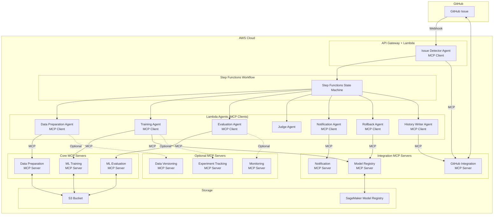

# MCP化拡張提案: 追加機能のMCP対応

## 概要

現在の設計では、Data Preparation、ML Training、ML Evaluationの3つのMCPサーバーを提案していますが、さらに以下の機能もMCP化することで、システム全体の柔軟性と再利用性を向上できます。

---

## 追加でMCP化できる機能

### 1. GitHub Integration MCP Server ⭐ **強く推奨**

#### 現状の課題
- Issue Detector Agent、Notification Agent、History Writer Agentそれぞれに GitHub API連携コードが分散
- GitHub API の変更時に複数のエージェントを修正する必要がある
- GitHub以外のプラットフォーム（GitLab、Bitbucket等）への移行が困難

#### MCP化のメリット
- GitHub連携機能を一箇所に集約
- 他のMLOpsプロジェクトでも再利用可能
- GitHub以外のプラットフォーム対応が容易（新しいMCPサーバーを追加するだけ）

#### 提供ツール

**Issue管理**:
- `get_issue` - Issueの取得
- `create_issue` - Issueの作成
- `update_issue` - Issueの更新
- `add_issue_comment` - Issueにコメント追加
- `get_issue_comments` - Issueのコメント一覧取得
- `parse_issue_body` - Issue本文のYAML/JSONパース

**ラベル管理**:
- `get_issue_labels` - Issueのラベル取得
- `add_label` - ラベル追加
- `remove_label` - ラベル削除

**リポジトリ操作**:
- `create_file` - ファイル作成（履歴保存用）
- `update_file` - ファイル更新
- `commit_changes` - 変更のコミット
- `create_pull_request` - プルリクエスト作成

**Webhook**:
- `validate_webhook_signature` - Webhook署名の検証
- `parse_webhook_payload` - Webhookペイロードのパース

#### ツール定義例

```json
{
  "name": "add_issue_comment",
  "description": "GitHub Issueにコメントを追加",
  "inputSchema": {
    "type": "object",
    "properties": {
      "repository": {
        "type": "string",
        "description": "リポジトリ名（org/repo形式）"
      },
      "issue_number": {
        "type": "integer",
        "description": "Issue番号"
      },
      "comment_body": {
        "type": "string",
        "description": "コメント本文（Markdown形式）"
      }
    },
    "required": ["repository", "issue_number", "comment_body"]
  }
}
```

#### 影響を受けるエージェント
- Issue Detector Agent → MCPクライアント化
- Notification Agent → MCPクライアント化
- History Writer Agent → MCPクライアント化

---

### 2. Notification MCP Server ⭐ **推奨**

#### 現状の課題
- Notification Agentに複数の通知チャネル（GitHub、Slack、Email）のコードが混在
- 新しい通知チャネル（Teams、Discord等）の追加が困難
- 通知フォーマットの一貫性が保てない

#### MCP化のメリット
- 通知機能を標準化されたインターフェースで提供
- 新しい通知チャネルを容易に追加可能
- 通知テンプレート管理が容易

#### 提供ツール

**GitHub通知**:
- `notify_github_issue` - GitHub Issueにコメント投稿
- `update_github_issue_status` - Issueのステータス更新

**Slack通知**:
- `send_slack_message` - Slackメッセージ送信
- `send_slack_thread_reply` - スレッド返信
- `send_slack_dm` - DM送信

**Email通知**:
- `send_email` - Email送信
- `send_email_with_attachment` - 添付ファイル付きEmail送信

**Microsoft Teams通知**:
- `send_teams_message` - Teamsメッセージ送信

**Discord通知**:
- `send_discord_message` - Discordメッセージ送信

**通知テンプレート**:
- `render_notification_template` - テンプレートレンダリング
- `get_notification_templates` - テンプレート一覧取得

#### ツール定義例

```json
{
  "name": "send_slack_message",
  "description": "Slackにメッセージを送信",
  "inputSchema": {
    "type": "object",
    "properties": {
      "channel": {
        "type": "string",
        "description": "Slackチャネル名またはID"
      },
      "message": {
        "type": "string",
        "description": "メッセージ本文"
      },
      "blocks": {
        "type": "array",
        "description": "Slack Block Kit形式のメッセージ（オプション）"
      },
      "thread_ts": {
        "type": "string",
        "description": "スレッドのタイムスタンプ（スレッド返信の場合）"
      }
    },
    "required": ["channel", "message"]
  }
}
```

#### 影響を受けるエージェント
- Notification Agent → MCPクライアント化

---

### 3. Model Registry MCP Server ⭐ **推奨**

#### 現状の課題
- Training Agent、Rollback Agentに SageMaker Model Registry操作が分散
- モデルバージョン管理ロジックが複数箇所に存在
- SageMaker以外のモデルレジストリ（MLflow、DVC等）への移行が困難

#### MCP化のメリット
- モデル管理機能を一箇所に集約
- モデルレジストリの切り替えが容易（SageMaker ↔ MLflow等）
- モデルガバナンス（承認フロー、監査ログ等）の実装が容易

#### 提供ツール

**モデル登録**:
- `register_model` - モデルの登録
- `update_model_metadata` - モデルメタデータの更新
- `delete_model` - モデルの削除

**モデルバージョン管理**:
- `list_model_versions` - モデルバージョン一覧取得
- `get_model_version` - 特定バージョンの取得
- `promote_model_version` - モデルバージョンの昇格（Staging → Production）
- `archive_model_version` - モデルバージョンのアーカイブ

**モデルステータス管理**:
- `approve_model` - モデルの承認
- `reject_model` - モデルの却下
- `get_model_status` - モデルステータスの取得

**ロールバック**:
- `rollback_model` - 前バージョンへのロールバック
- `get_rollback_history` - ロールバック履歴の取得

**モデル検索**:
- `search_models` - モデル検索
- `filter_models_by_metrics` - メトリクスでフィルタリング
- `get_best_model` - 最良モデルの取得

#### ツール定義例

```json
{
  "name": "register_model",
  "description": "モデルをレジストリに登録",
  "inputSchema": {
    "type": "object",
    "properties": {
      "model_name": {
        "type": "string",
        "description": "モデル名"
      },
      "model_s3_uri": {
        "type": "string",
        "description": "モデルのS3 URI"
      },
      "model_version": {
        "type": "string",
        "description": "モデルバージョン（例: v1.2.3）"
      },
      "metrics": {
        "type": "object",
        "description": "評価メトリクス"
      },
      "metadata": {
        "type": "object",
        "description": "追加メタデータ"
      },
      "approval_status": {
        "type": "string",
        "enum": ["Pending", "Approved", "Rejected"],
        "description": "承認ステータス"
      }
    },
    "required": ["model_name", "model_s3_uri", "model_version"]
  }
}
```

#### 影響を受けるエージェント
- Training Agent → MCPクライアント化（モデル登録部分）
- Rollback Agent → MCPクライアント化

---

### 4. Experiment Tracking MCP Server 💡 **オプション**

#### 現状の課題
- 学習実験の追跡機能が不足
- ハイパーパラメータチューニングの履歴管理が困難
- 実験の比較・可視化機能がない

#### MCP化のメリット
- MLflow、Weights & Biases等の実験追跡ツールを標準インターフェースで利用
- 実験管理をMLOpsパイプラインから分離
- 複数の実験追跡ツールを並行利用可能

#### 提供ツール

**実験管理**:
- `create_experiment` - 実験の作成
- `log_params` - パラメータのログ
- `log_metrics` - メトリクスのログ
- `log_artifacts` - アーティファクトのログ
- `end_experiment` - 実験の終了

**実験検索・比較**:
- `search_experiments` - 実験検索
- `compare_experiments` - 実験比較
- `get_best_experiment` - 最良実験の取得

**ハイパーパラメータチューニング**:
- `log_hyperparameter_tuning_run` - チューニング実行のログ
- `get_best_hyperparameters` - 最良ハイパーパラメータの取得

#### ツール定義例

```json
{
  "name": "create_experiment",
  "description": "新しい実験を作成",
  "inputSchema": {
    "type": "object",
    "properties": {
      "experiment_name": {
        "type": "string",
        "description": "実験名"
      },
      "tags": {
        "type": "object",
        "description": "タグ（key-value）"
      }
    },
    "required": ["experiment_name"]
  }
}
```

#### 影響を受けるエージェント
- Training Agent → 実験追跡機能を追加
- Evaluation Agent → 評価メトリクスをログ

---

### 5. Data Versioning MCP Server 💡 **オプション**

#### 現状の課題
- データセットのバージョン管理が不十分（S3バージョニングのみ）
- データ系譜（Data Lineage）の追跡が困難
- データ品質のモニタリング機能がない

#### MCP化のメリット
- DVC、Delta Lake等のデータバージョニングツールを統一インターフェースで利用
- データセットの変更履歴を追跡
- データ品質メトリクスの自動計算

#### 提供ツール

**データバージョン管理**:
- `register_dataset` - データセット登録
- `version_dataset` - データセットのバージョン作成
- `get_dataset_version` - 特定バージョンの取得
- `list_dataset_versions` - バージョン一覧取得

**データ系譜**:
- `track_data_lineage` - データ系譜の記録
- `get_data_lineage` - データ系譜の取得

**データ品質**:
- `validate_data_quality` - データ品質検証
- `calculate_data_statistics` - データ統計計算
- `detect_data_drift` - データドリフト検出

#### ツール定義例

```json
{
  "name": "register_dataset",
  "description": "データセットを登録",
  "inputSchema": {
    "type": "object",
    "properties": {
      "dataset_name": {
        "type": "string",
        "description": "データセット名"
      },
      "dataset_s3_uri": {
        "type": "string",
        "description": "データセットのS3 URI"
      },
      "version": {
        "type": "string",
        "description": "バージョン"
      },
      "metadata": {
        "type": "object",
        "description": "メタデータ"
      }
    },
    "required": ["dataset_name", "dataset_s3_uri", "version"]
  }
}
```

#### 影響を受けるエージェント
- Data Preparation Agent → データバージョン管理機能を追加

---

### 6. Monitoring & Observability MCP Server 💡 **オプション**

#### 現状の課題
- CloudWatch Logs/Metricsへの直接依存
- カスタムメトリクスの追加が困難
- 複数のモニタリングツール（Prometheus、Datadog等）への対応が困難

#### MCP化のメリット
- モニタリングツールの切り替えが容易
- カスタムメトリクスの標準化
- アラート設定の一元管理

#### 提供ツール

**メトリクス**:
- `publish_metric` - メトリクス送信
- `publish_custom_metric` - カスタムメトリクス送信
- `query_metrics` - メトリクス取得

**ログ**:
- `log_event` - イベントログ
- `query_logs` - ログ検索

**トレーシング**:
- `start_trace` - トレース開始
- `end_trace` - トレース終了
- `add_trace_annotation` - トレース注釈追加

**アラート**:
- `create_alert` - アラート作成
- `send_alert` - アラート送信

---

## 優先度付けと推奨順序

### 🔴 Phase 1: 必須（Week 1-6）
1. **Data Preparation MCP Server** ⭐⭐⭐ （既に提案済み）
2. **ML Training MCP Server** ⭐⭐⭐ （既に提案済み）
3. **ML Evaluation MCP Server** ⭐⭐⭐ （既に提案済み）

### 🟡 Phase 2: 強く推奨（Week 7-10）
4. **GitHub Integration MCP Server** ⭐⭐
   - 理由: GitHub連携コードが3つのエージェントに分散しており、統合効果が高い
   - 工数: 2週間

5. **Model Registry MCP Server** ⭐⭐
   - 理由: モデルガバナンスの強化、他のレジストリへの移行可能性
   - 工数: 1.5週間

### 🟢 Phase 3: 推奨（Week 11-14）
6. **Notification MCP Server** ⭐
   - 理由: 通知チャネルの拡張性向上
   - 工数: 1.5週間

### 🔵 Phase 4: オプション（将来的に検討）
7. **Experiment Tracking MCP Server** 💡
   - 理由: 高度な実験管理が必要な場合
   - 工数: 2週間

8. **Data Versioning MCP Server** 💡
   - 理由: データガバナンスが重要な場合
   - 工数: 2週間

9. **Monitoring & Observability MCP Server** 💡
   - 理由: マルチクラウド対応が必要な場合
   - 工数: 1.5週間

---

## アーキテクチャ全体像（全MCPサーバー統合）



---

## コスト・ベネフィット分析

| MCPサーバー | 開発工数 | 運用コスト増 | 再利用性 | 保守性向上 | 総合評価 |
|------------|---------|------------|---------|-----------|---------|
| Data Preparation | 2週間 | 低 | ⭐⭐⭐ | ⭐⭐⭐ | ✅ 必須 |
| ML Training | 2週間 | 低 | ⭐⭐⭐ | ⭐⭐⭐ | ✅ 必須 |
| ML Evaluation | 1.5週間 | 低 | ⭐⭐⭐ | ⭐⭐⭐ | ✅ 必須 |
| GitHub Integration | 2週間 | 低 | ⭐⭐ | ⭐⭐⭐ | ✅ 強く推奨 |
| Model Registry | 1.5週間 | 低 | ⭐⭐⭐ | ⭐⭐ | ✅ 強く推奨 |
| Notification | 1.5週間 | 低 | ⭐⭐ | ⭐⭐ | 🟡 推奨 |
| Experiment Tracking | 2週間 | 中 | ⭐⭐ | ⭐⭐ | 🔵 オプション |
| Data Versioning | 2週間 | 中 | ⭐⭐ | ⭐⭐ | 🔵 オプション |
| Monitoring | 1.5週間 | 中 | ⭐ | ⭐⭐ | 🔵 オプション |

---

## まとめ

### 推奨構成

**最小構成（Phase 1-2）**:
1. Data Preparation MCP Server
2. ML Training MCP Server
3. ML Evaluation MCP Server
4. GitHub Integration MCP Server
5. Model Registry MCP Server

**合計開発期間**: 約10週間
**合計MCPサーバー数**: 5個

この構成で、システムの**80%の機能をMCP化**でき、以下のメリットを享受できます:

- ✅ ML専門機能の完全なMCP化
- ✅ GitHub連携の一元化
- ✅ モデル管理の標準化
- ✅ 高い再利用性と保守性
- ✅ ベンダーニュートラルなアーキテクチャ

### オプション機能

以下の機能は、**将来的に必要になった時点で追加**することを推奨:

- Notification MCP Server（通知チャネル拡張時）
- Experiment Tracking MCP Server（高度な実験管理が必要な場合）
- Data Versioning MCP Server（データガバナンス強化時）
- Monitoring & Observability MCP Server（マルチクラウド対応時）

---

## 変更履歴

| バージョン | 日付 | 変更内容 | 作成者 |
| --- | --- | --- | --- |
| 1.0 | 2025-12-27 | 初版作成（MCP拡張提案） | - |
