# MLOpsワークフロー: GitHub Issue駆動型統合MCPシステム

**バージョン**: 0.1
**作成日**: 2025-12-27

---

## 1. ワークフロー概要

本システムは、GitHub Issueをトリガーとして、機械学習モデルの学習・評価・デプロイを自動化するMLOpsパイプラインです。統合MLOps MCPサーバーを活用し、エージェントベースで処理を実行します。

---

## 2. エンドツーエンドワークフロー図

```mermaid
graph TB
    Start([オペレータ]) -->|1. GitHub Issueを作成<br/>ラベル: mlops:train| Issue[GitHub Issue]

    Issue -->|2. Webhook| Detector[Issue Detector Agent]
    Detector -->|3. Issue解析<br/>パラメータ抽出| Parse{Issue本文<br/>パース}

    Parse -->|4. 有効なパラメータ| SF[Step Functions<br/>ワークフロー起動]
    Parse -->|無効| NotifyError[エラー通知]

    SF -->|5. データ準備| PrepAgent[Data Preparation Agent]
    PrepAgent -->|MCP呼び出し| MCP1[統合MCP Server<br/>Capability 1:<br/>Data Preparation]
    MCP1 -->|6. S3から<br/>データロード| S3_1[(S3: datasets/)]
    MCP1 -->|7. 前処理実行<br/>正規化・エンコーディング| Prep[前処理]
    Prep -->|8. 処理済みデータ保存| S3_2[(S3: processed/)]

    S3_2 -->|9. 学習開始| TrainAgent[Training Agent]
    TrainAgent -->|MCP呼び出し| MCP2[統合MCP Server<br/>Capability 2:<br/>ML Training]
    MCP2 -->|10. SageMaker<br/>Training Job起動| SageMaker[Amazon SageMaker<br/>Training Job]
    SageMaker -->|11. 学習完了<br/>モデル保存| S3_3[(S3: models/)]

    S3_3 -->|12. 評価開始| EvalAgent[Evaluation Agent]
    EvalAgent -->|MCP呼び出し| MCP3[統合MCP Server<br/>Capability 3:<br/>ML Evaluation]
    MCP3 -->|13. モデル評価<br/>メトリクス計算| Eval[評価処理]
    Eval -->|14. 評価結果保存| S3_4[(S3: evaluations/)]

    S3_4 -->|15. 判定| JudgeAgent[Judge Agent]
    JudgeAgent -->|16. 閾値比較| Decision{評価結果<br/>≥ 閾値?}

    Decision -->|Yes: 合格| RegistryAgent[Model Registry操作]
    RegistryAgent -->|MCP呼び出し| MCP5[統合MCP Server<br/>Capability 5:<br/>Model Registry]
    MCP5 -->|17. モデル登録| Registry[(SageMaker<br/>Model Registry)]
    Registry -->|18. バージョン管理| Version[v1.2.3]

    Decision -->|No: 不合格| RetryCheck{再学習<br/>回数<br/>< max_retry?}
    RetryCheck -->|Yes| NotifyRetry[Notification Agent]
    NotifyRetry -->|MCP呼び出し| MCP6[統合MCP Server<br/>Capability 6:<br/>Notification]
    MCP6 -->|19. 再学習通知| Slack1[Slack/Email]
    Slack1 -->|20. オペレータ承認待ち| WaitApproval[承認待機]
    WaitApproval -->|21. 承認| PrepAgent

    RetryCheck -->|No: 超過| RollbackAgent[Rollback Agent]
    RollbackAgent -->|MCP呼び出し| MCP5_2[統合MCP Server<br/>Capability 5:<br/>Model Registry]
    MCP5_2 -->|22. 前バージョンに<br/>ロールバック| Registry

    Version -->|23. 履歴保存| HistoryAgent[History Writer Agent]
    HistoryAgent -->|MCP呼び出し| MCP4[統合MCP Server<br/>Capability 4:<br/>GitHub Integration]
    MCP4 -->|24. 学習結果を<br/>Markdown作成| History[training_history/<br/>train-20251227-001.md]
    MCP4 -->|25. GitHubに<br/>コミット| GitHub[(GitHub Repository)]

    History -->|26. 成功通知| NotifySuccess[Notification Agent]
    NotifySuccess -->|MCP呼び出し| MCP6_2[統合MCP Server<br/>Capability 6:<br/>Notification]
    MCP6_2 -->|27. Issue更新<br/>+ Slack通知| IssueUpdate[Issue #123<br/>ステータス: 完了]
    MCP6_2 -->|28. Slack通知| Slack2[Slack Channel]

    RollbackAgent -->|29. 失敗通知| NotifyFail[Notification Agent]
    NotifyFail -->|MCP呼び出し| MCP6_3[統合MCP Server<br/>Capability 6:<br/>Notification]
    MCP6_3 -->|30. Issue更新<br/>+ Slack通知| IssueFail[Issue #123<br/>ステータス: 失敗]

    IssueUpdate -->|完了| End([終了])
    IssueFail -->|完了| End
    NotifyError -->|完了| End

    style MCP1 fill:#e1f5fe
    style MCP2 fill:#e1f5fe
    style MCP3 fill:#e1f5fe
    style MCP4 fill:#e1f5fe
    style MCP5 fill:#e1f5fe
    style MCP6 fill:#e1f5fe
    style MCP5_2 fill:#e1f5fe
    style MCP6_2 fill:#e1f5fe
    style MCP6_3 fill:#e1f5fe
    style Decision fill:#fff9c4
    style RetryCheck fill:#fff9c4
```

---

## 3. 詳細シーケンス図

### 3.1 正常系フロー（教師あり学習）

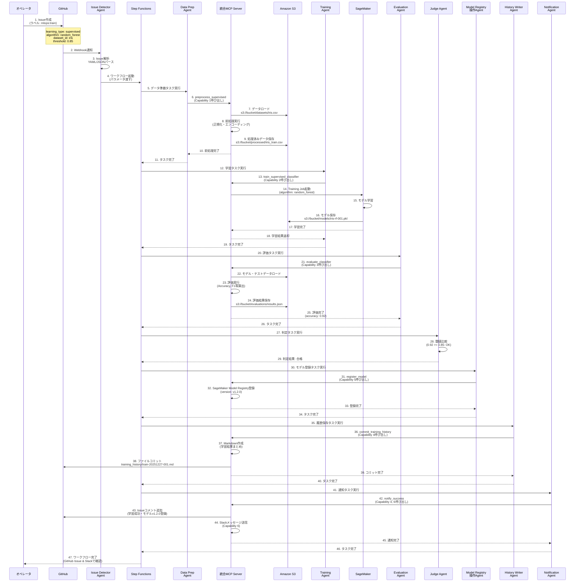

### 3.2 異常系フロー（再学習）

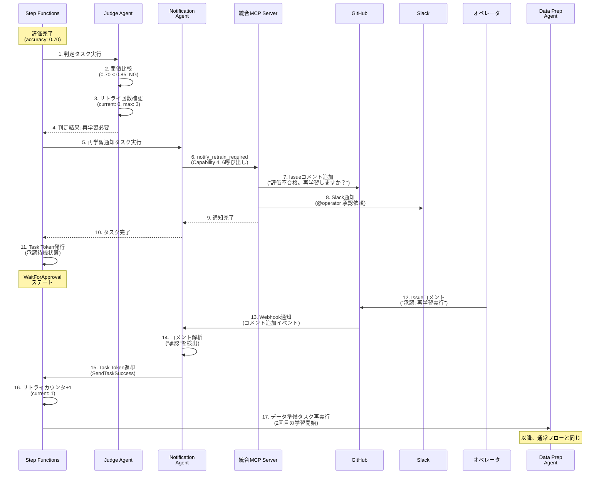

### 3.3 異常系フロー（ロールバック）

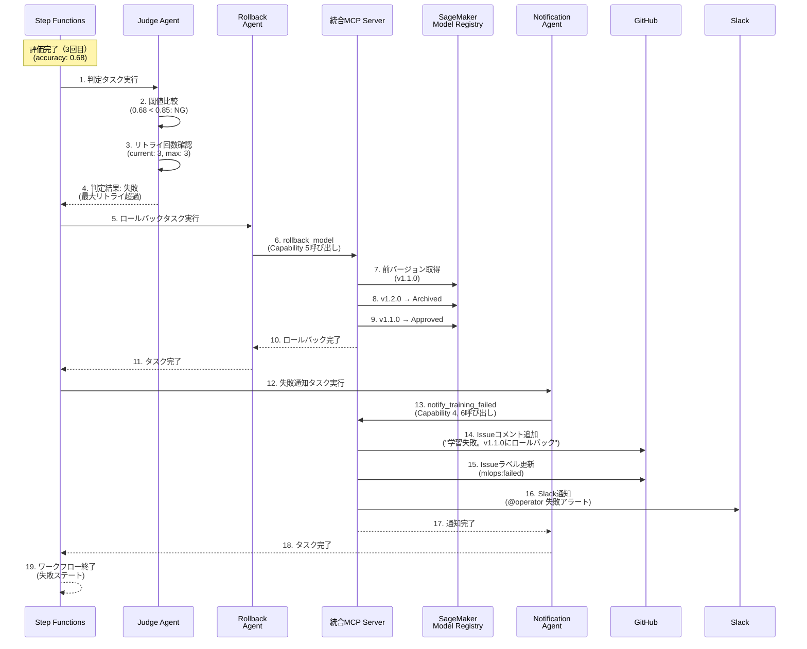

---

## 4. 学習方式別ワークフロー

### 4.1 教師あり学習（分類）

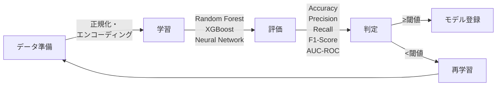

### 4.2 教師あり学習（回帰）

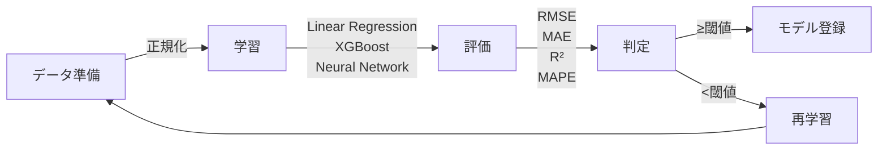

### 4.3 教師なし学習（クラスタリング）

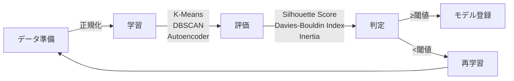

### 4.4 強化学習

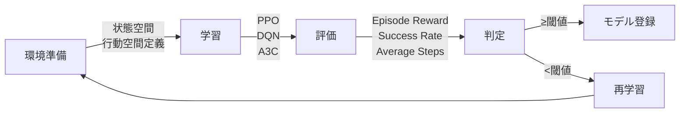

---

## 5. MCPサーバー連携詳細

### 5.1 Agent → MCP Server通信フロー

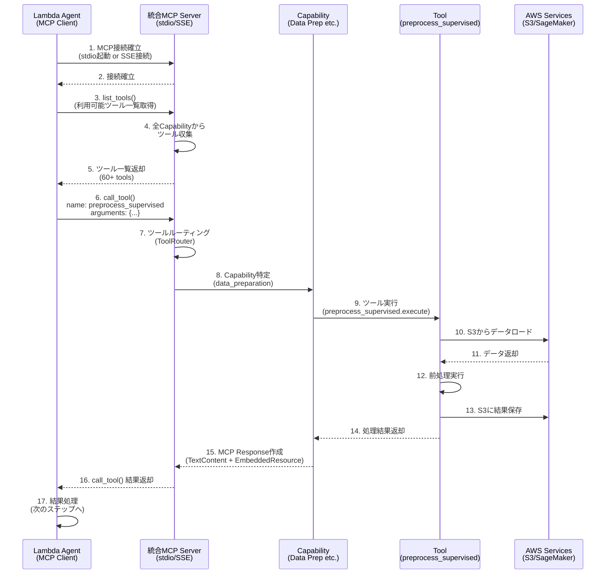

### 5.2 統合MCPサーバー内部ルーティング

```mermaid
graph TB
    Agent[Lambda Agent] -->|MCP Request<br/>tool: train_supervised_classifier| Server[MCP Server]

    Server --> Router[ToolRouter]
    Router -->|ツール名で検索| Mapping{Tool Mapping<br/>Dictionary}

    Mapping -->|"train_supervised_classifier"<br/>→ "ml_training"| Cap2[Capability 2:<br/>ML Training]
    Mapping -->|"preprocess_supervised"<br/>→ "data_preparation"| Cap1[Capability 1:<br/>Data Preparation]
    Mapping -->|"evaluate_classifier"<br/>→ "ml_evaluation"| Cap3[Capability 3:<br/>ML Evaluation]
    Mapping -->|"register_model"<br/>→ "model_registry"| Cap5[Capability 5:<br/>Model Registry]

    Cap2 --> Tool[train_supervised_classifier<br/>ツール実行]
    Tool --> SM[SageMaker<br/>Training Job起動]
    SM --> Result[MCP Response]
    Result --> Agent

    style Mapping fill:#fff9c4
    style Router fill:#e1f5fe
```

---

## 6. データフロー

### 6.1 S3バケット間のデータ移動

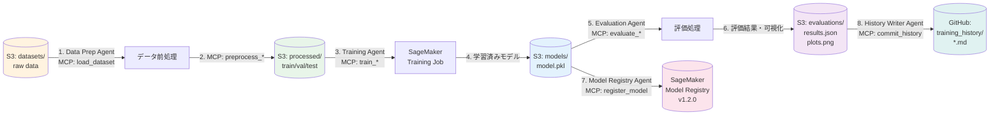

### 6.2 メタデータフロー

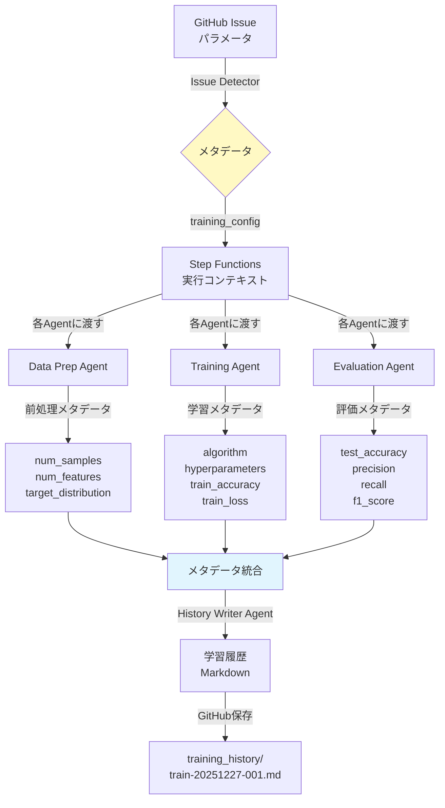

---

## 7. Step Functions ステートマシン詳細

### 7.1 メインワークフロー（状態遷移図）

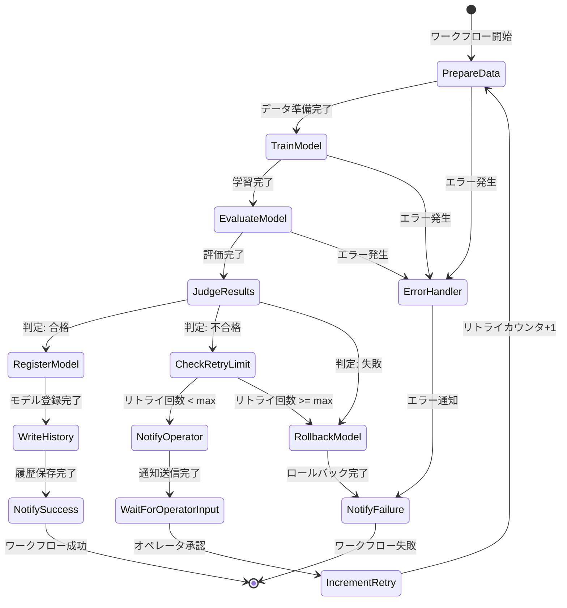

### 7.2 各ステートの詳細

| ステート名 | タイプ | 実行内容 | タイムアウト | リトライ |
|-----------|--------|---------|------------|---------|
| **PrepareData** | Task | Data Preparation Agent実行 | 15分 | 3回 |
| **TrainModel** | Task | Training Agent実行（.sync統合） | 60分 | 1回 |
| **EvaluateModel** | Task | Evaluation Agent実行 | 15分 | 3回 |
| **JudgeResults** | Task | Judge Agent実行 | 5分 | なし |
| **CheckRetryLimit** | Choice | リトライ回数判定 | - | - |
| **NotifyOperator** | Task | Notification Agent実行 | 5分 | 3回 |
| **WaitForOperatorInput** | Task (Token) | オペレータ承認待機 | 24時間 | なし |
| **IncrementRetry** | Pass | リトライカウンタ+1 | - | - |
| **RegisterModel** | Task | Model Registry操作Agent実行 | 10分 | 3回 |
| **WriteHistory** | Task | History Writer Agent実行 | 5分 | 3回 |
| **NotifySuccess** | Task | Notification Agent実行 | 5分 | 3回 |
| **RollbackModel** | Task | Rollback Agent実行 | 10分 | 3回 |
| **NotifyFailure** | Task | Notification Agent実行 | 5分 | 3回 |
| **ErrorHandler** | Catch | エラーハンドリング | - | - |

---

## 8. 通知フロー

### 8.1 通知チャネルマトリクス

| イベント | GitHub Issue | Slack | Email | 内容 |
|---------|-------------|-------|-------|------|
| **学習開始** | コメント | メッセージ | - | "学習を開始しました（Job: train-001）" |
| **学習完了** | - | メッセージ | - | "学習が完了しました（Accuracy: 0.92）" |
| **評価完了** | コメント | - | - | "評価結果: Accuracy=0.92, F1=0.90" |
| **合格判定** | コメント + ラベル更新 | メンション付き | - | "閾値を超えました。モデルv1.2.0を登録" |
| **再学習要求** | コメント | メンション付き | メール | "評価不合格。再学習承認をお願いします" |
| **学習成功** | コメント + Issueクローズ | メンション付き | メール | "学習成功。モデルv1.2.0をデプロイ可能" |
| **学習失敗** | コメント + ラベル更新 | アラート | メール | "最大リトライ超過。v1.1.0にロールバック" |

### 8.2 通知テンプレート例

**GitHub Issueコメント（学習成功）**:
```markdown
## ✅ 学習成功

**学習ジョブ**: train-20251227-001
**アルゴリズム**: Random Forest
**モデルバージョン**: v1.2.0

### 📊 評価結果
- **Accuracy**: 0.92 (閾値: 0.85)
- **Precision**: 0.90
- **Recall**: 0.94
- **F1-Score**: 0.92

### 📁 成果物
- モデル: [s3://mlops-bucket/models/train-20251227-001/model.pkl](...)
- 評価レポート: [training_history/train-20251227-001.md](...)

**ステータス**: モデルはSageMaker Model Registryに登録済みです。デプロイ可能です。
```

**Slack通知（再学習要求）**:
```
⚠️ *再学習承認が必要です* @operator

*Issue*: #123 Iris分類モデルの学習
*評価結果*: Accuracy=0.70 (閾値: 0.85未満)
*現在のリトライ*: 0/3

以下のいずれかを選択してください:
• Issueに "承認" とコメント → 再学習実行
• Issueに "却下" とコメント → ロールバック
```

---

## 9. エラーハンドリング戦略

### 9.1 エラー分類と対応

| エラー種別 | 例 | 対応 | 通知 |
|----------|---|------|------|
| **一時的エラー** | S3接続タイムアウト | 自動リトライ（3回） | なし |
| **データエラー** | 欠損値過多、型不整合 | ワークフロー停止 | GitHub + Slack |
| **学習エラー** | SageMaker Job失敗 | リトライ（1回）→失敗なら通知 | GitHub + Slack |
| **評価不合格** | Accuracy < 閾値 | 再学習フロー | GitHub + Slack |
| **最大リトライ超過** | 3回再学習しても不合格 | ロールバック | GitHub + Slack + Email |
| **システムエラー** | Lambda OOM、ECS Task停止 | エラーログ記録、アラート | Slack + Email |

### 9.2 エラーリカバリーフロー

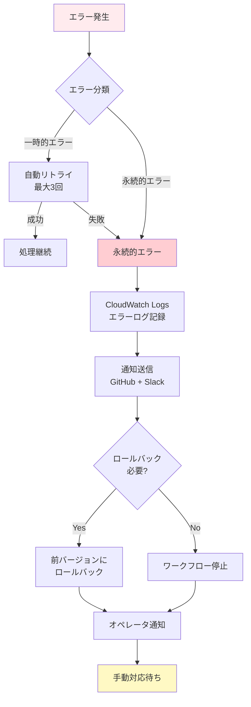

---

## 10. モニタリング・ロギング

### 10.1 モニタリング項目

| カテゴリ | メトリクス | 閾値 | アクション |
|---------|----------|------|-----------|
| **ワークフロー** | 実行成功率 | < 95% | アラート |
| | 平均実行時間 | > 90分 | パフォーマンス調査 |
| **学習** | SageMaker Job成功率 | < 90% | アラート |
| | 学習時間 | > 60分 | リソース見直し |
| **評価** | 評価指標の推移 | 低下傾向 | データ品質調査 |
| **MCP Server** | ツール呼び出しレイテンシ | P95 > 1秒 | パフォーマンス最適化 |
| | エラー率 | > 1% | エラー原因調査 |
| **インフラ** | Lambda同時実行数 | > 80% | 制限緩和申請 |
| | ECS CPU使用率 | > 80% | スケールアウト |

### 10.2 ロギング構造

**CloudWatch Logs ロググループ構成**:
```
/aws/lambda/issue-detector-agent
/aws/lambda/data-preparation-agent
/aws/lambda/training-agent
/aws/lambda/evaluation-agent
/aws/lambda/judge-agent
/aws/lambda/notification-agent
/aws/lambda/rollback-agent
/aws/lambda/history-writer-agent
/aws/ecs/unified-mcp-server
/aws/sagemaker/TrainingJobs
/aws/states/mlops-workflow
```

**統合ログフォーマット（JSON）**:
```json
{
  "timestamp": "2025-12-27T10:30:00.123Z",
  "level": "INFO",
  "service": "training-agent",
  "execution_id": "exec-abc123",
  "issue_number": 123,
  "training_job_name": "train-20251227-001",
  "message": "Training job started successfully",
  "duration_ms": 1234,
  "status": "success"
}
```

---

## 11. まとめ

本MLOpsワークフローは以下の特徴を持ちます:

✅ **GitHub Issue駆動**: オペレータが簡単にIssueを作成するだけで学習を開始
✅ **完全自動化**: データ準備→学習→評価→判定→デプロイまで自動化
✅ **統合MCP対応**: 11個のCapabilityを1つのMCPサーバーで提供し、運用を簡素化
✅ **エージェントベース**: 各処理を独立したAgentとして実装し、疎結合を実現
✅ **柔軟な学習方式**: 教師あり・教師なし・強化学習をサポート
✅ **堅牢なエラーハンドリング**: 自動リトライ、再学習フロー、ロールバック機能
✅ **透明性**: GitHub履歴保存、Slack/Email通知、CloudWatch Logsで可視化

---

## 12. 変更履歴

| バージョン | 日付 | 変更内容 | 作成者 |
| --- | --- | --- | --- |
| 0.1 | 2025-12-27 | 初版発行 | - |
